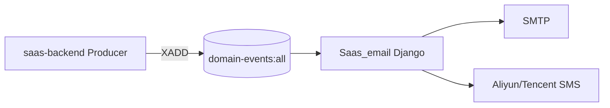
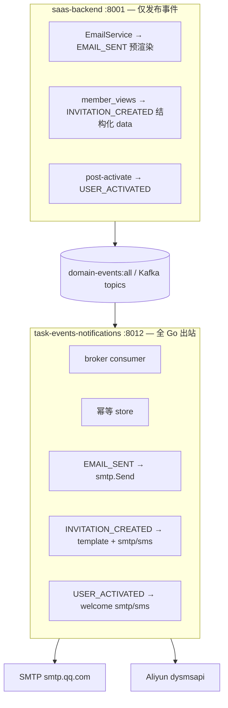

# Saas_email → taskEvents notifications 域（方案 C：全 Go 出站）

> 日期：2026-06-01  
> 状态：**已实施**（2026-06-01）— 方案 C 全 Go 出站；`Saas_email/` 已删除  
> 触发：将 `Saas_email` 迁入 `taskEvents`，**SMTP / 模板 / SMS 全部在 Go 内完成**，不回调 Django dispatch。  
> 前置：`2026-06-01-email-register-activation-design.md`（注册激活邮件链路）

---

## 1. 决策摘要

| 问题 | 决策 |
|------|------|
| 迁移目标 | 新增 **`task-events-notifications`** Go 进程，**完全替代** `Saas_email` Django 进程 |
| 出站执行位置 | **100% Go**（SMTP + 模板渲染 + 短信 SDK） |
| Django dispatch | **不使用** `/api/internal/task-events/notifications/dispatch/` |
| Producer 契约 | **不变** — saas-backend 仍 `send_event(...)`，payload 保持现有字段 |
| 模板真源 | Go embed：`taskEvents/notifications/templates/`（`EMAIL_SENT` 延迟渲染 + `INVITATION_CREATED`）；Django 模板保留作对照，Producer 可预渲染或发 `template_name` |
| 配置真源 | `task2app/conf/port_config.json` → `django.email` / `django.sms`（与 saas-backend 对齐） |
| Saas_email 清理 | **验收完成后直接删除** `task2app/Saas_email/`；删除前打 git tag 供紧急回滚 |

---

## 2. As-Is → To-Be

### 2.1 当前（As-Is）



### 2.2 目标（To-Be）



**与 accounts/projects 的差异**：notifications 域 **不** 使用 `commandhttp.Client`；实现 `notifications.DeliveryPort` 作为本地 `DomainCommandPort`，复用 `consumer.Run` 的 broker / 幂等 / otel / health 框架。

---

## 3. 事件 → Handler 映射

| 事件 | Producer  payload 特点 | Go Handler 职责 |
|------|------------------------|----------------|
| `EMAIL_SENT` | **双轨**：预渲染 `message`/`html_message`，或 `template_name`+`context` | 校验 → 按需 Go 模板渲染 → SMTP |
| `INVITATION_CREATED` | 结构化：`company_name`, `email`, `phone`, `invitation_url`, `invite_method`, `message`, … | 按 `invite_method` 分支：模板渲染 + SMTP 或 SMS |
| `USER_ACTIVATED` | `user_id`, `activated_method_type`, `activated_identifier`, `username` | 邮箱 → 欢迎 SMTP；手机 → 欢迎 SMS |
| `USER_CREATED` | — | **不订阅**（Saas_email 已 noop） |

### 3.1 EMAIL_SENT — Go 模板渲染（2026-06-01 修正）

Producer 支持两种 payload：

1. **预渲染**（`EmailService`）：`message` + `html_message` → Go 直接 SMTP
2. **延迟渲染**（taskAuth internal 等）：`template_name` + `context` → Go `notifications/templates` embed 渲染

详见 `2026-06-01-email-sent-template-rendering-gap-design.md`。

```python
# 延迟渲染示例
send_event('EMAIL_SENT', {
    'subject': '密码重置 - SaaS平台',
    'template_name': 'password_reset',
    'context': {'reset_url': reset_url},
    'recipient_list': [email],
})
```

### 3.2 INVITATION_CREATED — Go 需移植模板

模板真源（从 Saas_project 复制，语法改为 Go `html/template` + `text/template`）：

| 模板 | 源路径 |
|------|--------|
| invitation.txt | `Saas_project/accounts/templates/email/invitation.txt` |
| invitation.html | `Saas_project/accounts/templates/email/invitation.html` |

Django 语法迁移要点：

| Django | Go template |
|--------|-------------|
| `...` | `{{if .Message}}...{{end}}` |
| `{{ company_name }}` | `{{.CompanyName}}` |

业务逻辑与 `Saas_email/.../invitation_created/1_send_invitation_email.active.py` 对齐：

- `invite_method=link` 且无 email → skip
- `invite_method=phone` → SMS
- `invite_method=email` → 模板 + SMTP

### 3.3 USER_ACTIVATED — 欢迎通知

与 Saas_email handler 对齐（**内联文案**，非独立模板文件）：

- 邮箱：`subject=欢迎使用SaaS平台`，text/html 内联
- 手机：`欢迎加入SaaS平台，{username}！您的账号已激活成功。` → Aliyun SMS

---

## 4. Go 模块结构

```
taskEvents/
├── cmd/notifications/main.go          # consumer.Run("notifications", ...)
├── config/config.go                   # + Notifications consumer + Email/SMS config loader
├── consumer/runner.go                 # 不变；注入 DeliveryPort
├── notifications/
│   ├── delivery.go                    # LocalDelivery implements DomainCommandPort
│   ├── handlers/
│   │   ├── email_sent.go
│   │   ├── invitation_created.go
│   │   └── user_activated.go
│   ├── smtp/
│   │   ├── client.go                  # net/smtp + TLS; LocalName=localhost
│   │   └── message.go                 # multipart/alternative HTML+text
│   ├── sms/
│   │   ├── aliyun.go                  # dysmsapi SendSms HTTP
│   │   └── tencent.go                 # 可选；P2
│   ├── templates/
│   │   ├── embed.go                   //go:embed invitation.*
│   │   ├── invitation.txt
│   │   └── invitation.html
│   └── config.go                      # 读 port_config django.email / django.sms
└── notifications/delivery_test.go
```

### 4.1 配置加载

从 `task2app/conf/port_config.json` 读取（与 `config.Load()` 同路径解析）：

```go
type EmailConfig struct {
    Host, User, Password, DefaultFrom string
    Port                              int
    UseSSL                            bool
    Timeout                           time.Duration
    LocalHostname                     string // 默认 "localhost"，修复 macOS getfqdn
}

type SMSConfig struct {
    Provider string // aliyun | tencent
    Aliyun   AliyunSMSConfig
}
```

**不**再读取 `email_queue` 块；**不**依赖 `Saas_email/conf/conf.yaml`。

### 4.2 SMTP 客户端

| 要求 | 实现 |
|------|------|
| QQ 邮箱 465 SSL | `smtp.Dial` + TLS，`ServerName=smtp.qq.com` |
| EHLO hostname | `client.Hello("localhost")` 或配置项 `localHostname` |
| HTML 邮件 | `mime/multipart` alternative（text + html） |
| 错误分类 | 连接/认证失败 → `DispatchRetryable`；参数缺失 → `DispatchPermanent` |

### 4.3 SMS 客户端（Aliyun 优先）

对齐 Python `SMSService._send_aliyun_sms`：

- API：`dysmsapi.aliyuncs.com` `SendSms` v2017-05-25
- 配置不完整时：**dev 模拟成功**（log + return OK，与 Python 行为一致）
- Go 实现：官方 REST 签名或轻量 HTTP client（避免引入巨大 SDK）

腾讯云 SMS 可作为 **P2**；port_config 已有 `django.sms.tencent` 结构预留。

### 4.4 LocalDelivery（核心）

```go
// notifications/delivery.go
type LocalDelivery struct {
    SMTP      *smtp.Client
    SMS       sms.Sender
    Templates *templates.Engine
    Log       *slog.Logger
}

func (d *LocalDelivery) Dispatch(ctx context.Context, cmd domain.DomainCommand) (domain.DispatchOutcome, error) {
    switch cmd.EventType {
    case "EMAIL_SENT":
        return d.handleEmailSent(cmd)
    case "INVITATION_CREATED":
        return d.handleInvitationCreated(cmd)
    case "USER_ACTIVATED":
        return d.handleUserActivated(cmd)
    default:
        return domain.DispatchPermanent, fmt.Errorf("unknown event %s", cmd.EventType)
    }
}
```

`consumer.Run` 改造（最小 diff）：

```go
// 新增 RunWithDelivery(domainName, cfg, consumerCfg, delivery domain.DomainCommandPort)
// notifications/main.go 调用 RunWithDelivery(..., notifications.NewLocalDelivery(cfg))
```

accounts/projects 等仍用 `commandhttp.NewClient`；仅 notifications 注入 `LocalDelivery`。

---

## 5. 领域概念清单（→ Step 5 DDD）

| 类型 | 候选 |
|------|------|
| **Bounded Context** | **Notifications**（出站通知） |
| **Entity** | `OutboundMessage`（逻辑实体，幂等键标识，无 DB 表） |
| **Aggregate** | `OutboundMessage` — `(event_type, key, channel, recipient)` 最多投递一次 |
| **Domain Event** | `EMAIL_SENT`, `INVITATION_CREATED`, `USER_ACTIVATED` |
| **Domain Service** | `SmtpDeliveryService`, `SmsDeliveryService`, `InvitationTemplateService` |
| **Port** | `DeliveryPort`（= `DomainCommandPort` 本地实现） |
| **Infrastructure** | Redis/Kafka broker、Aliyun dysmsapi、SMTP |

---

## 6. 价值流影响（value-stream.yaml）

### 6.1 受影响 stream

| Stream | Step | 影响 |
|--------|------|------|
| **user-auth** | `email-register`, `resend-activation`, `reset-password`, `verification-code` | `EMAIL_SENT` 由 Go notifications 投递 |
| **user-auth** | `user-activation-event` | `USER_ACTIVATED` 欢迎通知改 Go |
| **company-management** | `invitation-email` | `INVITATION_CREATED` 改 Go；测试需改 import 路径 |
| **message-queue-kafka-to-redis** | `increment1-redis-transport-e2e` | 移除 `saas-email-group` |
| **platform-dev-database-reset** | （间接） | runAll 不再启动 saas-email |

### 6.2 建议新增 step

```yaml
- name: notifications-go-delivery
  status: planned
  test_file: taskEvents/notifications/delivery_test.go
  fields:
    - name: task-events-notifications.health.status
      description: Go notifications 消费者健康
    - name: saas-backend.config.domain_events_notifications_port
      description: port_config domainEvents.consumers.notifications.port

- name: email-register-activation-delivered
  status: planned
  test_file: ../playwright/front_project/tests/AuthRegister.activation-email.playwright.test.js
  fields:
    - name: task-events-notifications.delivery.activation_email
      description: EMAIL_SENT Go SMTP 实际投递成功

- name: invitation-email-go
  status: planned
  test_file: taskEvents/notifications/handlers/invitation_created_test.go
  fields:
    - name: saas-backend.accounts_invitation.email
      description: INVITATION_CREATED Go 模板+SMTP
```

---

## 7. 配置与 runAll 变更

### 7.1 `port_config.json`

```json
"notifications": {
  "enabled": true,
  "host": "127.0.0.1",
  "port": 8012,
  "groupId": "task-events-notifications",
  "events": ["EMAIL_SENT", "INVITATION_CREATED", "USER_ACTIVATED"]
}
```

### 7.2 `runAll.yaml`

- `domain-events` 组 **新增** `task-events-notifications`（port 8012，health `/api/health/`）
- **删除** `saas-email` 服务
- `depends_on`: `[docker-redis]`（**不**依赖 saas-backend 运行时 HTTP）

### 7.3 废弃

| 项 | 时机 |
|----|------|
| `task2app/Saas_email/` 整个目录 | **验收完成后直接删除**（不保留 deprecated 副本） |
| `email_queue` 配置块 | 同上 |
| `DOMAIN_EVENTS.md`「邮件仍走 Saas_email」 | 切片 8.4 切换时更新 |

---

## 8. 实施切片（→ Step 6 Plan）

### 切片 8.1 — 骨架 + EMAIL_SENT（最高优先级）

| 任务 | 说明 |
|------|------|
| `cmd/notifications/main.go` + config | 端口 8012 |
| `notifications/smtp/` | SSL SMTP + LocalHostname |
| `notifications/delivery.go` | `handleEmailSent` |
| `consumer/runner.go` | `RunWithDelivery` |
| 单元测试 | mock SMTP server（`net/smtp` test harness） |

**验收**：XADD `EMAIL_SENT` → Go 日志「delivered」；注册激活邮件真实可达。

### 切片 8.2 — INVITATION_CREATED

| 任务 | 说明 |
|------|------|
| 移植 invitation 模板 → Go embed |  golden test 对比 Python 渲染结果 |
| `handleInvitationCreated` | email / phone / link 三分支 |
| `notifications/sms/aliyun.go` | 邀请短信 |
| 测试 | 移植 `test_invitation_email_handler.py` 断言为 Go table test |

**验收**：邀请邮件含自定义 message；空 message 无「邀请人留言」块。

### 切片 8.3 — USER_ACTIVATED 欢迎

| 任务 | 说明 |
|------|------|
| `handleUserActivated` | 邮箱/手机分支 |
| 测试 | 对齐 `test_user_activation_welcome_event` 语义（事件仍由 Django 发布，消费在 Go） |

### 切片 8.4 — 切换与 E2E

| 任务 | 说明 |
|------|------|
| runAll 切换 | 停 saas-email，启 task-events-notifications |
| Playwright | `AuthRegister.activation-email` + 可选 Mailpit 断言 |
| 并行期 | 双跑 1 周对比日志（可选） |

### 切片 8.5 — 清理（验收门禁）

**前置条件**（全部满足后才执行删除）：

1. `task-events-notifications` 在 runAll `domain-events` 组稳定运行
2. Go 单元/集成测试 + Playwright `AuthRegister.activation-email` 全绿
3. 邀请邮件 Go golden test 通过（`invitation_created_test.go`）
4. 生产/开发环境无 `saas-email` 进程依赖

| 任务 | 说明 |
|------|------|
| **删除 `task2app/Saas_email/`** | 整目录移除，不保留 archive |
| 删除 `email_queue`（`port_config.json`） | |
| 删除 `runAll.yaml` 中 `saas-email` 服务 | |
| 删除 `db/email/` 迁移脚本（若仅服务 Saas_email DB） | 需确认 `db/registry.yaml` 引用 |
| 更新 `value-stream.yaml`、`DOMAIN_EVENTS.md`、`Saas_email/skill.md` 引用处 | |

**回滚窗口**：删除前打一个 git tag（如 `pre-delete-saas-email`），回滚时 `git checkout tag -- task2app/Saas_email` 并临时恢复 runAll 条目；**不**在仓库内长期保留 deprecated 目录。

---

## 9. 幂等与失败策略

| 场景 | 策略 |
|------|------|
| 重复投递（同 event key + recipient） | Go 内存幂等 store（与 accounts 相同）；生产可换 Redis |
| SMTP 临时失败（网络/4xx 可重试） | `DispatchRetryable` → 不 ACK |
| 参数缺失（无 subject/recipient） | `DispatchPermanent` → ACK 丢弃 + error log |
| Aliyun 配置缺失（dev） | 模拟成功 + log（与 Python 一致） |
| Aliyun API 业务失败 | `DispatchPermanent` 或 Retryable 视错误码 |

**幂等键扩展**：

```
notifications:{event_type}:{envelope.key}:{sha256(recipient)}
```

---

## 10. 测试策略

| 层级 | 文件 | 覆盖 |
|------|------|------|
| Go unit | `notifications/smtp/client_test.go` | TLS、multipart、LocalHostname |
| Go unit | `notifications/handlers/*_test.go` | 各事件 happy path + 参数校验 |
| Go unit | `notifications/templates/invitation_test.go` | 模板 golden（message 有/无） |
| Go integration | `notifications/delivery_integration_test.go` | Redis XADD → 消费（build tag `integration`） |
| Playwright | `AuthRegister.activation-email.playwright.test.js` | 注册 + stream 事件 |
| 回归 | 原 `test_invitation_email_handler.py` | **迁移为 Go** 或标记 deprecated |

**本地 SMTP 调试**：推荐 [Mailpit](https://github.com/axllent/mailpit) 作为 dev `django.email.host` 替代，E2E 断言收件箱。

---

## 11. 风险与缓解

| 风险 | 缓解 |
|------|------|
| 模板与 Django 渲染不一致 | invitation 做 **golden test**；EMAIL_SENT 不渲染 |
| SMS SDK 行为差异 | 首版仅 Aliyun；配置缺失 dev 模拟与 Python 一致 |
| 范围大、交付慢 | 切片 8.1 先通 EMAIL_SENT（覆盖注册激活主路径） |
| macOS SMTP hostname | Go `Hello("localhost")` 一次性修复 |
| 双消费重复发信（迁移并行期） | 切换日 stop saas-email，不同时运行 |

---

## 12. 非目标

- **不**新增 Django notifications dispatch 端点。
- **不**在 Go 重渲染 activation / verification / password_reset 模板（仍由 Producer `EMAIL_SENT` 携带）。
- **不**合并 notifications 与 accounts 进程。
- **不**改变 taskAuth `post-register` 发布逻辑。
- P1 **不**实现腾讯云 SMS（可后续补）。

---

## 13. 与方案 A/B 对比（选型记录）

| 维度 | A Django dispatch | B 混合 | **C 全 Go（选定）** |
|------|-------------------|--------|---------------------|
| Django 运行时依赖 | 是 | 部分 | **否** |
| 模板维护 | Django | 分裂 | Go embed（仅 invitation） |
| 部署单元 | 2 进程 | 2 进程 | **1 Go 进程** |
| 注册邮件修复 | 需 Django SMTP 修复 | Go SMTP | **Go SMTP** |
| 实施复杂度 | 低 | 中 | **高** |
| 长期架构一致性 | 中 | 中 | **高** |

---

## 14. 待确认

1. **端口 8012** 是否确认？
2. **腾讯云 SMS** 是否纳入 P1，还是 P2？
3. **模板 golden test** 是否作为合并门禁（CI 必须）？
4. ~~迁移完成后 Saas_email 如何处理？~~ → **已确认：验收完成后直接删除**
5. dev 环境是否引入 **Mailpit** 作为标准 SMTP 探针？

确认后进入 `/2-worktrees-工作隔离` 或 `/6-plans-实施计划`。
