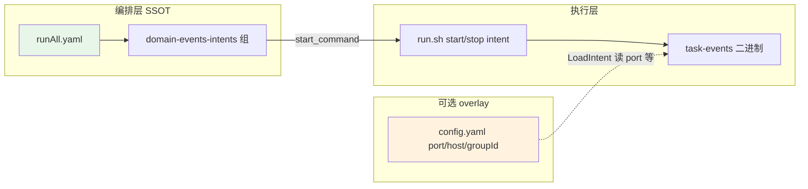

# taskEvents 消费者启停：移除 config.yaml `enabled`，由 runAll 单点控制

> 日期：2026-06-01  
> 状态：已实施（2026-06-01）  
> 触发：密码重置邮件未发出 — runAll 已配置 `task-events-email-sent-1-send-email`，但 `bin/.../config.yaml` 中 `"enabled": false` 导致 `run.sh start` 静默 skip，健康检查 `on_failure: skip` 掩盖失败

---

## 1. 问题陈述

### 1.1 现状：三层「是否启用」互相打架

| 层级 | 位置 | 谁在读 | 实际效果 |
|------|------|--------|----------|
| **A** | `taskEvents/bin/{event}/{intent}/config.yaml` → `"enabled"` | `run.sh`、`check_event_health.sh` | **阻止** `run.sh start` 启动进程 |
| **B** | `task2app/conf/port_config.json` → `domainEvents.consumers.*.intents.*.enabled` | 文档/人读；Go `LoadIntent` **不读** | 仅误导，无运行时作用 |
| **C** | `taskEvents/config/intent_registry.go` → `DefaultEnabled` | `PrimaryIntentForEvent`、README 表格 | 不阻止启动；影响 v3 主 intent 解析 |
| **D** | `runAll.yaml` → `domain-events-intents` 组 18 个 `start_command` | runAll 编排 | **认为**应启动，但 A 层拦截 |

典型故障链：

```
runAll start task-events-email-sent-1-send-email
  → bash run.sh start email_sent/1_send_email
  → intent_enabled() 见 config.yaml enabled:false
  → 打印 "skip disabled intent" 并 exit 0
  → health_check 18022 失败 → on_failure: skip（无告警）
  → EMAIL_SENT 事件积压在 Redis，邮件永不发出
```

### 1.2 用户诉求

> 把 taskEvents 消费者的 `config.yaml` 的 `enabled` **移除**，**仅通过 runAll 中对应进程是否启动**来决定消费者是否运行。

---

## 2. 目标与非目标

### 2.1 目标

1. **单一启停真源（SSOT）**：进程是否运行，由 **runAll 是否声明并启动该 service** 决定。
2. **移除 config.yaml 的 `enabled`**：`config.yaml` 只保留 **运行时 overlay**（port / host / groupId），不再表达启停意图。
3. **消除静默 skip**：`run.sh start {intent}` 被调用即尝试启动（port 冲突则明确失败）。
4. **修复 runAll 与 run.sh 语义一致**：runAll 列出的 service 启动后，对应 intent 进程必须真的在跑。

### 2.2 非目标

- 不改变 intent 二进制布局、端口段 18020–18037、Redis/Kafka transport。
- 不在 runAll 内实现新的 `enabled:` YAML 字段（已有机制：不写 service = 不启动）。
- 不强制 CI 必须启动全部 18 个 intent（g45 策略见 §6.3）。

---

## 3. 领域概念清单（供 `/5-ddd`）

| 概念 | 说明 |
|------|------|
| 限界上下文 **orchestration-lifecycle** | runAll 进程 DAG、health_check、on_failure |
| 限界上下文 **domain-events** | taskEvents intent 消费者 |
| 实体 **IntentProcess** | 一个 `{event}/{intent}` 对应一个 OS 进程 + health 端口 |
| 值对象 **ConsumerOverlay** | 可选 port/host/groupId（原 config.yaml 非 enabled 部分） |
| 端口 **ProcessStartPort** | `run.sh start` — 只负责「启动被点名的 intent」，不做启停策略 |

**原则**：启停策略属于 **编排层（runAll）**；**执行层（run.sh）** 只执行启动/停止命令。

---

## 4. 目标架构



### 4.1 启停决策表（批准后）

| 场景 | 是否运行 |
|------|----------|
| runAll 组内含 service 且用户启动了该组 | **运行** |
| runAll 未声明该 service | **不运行** |
| 开发者手动 `run.sh start email_sent/1_send_email` | **运行**（显式命令） |
| config.yaml | **不参与**启停决策 |
| port_config `enabled` | **删除**（见 §5.2） |

### 4.2 config.yaml 保留字段

```json
{
  "host": "127.0.0.1",
  "port": 18022,
  "groupId": "task-events-email-sent-1-send-email"
}
```

- 文件可省略（完全走 `intent_registry.go` + `port_config.json` 嵌套 intents）。
- **禁止**再出现 `"enabled"` 键；脚手架与 CI 可加 grep 门禁。

---

## 5. 元规则与配置清理

### 5.1 文档更新

| 文件 | 变更 |
|------|------|
| `taskEvents/bin/README.md` | 删除「启停由 config.yaml enabled 控制」；改为「启停由 runAll.yaml 编排」 |
| `Saas_project/docs/integration/DOMAIN_EVENTS.md` | 同步 §启动 段落 |
| `task2app/conf/port_config.json.md` | 删除 intents 下 `enabled` 字段说明 |
| `docs/superpowers/specs/2026-06-01-taskevents-intent-binary-layout-design.md` | 标注 enabled 设计已废弃 |

### 5.2 一并移除的冗余 enabled（推荐，与 config.yaml 同 PR）

| 位置 | 处理 |
|------|------|
| `port_config.json` 中 4 处 `"enabled": false` | **删除**键（保留 port/groupId/events） |
| `event_loader.go` 的 `eventOverlay.Enabled` | **删除**字段（Go 从未在 overlay 应用 enabled） |
| `intent_registry.DefaultEnabled` | **保留但改名语义**：仅用于 `PrimaryIntentForEvent`（多 intent 事件选主路径），**不**表示「默认是否启动进程」；README 列「默认启用」改为「runAll 默认是否列出」 |

### 5.3 元规则正文（拟写入 DOMAIN_EVENTS.md）

> **消费者启停（强制）**  
> - 是否运行某 intent 消费者，**仅**由编排配置决定：`runAll.yaml` 是否包含对应 `service` 且该组被启动。  
> - `run.sh start {event}/{intent}` 为**执行命令**，不做 enabled 过滤；调用方负责是否 invoke。  
> - `bin/{event}/{intent}/config.yaml` **不得**包含 `enabled`；仅允许 port/host/groupId overlay。  
> - 禁止在 port_config、registry、config.yaml、runAll 多处重复表达启停意图。

---

## 6. 实现方案（批准后）

### 6.1 代码与脚本变更

| 项 | 动作 |
|----|------|
| `taskEvents/run.sh` | 删除 `intent_enabled()`；`start_intent` 不再 skip |
| `taskEvents/scripts/check_event_health.sh` | 删除 skip disabled 分支；改为「只检查**正在运行**的 intent」或接受参数列表 |
| `taskEvents/scripts/scaffold_v4_intents.sh` | 不再写入 `"enabled"` |
| 18 个 `config.yaml` | 删除 `"enabled"` 行；仅含 enabled 的 4 文件可删为空 `{}` 或删除 |
| `taskEvents/config/event_loader.go` | 移除 `Enabled` 字段 |
| `task2app/conf/port_config.json` | 移除 intents 下 `enabled` |

### 6.2 runAll.yaml（可选优化，非阻塞）

当前 `domain-events-intents` **已列出全部 18 个 service**。移除 config enabled 后，**启动该组即启动全部 18 个**，包括邮件类 4 个 intent。

若希望「全栈默认不启邮件消费者」：

- **方案 R1（推荐）**：拆组  
  - `domain-events-intents` — 14 个核心 intent  
  - `domain-events-notifications` — 4 个邮件/通知 intent（按需启动）  
- **方案 R2**：从 `domain-events-intents` **删除** 4 个 notification service 条目（需要邮件时再手动加回或单独启组）

**默认建议**：全栈 dev 需要邮件时，18 个全启；CI/g45 见 §6.3。

### 6.3 `run.sh start events` 与 g45 门禁

| 命令 | 现行为 | 目标行为 |
|------|--------|----------|
| `run.sh start events` | 按 event  slug 批量 start，跳过 disabled | **启动该 event 下所有 intent**（无 skip） |
| `run.sh start all` | 启动 18 个 intent | 不变 |
| `g45_verify.sh` | integration → `start events` → health 仅 enabled | 见下 |

**g45 调整（二选一，请确认）**：

| 选项 | 说明 |
|------|------|
| **G-A** | g45 仍 `start all` + health **全部 18 端口**（最简单，与 SSOT 一致） |
| **G-B** | g45 只 health **runAll 默认可运行子集**（维护一份 intent 列表，与 runAll 同步） |

倾向 **G-A**：g45 验证「所有 intent 二进制可启动且 health OK」，与「enabled 过滤」解耦。

**check_event_health.sh 调整**：

```bash
# 新语义：检查全部 18 端口；未启动则 FAIL（不再 SKIP disabled）
# 或：bash check_event_health.sh --running-only  只 curl 有 pid 的 intent
```

### 6.4 runAll health_check 行为

保留 `on_failure: skip` 不变，但移除 enabled 后 **18022 等端口应能 bind**，health 会通过（除非 SMTP 配置导致进程 crash — 需单独验证）。

若邮件 intent 启动依赖 SMTP 凭证缺失而 crash，应在 consumer 启动时 **health 仍 OK、SMTP 失败在 dispatch 时 retry**（已有行为，不在本增量改）。

---

## 7. 价值流影响

| 价值流 | 影响 |
|--------|------|
| **domain-events-consumer-split** | 启停策略从 config.yaml 迁至 runAll；increment5-g45 测试脚本需更新 |
| **message-queue-kafka-to-redis** | `task-events-email-sent-1-send-email.health.status` 在 runAll 启动后应为 OK |
| **user-auth** / reset-password、resend-activation | 邮件 intent 随 runAll 组启动而可用（修复此前 silent skip） |
| **centralized-logs-grafana-traceid** | 无直接变更 |

### 7.1 建议 value-stream 步骤

```yaml
- name: consumer-start-runall-ssot
  status: planned
  test_file: ../../taskEvents/scripts/g45_verify.sh
  fields:
    - name: task-events.config_yaml.enabled_removed
      description: bin overlay 不再含 enabled
    - name: runall.domain_events_intents.start_parity
      description: runAll start_command 与进程实际运行一致
```

### 7.2 测试影响

| 测试 | 变更 |
|------|------|
| `g45_verify.sh` | 期望 18 端口 health（若选 G-A） |
| `check_event_health.sh` | 去除 SKIP disabled 断言 |
| 新建 shell 测试或 Go 测试 | grep 门禁：`config.yaml` 不得含 `"enabled"` |
| `tests/test_domain_events_port_config.py` | 若有 enabled 断言则删除 |

---

## 8. 风险与缓解

| 风险 | 缓解 |
|------|------|
| 启动全组后进程数 +4、内存略增 | 拆组 R1；或 runAll UI 按组启停 |
| 开发者习惯 `enabled:false` 本地关邮件 | 改为 runAll 不启该 service 或 `run.sh stop` |
| `start events` 误启全部 | 文档标明：批量启动 = 全部 intent；精细控制用 runAll 或单 intent |
| 旧文档/设计仍写 enabled | 本设计 + README 一次性清扫 |

---

## 9. 验收标准

1. `grep -r '"enabled"' taskEvents/bin/*/config.yaml` 无匹配（或 CI 失败）。
2. `runAll` 启动 `task-events-email-sent-1-send-email` 后，`curl :18022/api/health/` 返回 OK，且 `ps` 可见对应二进制。
3. `run.sh start email_sent/1_send_email` **不再**输出 `skip disabled intent`。
4. `port_config.json` intents 无 `enabled` 字段。
5. `bin/README.md` / `DOMAIN_EVENTS.md` 声明 runAll 为启停 SSOT。

---

## 10. 开放问题（请确认）

1. **runAll 默认是否启动 4 个 notification intent？**  
   - 建议：保持 18 个全在 `domain-events-intents`（修复邮件问题）；若担心资源，采用 **R1 拆组**。

2. **g45 健康检查范围：G-A（18 全检）还是 G-B（子集）？**  
   - 建议：**G-A**。

3. **`DefaultEnabled` 是否改名为 `PrimaryIntent` 标志**，避免与「进程启用」混淆？  
   - 建议：本 PR 仅改文档语义；重命名 registry 字段可 follow-up。

---

## 11. 决策摘要

| 决策 | 选择 |
|------|------|
| 启停 SSOT | `runAll.yaml` service 列表 + 组启动 |
| 移除 | `config.yaml` 的 `enabled`；`port_config` 的 `enabled` |
| `run.sh start {intent}` | 无条件尝试启动 |
| config.yaml 保留 | port / host / groupId overlay |
| runAll 默认 | 18 个全列（或拆 notifications 组，见 §6.2） |
