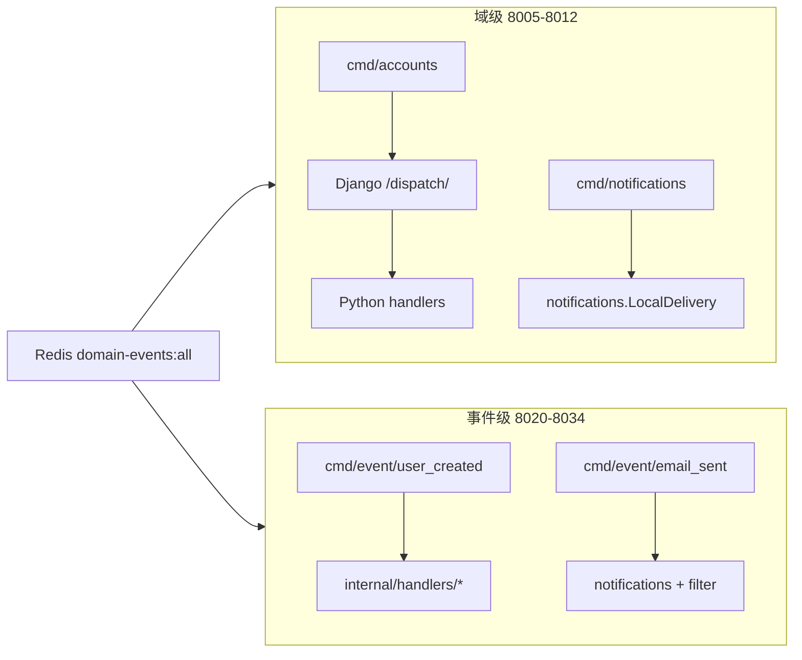

# taskEvents 域级 → 事件级处理对照核查

> 日期：2026-06-01  
> 状态：**核查完成 — 事件类型 100% 覆盖；2 项行为缺口**  
> 触发：用户要求确认「所有域级处理在事件级均有对应」  
> 关联：cmd-layout-design、relocation-design v3.1、G4.5 runbook

---

## 1. 核查结论（摘要）

| 维度 | 结果 |
|------|------|
| **event_type 覆盖** | ✅ **15/15** 域级订阅的事件类型，均有独立事件级二进制 + Handler |
| **域级进程可删** | ✅ 6 个域级 consumer 的并集 = 15 个唯一 event_type，无遗漏 |
| **行为等价** | ⚠️ **13/15 完整或更优**；**2/15 部分实现**（cloud 相关，见 §4） |
| **重复订阅** | ⚠️ `USER_ACTIVATED` 曾同时出现在 accounts + notifications 域级 — 事件级 **合并为单一** `user_activated`（正确） |

**结论**：从「该谁消费哪个 event_type」角度，**可以删除域级**；删除前须知晓 cloud 两事件的已知缺口。

---

## 2. 域级 vs 事件级：执行路径



| 域级进程 | 执行路径 | 事件级替代 |
|----------|----------|------------|
| accounts, projects, cloud, billing, realtime | Go consumer → **HTTP** → Python | 各 event → **Go Handler 本地** |
| notifications | Go consumer → **LocalDelivery**（已是 Go） | 拆为 email_sent / invitation_created / user_activated |

---

## 3. 事件类型对照矩阵

### 3.1 按域级 consumer 展开

| 域级进程 | 端口 | event_type | 事件级 slug | 端口 | Go Handler | Python handler 状态 |
|----------|------|------------|-------------|------|------------|---------------------|
| **accounts** | 8005 | USER_CREATED | user_created | 8025 | usercreated | `0_create_company` **active** |
| accounts | | COMPANY_CREATED | company_created | 8026 | companycreated（三步链） | `1/2/3_*` **active** |
| accounts | | USER_ACTIVATED | user_activated | 8024 | notifications.LocalDelivery | **inactive**（域级实为 noop） |
| **projects** | 8006 | WORKSPACE_CREATED | workspace_created | 8027 | workspacecreated | **active** |
| projects | | PROJECT_UPDATED | project_updated | 8028 | projectupdated | **active** |
| projects | | TASK_COMPLETED | task_completed | 8029 | taskcompleted | **active** |
| projects | | AI_ASSISTANT_REPLY_COMPLETED | ai_assistant_reply_completed | 8030 | aiassistant | **active** |
| **cloud** | 8007 | CLOUD_SERVER_STARTED | cloud_server_started | 8031 | cloudserverstarted | **active** |
| cloud | | CLOUD_SERVER_STOPPED | cloud_server_stopped | 8032 | cloudserverstopped | **active** |
| cloud | | CLOUD_SERVER_START_AUTO | cloud_server_start_auto | 8033 | cloudserverstartauto | **active**（auto_create 缺口） |
| cloud | | CLOUD_PLATFORM_AUTHORIZATION_CREATED | cloud_platform_authorization_created | 8034 | cloudplatformauth | **active** |
| **realtime** | 8008 | SSE_MESSAGE | sse_message | 8021 | sse | **active** |
| **billing** | 8009 | BILLING_TRANSACTION_CREATED | billing_transaction_created | 8020 | billing | **active** |
| **notifications** | 8012 | EMAIL_SENT | email_sent | 8022 | notifications.LocalDelivery | **inactive**（Go 已实现） |
| notifications | | INVITATION_CREATED | invitation_created | 8023 | notifications.LocalDelivery | **inactive** |
| notifications | | USER_ACTIVATED | user_activated | 8024 | notifications.LocalDelivery | **inactive** |

**统计**：6 域级进程共 **16 条** event 订阅（含重复），去重后 **15** 个 event_type ↔ **15** 个事件二进制 **1:1**。

### 3.2 反向核查：事件级是否多出域级未覆盖项？

| 事件级 slug | 是否在域级并集中 |
|-------------|------------------|
| 全部 15 个 | ✅ 均在 |

无「孤儿」事件级二进制。

---

## 4. 行为等价缺口（非缺失二进制）

以下 event_type **有二进制**，但与 Python **active** handler 行为未完全对齐：

| event_type | 缺口 | 域级原行为 | 事件级现状 | 门禁 |
|------------|------|------------|------------|------|
| **CLOUD_SERVER_START_AUTO** | `auto_create_vpc/vswitch/security_group` | Python `auto_create_resources.py` | 未实现；需预填 vpc/sg/vswitch 或返回 permanent error | G4.5 可 **documented skip** |
| **CLOUD_SERVER_STARTED** | ECS 启动完整度 | Python 完整 `start_aliyun_vm` | 最小 RunInstances + DB + SSE | G4.5 沙箱/mock 验收 |

### 4.1 无需事件级对应的 inactive Python handler

| Python 路径 | 说明 |
|-------------|------|
| `user_created/1_send_welcome_email.inactive.py` | 注册欢迎信，从未 active |
| `email_sent/1_send_email.inactive.py` | 由 notifications 域级 Go 已替代；事件级 email_sent 已实现 |
| `invitation_created/1_send_invitation_email.inactive.py` | 同上 |
| `user_activated/1_send_welcome_notification.inactive.py` | 同上；事件级 user_activated 已实现 |

---

## 5. 特殊案例：USER_ACTIVATED 双域订阅

```
域级 accounts (8005)     ── USER_ACTIVATED ──► Django dispatch ──► handler .inactive →  noop
域级 notifications (8012) ── USER_ACTIVATED ──► LocalDelivery ──► 欢迎邮件/短信
事件级 user_activated (8024) ── USER_ACTIVATED ──► LocalDelivery（同 notifications 逻辑）
```

**删除域级后**：仅保留 `user_activated` 单 consumer，**消除双订阅歧义**，与设计 v3「唯一 USER_ACTIVATED 消费者」一致。

---

## 6. notifications 域级 → 三事件拆分

| 域级 notifications（单进程 3 事件） | 事件级 |
|-----------------------------------|--------|
| `consumer.RunWithDelivery(..., delivery)` | 3 个 `eventbin.Run` + `filter.SingleEvent` |
| 共享 `notifications.LocalDelivery` | **同一** LocalDelivery，按 event_type 过滤 |

**逻辑未丢失**，仅进程边界从 1→3。

---

## 7. 领域概念清单

| 类型 | 说明 |
|------|------|
| **Bounded Context** | 领域事件消费；notifications 从域级并入单事件进程 |
| **Entity** | EventConsumer（15 实例）；LegacyDomainConsumer（6 实例，可删） |
| **Aggregate** | PerEventDeployment = cmd + bin + handler |
| **Domain Event** | 15 种 event_type，域级并集 = 事件级全集 |

---

## 8. 价值流影响（value-stream.yaml）

**流**：`domain-events-consumer-split`

| 维度 | 影响 |
|------|------|
| 步骤 | 域级 increment（`task-events-accounts.health` 等）→ 迁移为事件级 health 字段 |
| 测试 | `test_task_events_*_dispatch.py` 测 Django dispatch；G5 后改 Redis 注入或依赖 Go integration |
| 字段 | `task-events-accounts.health.status` 等 **废弃**；改为 `task-events-user-created.health.status` 等（step 3 价值流时更新 YAML） |
| 新 step | 不需要新 event_type；可选增加「事件级 health 矩阵」step |

---

## 9. 与 cmd 整理决策的关系

用户已确认：**不应再有域级**。

本核查支持该决策：

1. ✅ 15 个 event_type 均有事件级 Handler  
2. ✅ 无域级独有 event_type  
3. ⚠️ 删除域级前在 runbook 标注 cloud 两事件缺口  
4. ✅ `USER_ACTIVATED` 双域问题由单事件级进程解决  

**建议下一步**：实施 cmd-layout-design（扁平 `cmd/{slug}` + 删除 6 域级目录），与 G5 Python handler 删除同批或紧接 G4.5 签字后。

---

## 10. 待确认

1. **cloud 两缺口**是否接受「G5 删除域级 + 文档 skip」，还是 **G5 前必须补全** auto_create？  
2. **inactive Python 欢迎信**（USER_CREATED 路径）是否永久不需要 Go 实现？
