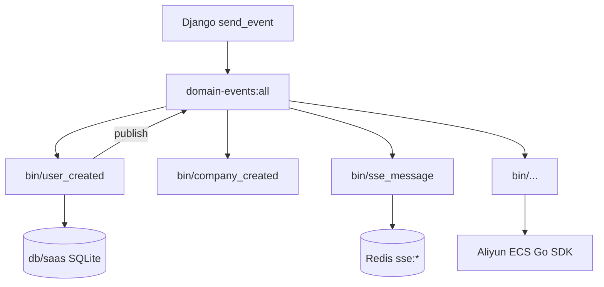

# taskEvents 领域事件 Handler Go 化迁移

> 日期：2026-06-01  
> 状态：**已完成（G5 + 端口 18020–18037）** — G0–G5 迁移闭环  
> 前置：`2026-05-28-taskkafka-consumer-split-design.md`  
> 取代：v1 Python 搬迁、v2 域级单进程 Delivery

---

## 1. 决策摘要（用户确认）

| # | 决策 |
|---|------|
| 1 | **运维布局**：`taskEvents/bin/{event}/` 含 **可执行文件 + 配置文件**；Go 包路径由实现者按惯例自行组织（如 `internal/handlers/…`） |
| 2 | **G2 USER_CREATED**：首版即 **纯 Go + SQLite repository**（不经 Django 窄 API） |
| 3 | **方案 A**：全 Go 重写，分阶段 G0–G5，终态 **无 Python handler** |
| 4 | **终态**：**完全删除** `Saas_project/core/kafka/handlers/` 及域级 Django `dispatch` + `load_handlers` |
| 5 | **部署模型**：**每个领域事件一个独立 Go 二进制**（非域级 `cmd/accounts` 等多事件进程） |

---

## 2. 目标架构

### 2.1 终态拓扑



- 每个二进制：**只订阅 1 个 `event_type`**，**独立 consumer group**、**独立 health 端口**。
- 业务逻辑在 Go 内完成（repository / SDK）；**不**回调 Django domain dispatch。
- Producer 仍为 Django；Go 侧需 **EventPublisher** 端口以链接式发事件（如 USER_CREATED → COMPANY_CREATED）。

### 2.2 运维目录（用户指定）

```
taskEvents/bin/
  user_created/
    config.yaml          # 本事件：port、groupId、enabled（可覆盖 port_config）
    README.md            # 事件说明、依赖、runAll 服务名
    task-events-user-created    # go build 产物（.gitignore）
  company_created/
    config.yaml
    task-events-company-created
  billing_transaction_created/
  sse_message/
  workspace_created/
  project_updated/
  task_completed/
  ai_assistant_reply_completed/
  cloud_server_started/
  cloud_server_stopped/
  cloud_server_start_auto/
  cloud_platform_authorization_created/
  email_sent/            # 自 notifications 拆分
  invitation_created/
  user_activated/        # 欢迎通知；与 accounts 域 USER_ACTIVATED noop 合并为此进程
  _template/             # 新事件脚手架（config + main 模板）
  README.md              # 事件索引表 + 端口段
```

**实现布局（智能体自选，不与运维目录混放）**：

```
taskEvents/
  cmd/event/{event}/main.go     # 薄入口：读 config → RunWithDelivery(单事件)
  bin/{event}/                  # 运维：config.yaml + 可执行文件（无源码）
  internal/handlers/{event}/    # Handle + 单元测试
  internal/repository/saas/     # SQLite（USER_CREATED、COMPANY_* 等共享）
  internal/publish/             # 回写 domain-events stream
  consumer/ config/ domain/     # 现有共享库
```

`cmd/accounts` 等 **域级 main** 在 G5 **删除**；过渡期可并存（feature flag）。

### 2.3 事件 → 二进制清单

| 目录名 | event_type | 现 Python handler | 阶段 | 备注 |
|--------|------------|-------------------|------|------|
| `user_created` | USER_CREATED | 0_create_company | G2 | 纯 Go SQLite；发 COMPANY_CREATED |
| `company_created` | COMPANY_CREATED | 1/2/3 顺序链 | G2 | 单二进制内串行三步 |
| `billing_transaction_created` | BILLING_TRANSACTION_CREATED | audit log | G1 | |
| `sse_message` | SSE_MESSAGE | Redis publish | G1 | 废弃 Django dict |
| `workspace_created` | WORKSPACE_CREATED | 多表默认 | G3 | |
| `project_updated` | PROJECT_UPDATED | | G3 | |
| `task_completed` | TASK_COMPLETED | | G3 | |
| `ai_assistant_reply_completed` | AI_ASSISTANT_REPLY_COMPLETED | | G3 | |
| `cloud_server_started` | CLOUD_SERVER_STARTED | 重型 | G4 | Go ECS SDK |
| `cloud_server_stopped` | CLOUD_SERVER_STOPPED | | G4 | |
| `cloud_server_start_auto` | CLOUD_SERVER_START_AUTO | | G4 | |
| `cloud_platform_authorization_created` | CLOUD_PLATFORM_AUTHORIZATION_CREATED | | G4 | |
| `email_sent` | EMAIL_SENT | inactive | G1′ | 自 `cmd/notifications` 拆出 |
| `invitation_created` | INVITATION_CREATED | inactive | G1′ | 同上 |
| `user_activated` | USER_ACTIVATED | inactive | G1′ | 欢迎信；**唯一** USER_ACTIVATED 消费者 |

**约 15 个进程**（原 6 域级 + notifications 拆 3）。

---

## 3. 配置与 runAll

### 3.1 port_config 演进

**终态**：`domainEvents.consumers` 由 **域级** 改为 **事件级**（或新增并列段）：

```json
"domainEvents": {
  "consumers": {
    "user_created": {
      "enabled": true,
      "host": "127.0.0.1",
      "port": 8020,
      "groupId": "task-events-user-created",
      "events": ["USER_CREATED"]
    },
    "company_created": {
      "port": 8021,
      "groupId": "task-events-company-created",
      "events": ["COMPANY_CREATED"]
    }
  }
}
```

- 端口建议：**8020–8049** 事件消费者；保留 8005–8012 过渡或 G5 释放。
- `bin/{event}/config.yaml`：**可选覆盖**（本地 dev）；默认 merge `port_config.json` 对应键。

### 3.2 runAll.yaml

- `domain-events` 组下列出 **15+** `task-events-{event}` 服务。
- 构建：`go build -o bin/user_created/task-events-user-created ./cmd/event/user_created`
- 启动：`./bin/user_created/task-events-user-created` 或统一 `run.sh start user_created`
- **G0–G4**：新旧进程勿双消费同一 event（切换日 stop 域级、启事件级）。

### 3.3 单事件 consumer 入口（模式）

```go
// cmd/event/user_created/main.go
func main() {
    event := "USER_CREATED"
    cfg, root, _ := config.LoadEvent(event) // 读 port_config + bin/config.yaml
    h := usercreated.NewHandler(usercreated.Deps{DB: saasrepo.Open(root), Publisher: publish.New(cfg)})
    consumer.RunWithDelivery("user-created", cfg, cfg.ForEvent(event), h, usercreated.IdempotencyKey)
}
```

---

## 4. G2 USER_CREATED（纯 Go + SQLite）

### 4.1 行为等价（相对 Python）

1. 校验 `user_id`、`username`
2. 若 creator 已有 Company → skip
3. `INSERT` Company（name=username, creator_id）
4. `INSERT` CompanyMember（is_admin=true）
5. **Publish** `COMPANY_CREATED`（payload 对齐现 Django）

### 4.2 Repository

- 库路径：`dbload.ResolveDatabasePath("saas", monorepoRoot)`（与 taskAuth 先例一致）
- 表：`accounts_user`、`accounts_company`、`accounts_companymember`（字段以 Django migration 为准）
- **不写** Django ORM；契约测试对比 Python 集成测试期望

### 4.3 出站事件

- 新增 `internal/publish/redis_stream.go`：`Publish(eventType, data, key)` 写入 `domain-events:all`
- USER_CREATED 成功后发 COMPANY_CREATED（与现链式事件一致）

### 4.4 验收

- `taskEvents/internal/handlers/usercreated/*_test.go`（sqlite :memory: 或 temp file）
- 回归：`test_task_events_internal_user_created` 行为改为 **端到端**：register → stream → **仅** `task-events-user-created` 消费 → DB 有 Company
- 切换时 **stop** `task-events-accounts`

---

## 5. 分阶段迁移 G0–G5

| 阶段 | 交付 | 验收 |
|------|------|------|
| **G0** | `bin/_template`、config 加载、`RunWithDelivery` 单事件模式、run.sh `build\|start\|stop {event}` | 样板二进制 health OK |
| **G1** | `billing_transaction_created`、`sse_message` 二进制 + 下线 Python | billing + realtime 测试 |
| **G1′** | 拆分 notifications → `email_sent`、`invitation_created`、`user_activated` 三二进制；删 `cmd/notifications` | notifications 测试迁路径 |
| **G2** | `user_created`、`company_created` 纯 Go SQLite | user-created E2E；company 默认体系 |
| **G3** | projects 四事件二进制 | projects dispatch 测试迁 Go |
| **G4** | cloud 四事件 + `sdk/ecs-20140526` | 云单元测试 + mock ECS；**不**作为 G5 门禁 |
| **G4.5 E2E 验证** | **切换门禁**：runAll 仅启事件级二进制、停域级 `cmd/*`；无 Python handler 参与消费 | 见 §5.1；**全绿前禁止 G5** |
| **G5** | 删 `core/kafka/handlers/`、`handler_loader` 消费路径、域级 `cmd/*`、Django `task_events/*/dispatch` | G4.5 通过后执行；runAll 仅事件级 |

**非目标**：方案 B（Django 窄 API 过渡）— **已否决**。

### 5.1 G4.5 — E2E 验证门禁（G5 前置条件）

> **现状说明**：G0–G4 已交付的是 **Go unit 测试**（`go test ./...`）与二进制骨架；**尚未**执行本阶段。先前「G5 建议 E2E 后再做」指的就是本阶段，但 v3 分阶段表未单独列出 — **v3.1 补全**。

**目标**：在 **不删 Python 代码** 的前提下，证明 15 个事件二进制可独立承担消费，行为与现网等价。

**切换方式（单事件逐步，避免双消费）**：

```text
对每个 event_slug:
  1. stop 域级进程（若其仍订阅该 event_type）
  2. start bin/{event_slug}
  3. 跑该事件验收集
  4. 记录通过 → 进入下一事件；失败 → 回滚启域级
```

**验收矩阵**：

| 优先级 | 事件 | 现有回归 | 新增/改造 |
|--------|------|----------|-----------|
| P0 | 注册链 | — | Playwright 注册 → 仅 `user_created`+`company_created`+`workspace_created` 消费 → DB/工作空间 |
| P0 | USER_CREATED | `test_task_events_internal_user_created.py` | 改断言路径：Redis XADD → 事件二进制（非 Django dispatch URL） |
| P1 | billing / sse | `test_task_events_billing_dispatch.py`, `test_task_events_realtime_sse.py` | 同上，对 `billing_transaction_created`、`sse_message` |
| P1 | notifications ×3 | Playwright `EMAIL_SENT` 等 | 对 `email_sent`、`invitation_created`、`user_activated` |
| P2 | projects ×4 | `test_task_events_projects_dispatch.py` | 拆分或重写为 per-event Redis 注入 |
| P2 | cloud ×4 | `test_task_events_cloud_dispatch.py`, 云探针 E2E | mock ECS / 沙箱 AK；`start_auto` auto_create 缺口单独标 `skip` |
| 横切 | 15 进程 health | `test_task_events_accounts_health.py` 等 | 扩展为 `8020–8034` per-event health |

**Go 侧补充（G4.5 实施项，非 G4 已完成项）**：

- `taskEvents/.../*_integration_test.go`（build tag `integration`）：Redis XADD → 单事件二进制消费 → 断言 DB/Redis
- `runAll.yaml`：`domain-events` 组改为 15 个 `task-events-{slug}` 服务（域级 six 标记 `deprecated`）
- 切换 runbook：`docs/superpowers/plans/2026-06-01-taskevents-handlers-go-e2e-runbook.md`

**通过标准（G5 解锁条件）**：

1. P0 + P1 全绿（cloud P2 允许 documented skip）
2. runAll `./run.sh status all` 15 事件进程 running、6 域级 stopped
3. 无双消费（同一 `event_type` 仅一个 consumer group 在跑）
4. `go test -tags=integration ./...` 绿（或 CI job 等价）

**未通过则**：不得执行 G5 删除；可保留 Python handlers 作对照回滚。

---

## 6. 领域概念（/5-ddd 输入）

| 上下文 | 事件 | 二进制 | Aggregate / 表 |
|--------|------|--------|----------------|
| 账户/组织 | USER_CREATED | bin/user_created | User, Company, CompanyMember |
| 组织初始化 | COMPANY_CREATED | bin/company_created | DeliverableSystem 关联、Progress、Workspace |
| 项目 | WORKSPACE_CREATED, … | bin/workspace_created, … | Workspace, WorkspaceAccess |
| 云 | CLOUD_SERVER_* | bin/cloud_* | CloudServerEvent |
| 计费 | BILLING_TRANSACTION_CREATED | bin/billing_* | （日志） |
| 实时 | SSE_MESSAGE | bin/sse_message | — |
| 通知 | EMAIL_SENT, … | bin/email_sent, … | 已完成逻辑，仅拆进程 |

---

## 7. 价值流影响

| Stream | 影响 |
|--------|------|
| message-queue-kafka-to-redis | 消费者由 6 域进程 → **~15 事件进程**；health 字段改为 per-event |
| user-auth | G2 前保持旧 accounts 消费；G2 切换 `user_created` 二进制 |
| 云平台与资源 | G4；独立里程碑 |

**value-stream 后续**（`/3-value-stream`）建议 per-event step，例如：

```yaml
- name: taskevents-bin-user-created
  status: planned
  test_file: taskEvents/internal/handlers/usercreated/handler_test.go
  fields:
    - name: task-events-user-created.health.status
      description: bin/user_created 进程健康
    - name: saas-backend.accounts_company.name
      description: USER_CREATED 后创建的公司名
```

---

## 8. 风险与缓解

| 风险 | 缓解 |
|------|------|
| **进程数增多**（~15） | runAll 分组启停；`bin/README` 索引；dev 可 `enabled:false` 非关键事件 |
| 双消费（迁移期） | **G4.5 runbook**：单事件切换；G5 前必须完成 G4.5 |
| Go/SQLite 与 Django ORM drift | repository 契约测试 + 共享 `db/registry.yaml` |
| COMPANY_CREATED 链 | 单二进制内 Chain，非 3 进程 |
| USER_ACTIVATED 双订阅 | 仅 `bin/user_activated`；从 accounts 配置移除 |
| 端口耗尽 | 8020–8049 段；document 在 port_config.json.md |

---

## 9. 测试策略

| 层级 | 说明 | 阶段 |
|------|------|------|
| Go unit | `internal/handlers/{event}/*_test.go` | G0–G4 ✅ 已做 |
| Go integration | 单事件二进制 + Redis XADD（tag `integration`） | **G4.5 待做** |
| 契约 | USER_CREATED / COMPANY_CREATED 对照 Django pytest 快照 | G4.5 |
| E2E / 回归 | 上表 P0–P2；Playwright 注册链；云探针 | **G4.5 门禁** |
| 删除后 smoke | 全 runAll 事件级 + 无 `core/kafka/handlers` | G5 |

---

## 10. 终态删除清单（G5）

- `task2app/Saas_project/core/kafka/handlers/` **整目录**
- `core/kafka/handler_loader.py` 对生产路径的依赖（测试 mock 可留 stub）
- `core/task_events/dispatch.py` + `accounts|projects|cloud|billing urls_task_events_internal`
- `taskEvents/cmd/{accounts,projects,cloud,realtime,billing,notifications}/`（由 `bin/{event}/` 取代）
- `port_config.domainEvents.consumers` 域级键（accounts、projects…）
- `KAFKA_HANDLERS_DIR` / `paths.conf` 中 handlers 路径

**保留**：Django `send_event` Producer；`DOMAIN_EVENTS.md` 更新为事件级进程表。

---

## 11. 下一步

1. **`/6-plans`** — 产出 **G4.5 E2E** 可勾选清单（runbook + integration 测试 + runAll 切换）
2. **执行 G4.5** — P0 注册链 → P1 billing/sse/notifications → P2 projects/cloud
3. **G5** — 仅当 G4.5 四门通过（§5.1）后删除 Python handlers

---

## 12. 修订记录

| 日期 | 说明 |
|------|------|
| 2026-06-01 | v1：Python 搬迁 |
| 2026-06-01 | v2：Go 域级 Delivery |
| 2026-06-01 | **v3.1：补 G4.5 E2E 验证门禁；澄清 G0–G4 仅 unit，G5 blocked until G4.5** |
