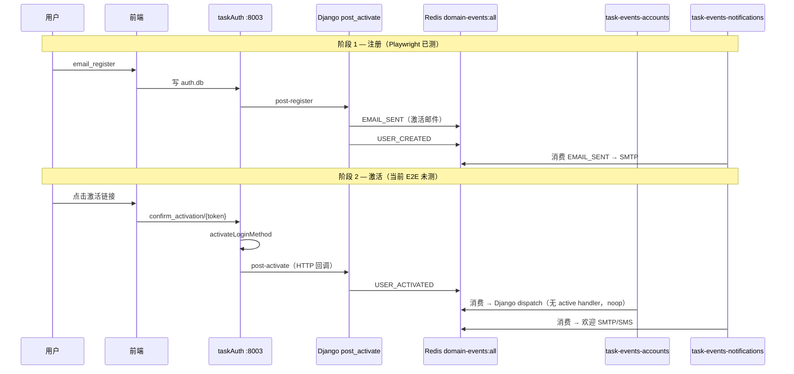

# USER_ACTIVATED「缺失」根因分析

> 日期：2026-06-01  
> 状态：待确认  
> 触发：代码审查指出 notifications 域缺少 `USER_ACTIVATED` 相关测试；需澄清「缺失」指什么、根因何在、如何补齐。

---

## 1. 问题陈述

「缺失 USER_ACTIVATED」在对话中可能指以下 **四种不同现象**，需先对齐语义：

| # | 现象 | 是否属实 |
|---|------|----------|
| A | Go `notifications` 包没有 `USER_ACTIVATED` 单测 | **是** |
| B | 注册 Playwright E2E 在 Redis 里看不到 `USER_ACTIVATED` | **预期行为**（注册阶段只发 `EMAIL_SENT`） |
| C | 用户激活后欢迎邮件/短信未送达 | **需单独验证**（依赖 notifications 进程 + `post_activate` 回调） |
| D | `task-events-accounts` 消费 `USER_ACTIVATED` 后 Django 无 handler | **是（设计如此）** — 欢迎通知已迁到 Go |

**结论**：运行时 **`USER_ACTIVATED` 事件与 Go handler 均已实现**；「缺失」主要是 **测试覆盖、观测路径、与 taskAuth 生产链路的验证缺口**，而非事件类型未订阅或未编码。

---

## 2. 当前链路（As-Is）

### 2.1 事件生命周期



### 2.2 代码锚点

| 环节 | 位置 | 说明 |
|------|------|------|
| 发布（taskAuth 路径） | `taskAuth/src/handlers.go` → `djangoPostActivate` | 生产主路径 |
| 发布（Django 直连） | `accounts/views/user_views.py` `confirm_activation` | taskAuth 关闭时 |
| 发布（internal） | `accounts/taskauth_internal_views.py` `post_activate` | 实际 `send_event('USER_ACTIVATED', …)` |
| Go 消费 | `taskEvents/notifications/delivery.go` `handleUserActivated` | 欢迎邮件/短信 |
| 配置 | `port_config.json` → `domainEvents.consumers.notifications.events` | 含 `USER_ACTIVATED` |
| Django 欢迎 handler | `core/kafka/handlers/user_activated/*.inactive.py` | **已停用**（迁 Go 后故意 inactive） |

### 2.3 与注册邮件的分工

| 时机 | 事件 | 用户收到 |
|------|------|----------|
| 注册完成 | `EMAIL_SENT` | **激活链接**邮件 |
| 点击链接激活成功 | `USER_ACTIVATED` | **欢迎**邮件/短信 |

因此 Playwright `AuthRegister.activation-email` **只断言 `EMAIL_SENT` 是正确范围**；在该用例里「看不到 `USER_ACTIVATED`」不是 bug。

---

## 3. 根因分析

### 3.1 根因 1 — 测试切片未完成（审查所指）

设计文档切片 **8.3** 要求：

- 实现 `handleUserActivated` ✅  
- 测试对齐 `test_user_activation_welcome_event.py` 语义 ❌ **未做 Go 侧**

现有测试分布：

| 测试 | 覆盖 |
|------|------|
| `tests/test_user_activation_welcome_event.py` | Django `UserViewSet.confirm_activation` **发布**事件 |
| `notifications/delivery_test.go` | `EMAIL_SENT`、`INVITATION_CREATED` only |
| Playwright activation-email | 注册 + `EMAIL_SENT` in stream |

**为何漏测**：迁移按切片 8.1 优先打通注册激活（`EMAIL_SENT`）；8.3 实现已合并但 **TDD 红→绿未执行**，审查时表现为「USER_ACTIVATED 缺失」。

### 3.2 根因 2 — 生产路径与单元测试路径不一致

`test_user_activation_welcome_event.py` 直接调用 Django ViewSet，**不经过 taskAuth**。

生产环境（`TASKAUTH_ENABLED=true`）路径：

```
confirm_activation → delegate → taskAuth → djangoPostActivate → post_activate → send_event
```

**风险点**（`taskAuth/src/handlers.go:114`）：

```go
_ = djangoPostActivate(lm.ObjectID, lm.MethodType, lm.Identifier)
```

`post_activate` 失败被 **静默忽略**，用户仍看到「激活成功」，但 Redis **不会出现 `USER_ACTIVATED`**。  
这在 stream 观测上会表现为「USER_ACTIVATED 缺失」，根因是 **回调失败未上报**，而非 notifications 未订阅。

### 3.3 根因 3 — 欢迎通知职责迁移后的「双消费 noop」

| 消费者 | `USER_ACTIVATED` 行为 |
|--------|------------------------|
| `task-events-accounts` | HTTP → Django dispatch → **无 active handler**（noop） |
| `task-events-notifications` | Go `handleUserActivated` → SMTP/SMS |

Saas_email 时代欢迎信由 **邮件进程** 处理；迁移后必须由 **notifications 进程运行** 才会发欢迎信。  
若只启 accounts、未启 notifications，stream 里可能有事件但 **无出站** — 易被误判为「USER_ACTIVATED 没用」。

### 3.4 根因 4 — 价值流字段未覆盖投递

`value-stream.yaml` 中 `user-activation-event`：

- `test_file`: `test_user_activation_welcome_event.py` — 只验 **发布**
- `fields`: 仅 `saas-backend.accounts_user.is_active`
- **无** `task-events-notifications.*` 投递字段

与 notifications 迁移设计 §6.2 建议的 `notifications-go-delivery` step 仍为 **planned**，未激活端到端门禁。

---

## 4. 领域概念清单（供 /5-ddd）

| 概念 | 说明 |
|------|------|
| **Bounded Context** | 身份认证（taskAuth + accounts）、出站通知（notifications） |
| **Domain Event** | `USER_ACTIVATED` — 用户登录方式已验证、账号可用 |
| **Aggregate** | `LoginMethod`（激活状态）、`User`（is_active） |
| **职责边界** | 激活 **状态变更** 在 taskAuth；**事件发布** 在 Django `post_activate`；**欢迎通知** 在 notifications（非 accounts dispatch） |

**无需修改领域模型**；缺口在集成测试与可靠性，不在聚合边界。

---

## 5. 价值流影响

| Stream | Step | 当前 | 建议 |
|--------|------|------|------|
| user-auth | `user-activation-event` | 只验 Django 发布 | 增加 taskAuth 桥接测试；fields 增加 notifications 投递 |
| user-auth | （新增）`user-activation-welcome-delivered` | planned | Go 单测 + 可选 Playwright 激活步骤 |
| notifications 迁移 | `notifications-go-delivery` | planned | 纳入 `USER_ACTIVATED` case |

---

## 6. 方案对比

### 方案 A — 仅补测试（推荐，最小增量）

| 项 | 内容 |
|----|------|
| Go | `delivery_test.go` 增加 `TestLocalDeliveryUserActivated`（email/phone/缺字段） |
| Django | `test_taskauth_post_activate_publishes_user_activated`（mock taskAuth → post_activate） |
| 可选 E2E | 新 Playwright：mock 激活 API 或端到端点链接 → 断言 stream 中 `USER_ACTIVATED` |
| 工作量 | 小 |
| 风险 | 不修复 taskAuth 静默吞错 |

### 方案 B — 测试 + taskAuth 可靠性（推荐合并上线）

在 A 基础上：

- `handleConfirmActivation`：`djangoPostActivate` 失败时打 error log；可选返回 502 或仍 200 但写 audit（产品决策）
- 至少 **结构化日志 + metrics**，避免「激活成功但无事件」

| 优点 | 消除生产 stream 真缺失 |
| 缺点 | 需定义失败 UX（用户已激活 vs 侧效应失败） |

### 方案 C — 合并 USER_ACTIVATED 到 EMAIL_SENT（不推荐）

注册激活邮件里附带欢迎语，取消 `USER_ACTIVATED` 欢迎。

| 优点 | 少一个事件 |
| 缺点 | 违背「注册 vs 激活」语义；手机注册路径不一致；与现有 value-stream 冲突 |

**推荐：方案 B（测试 + 可观测性）；若时间紧先 A，B 紧随其后。**

---

## 7. 验收标准

1. `go test ./notifications/...` 含 `USER_ACTIVATED` happy path + 参数校验。
2. Django/pytest 覆盖 `post_activate` 发布 payload（已有）+ **taskAuth 回调路径**（新增）。
3. `curl task-events-notifications:8012/api/health/` 仍列出 `USER_ACTIVATED`。
4. （可选）Playwright 或 integration：激活后 stream 出现 `USER_ACTIVATED` 且 notifications 日志有 `welcome email`。
5. value-stream 更新：`user-activation-event` 或新 step 引用 Go 测试文件。

---

## 8. 非目标

- 不重开 Django `user_activated` kafka handler（欢迎已归 Go）。
- 不改变 `USER_CREATED` vs `USER_ACTIVATED` 分工。
- 不在本增量实现 Aliyun SMS 生产签名（P2）。

---

## 9. 待确认

1. 「缺失 USER_ACTIVATED」主要指 **A 测试缺口**、**C 运行时未发事件**，还是 **欢迎信未送达**？
2. `djangoPostActivate` 失败时：返回 502（严格）还是 200 + 告警（宽松）？
3. 是否在本增量增加 **Playwright 激活步骤**（需可编程激活 token 或 test hook）？

---

## 10. 修订记录

| 日期 | 说明 |
|------|------|
| 2026-06-01 | 初版：根因分析 + 方案 A/B/C |
