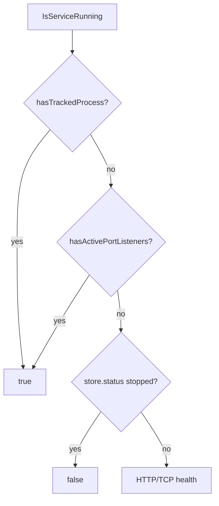

# runAll 基于端口的进程存活检测与停服兜底设计

**日期:** 2026-06-03  
**状态:** 已实现  
**范围:** `runAll` — `lsof` 端口 LISTEN 探活 + 停服阶梯

## 决策记录

| 能力 | 结论 |
|------|------|
| **探活：`IsServiceRunning` + `lsof`** | 本期（方案 A） |
| **停服：`stop_command` → 端口 SIGTERM → `kill -9`** | 本期（用户确认兜底） |
| 只改 `taskEvents/run.sh` 退出码 | 延期可选 |

---

## 背景与问题

### 已确认根因（2026-06-03 调查）

| 现象 | 根因 |
|------|------|
| UI 显示 `stopped`，`ps` 仍有 `task-events-*` | detach 启动，消费者 PPID=1 |
| 开发清库 / 状态判断认为已停 | `IsServiceRunning` 在 `status==stopped` 时**直接返回 false**，不查端口 |
| 再次点「关闭」无效 | `stopService` 对 `stopped` early return，且未查端口（**已修复**） |

### 本期目标

以 `resolveServicePorts` + **`lsof -iTCP:<port> -sTCP:LISTEN`** 作为「进程仍占用服务端口」的判定依据，修正 `IsServiceRunning`，使：

- **开发「清空数据库」** 在端口仍监听时识别为仍在运行并继续尝试 `stopServiceForDevDatabaseClear`
- **`RunningApplicationsExcept`** 列表包含「store=stopped 但端口仍开」的僵尸服务
- 与 HTTP health 探活解耦（health 不可达 ≠ 端口无监听）
- **停服阶梯**：`stop_command` → `stopProcess` → 端口 SIGTERM → **SIGKILL**
- **`stopped` 且端口仍监听** 时继续停服（幂等）；API 暴露 `listen_port_active`

### 本期非目标

- 修改 `taskEvents/run.sh` 非零退出码（可选二期）
- `/api/status` reconcile 探活超时（另 spec）
- 远程主机上的进程清理（仅本机 `lsof`）

---

## 领域概念清单（供 `/5-ddd` 引用）

| 类型 | 名称 | 职责 |
|------|------|------|
| 值对象 | `ServiceListenPort` | 从 health_check / command 解析的端口 |
| 领域服务 | `PortListenerProbe` | `listenerPIDs(port)` → 是否有 LISTEN |
| 聚合辅助 | `ManagedServiceRuntime` | store.status 与端口实况可对齐查询 |

（`ServiceStopEscalation` 留待二期 B。）

---

## 价值流影响

**受影响 stream:** `runall-cascade-lifecycle`

| 步骤 | 本期影响 |
|------|----------|
| `runall-global-start-stop-all`（planned） | `IsServiceRunning` 更准确，清库前停服循环少漏 |
| `runall-stop-cascade*` | 仅间接：下游若 stopped+端口开，依赖方 `EvaluateStop` 行为不变；清库路径受益 |

**本期字段（三步命名）:**

```yaml
- name: saas-backend.runtime.listen_port_active
  description: lsof 在服务配置端口上检测到 TCP LISTEN（与 store.status 独立）
```

`stop_escalation_level` **本期不引入**。

**测试:**

- `runAll/src/runner_dev_database_running_test.go` — 扩展 stopped + 端口监听 → `IsServiceRunning == true`
- `runAll/src/runner_test.go` — 复用 `listenerPIDs` 假注入，避免真起进程

---

## 详细设计（方案 A）

### 1. 新增 `hasActivePortListeners(svc *Service) bool`

```text
ports := resolveServicePorts(svc)   // 已有：health URL / TCP / command
for port in ports:
  if pids, _ := listenerPIDs(port); len(pids) > 0:
    return true
return false
```

- 复用现有 `listenerPIDs`（内部 `lsof -t -iTCP:port -sTCP:LISTEN`）
- 无端口可解析 → 返回 false（与现网一致，不猜测）

### 2. 修订 `IsServiceRunning(name string) bool`

```text
if hasTrackedProcess(name) → true
svc := findService(name)
if svc != nil && hasActivePortListeners(svc) → true   // 新增，且优先于 store.status

st := store.Get(name)
if st == nil || st.Status == StatusStopped → false
if svc == nil → st.Status != StatusStopped
return isServiceReachable(svc)   // 保留 HTTP/TCP 探活兜底
```

**关键行为变化:**

| store.status | 端口 LISTEN | 旧 `IsServiceRunning` | 新 |
|--------------|-------------|----------------------|-----|
| stopped | 有 | false | **true** |
| stopped | 无 | false | false |
| failed | 有 | 可能 false（health 失败） | **true** |
| healthy | 无 | false | false |

### 3. 调用方（无需改签名，行为自动传播）

| 调用点 | 效果 |
|--------|------|
| `RunningApplicationsExcept` | 清库前列出僵尸 task-events |
| `stopServiceForDevDatabaseClear` 多轮循环 | 对「stopped+端口开」服务仍会进入 stop（**若** `stopService` 未 early return） |

**注意:** `stopService` / `stopServiceForDevDatabaseClear` 在 `status==stopped` 时仍 **立即 return**，故清库对已是 `stopped` 的僵尸**仍可能杀不掉**。本期仅保证 **识别** 为 running；若清库需杀 stopped 僵尸，须在二期改 stop early return 或清库专用路径调用 `terminateListenersByPort`。

**停服兜底（用户确认，与探活同期实现）:**

凡需真正释放进程的路径（含 `stopService`、`stopServiceForDevDatabaseClear`），在 `hasActivePortListeners` 仍为 true 时：

```text
1. runStopCommandIfConfigured（如 bash run.sh stop）
2. stopProcess（tracked 包装进程）
3. terminateListenersByPort：SIGTERM → 短等待 → SIGKILL（kill -9）
4. 仍监听 → failed；否则 → stopped
```

`status==stopped` 但端口仍监听 → **不 early return**，执行上述阶梯（幂等）。

UI `/api/stop` 与 dev-db 清库共用该逻辑，与 `IsServiceRunning` 端口判定一致。

### 4. UI / status API（可选增强）

- `buildStatusPayload` 可增加 `listen_port_active: true` 供前端展示「端口仍占用」提示（**可选**，非阻塞本期）
- 不改 `status.html` 按钮逻辑（仍为 store.status 驱动 启动/关闭）

### 5. 边界情况

| 情况 | 行为 |
|------|------|
| 无端口配置 | 不启用端口检测，回退 tracked + health |
| 多端口任一 LISTEN | running |
| Docker 映射端口 | 以 YAML 解析端口为准 |
| 端口被其他进程占用 | 可能误判为 running（task-events 一端口一进程，风险低） |

### 6. 测试计划

| 用例 | 断言 |
|------|------|
| store=stopped，假 listener 有 PID | `IsServiceRunning` true |
| store=stopped，无 listener | false |
| store=healthy，有 listener | true |
| `RunningApplicationsExcept` 含 stopped+端口开 服务名 | 列表包含该服务 |

### 7. 验收标准（方案 A）

1. `go test ./runAll/src/... -run 'IsServiceRunning|RunningApplications|DevDatabase'` 通过  
2. 手工：某 `task-events-*` 为 stopped 且 `lsof -iTCP:18022 -sTCP:LISTEN` 有输出 → `RunningApplicationsExcept([])` 包含该服务名  
3. **不验收** UI 关闭后 `ps` 为空（属二期 B）

---

## 架构（只读探活）



---

## 二期（方案 B，未纳入本期）

- `stopService` 去掉裸 `stopped` early return；`stop_command` → 端口 SIGTERM → **kill -9**
- UI 再次「关闭」可清理孤儿进程
- 详见本文历史版本或另开 `2026-xx-xx-runall-stop-escalation-design.md`

---

## 相关文档

- `docs/superpowers/specs/2026-05-27-runall-cascade-failed-downstream-stop-design.md`
- `runAll/src/runner.go` — `IsServiceRunning`、`listenerPIDs`、`resolveServicePorts`
