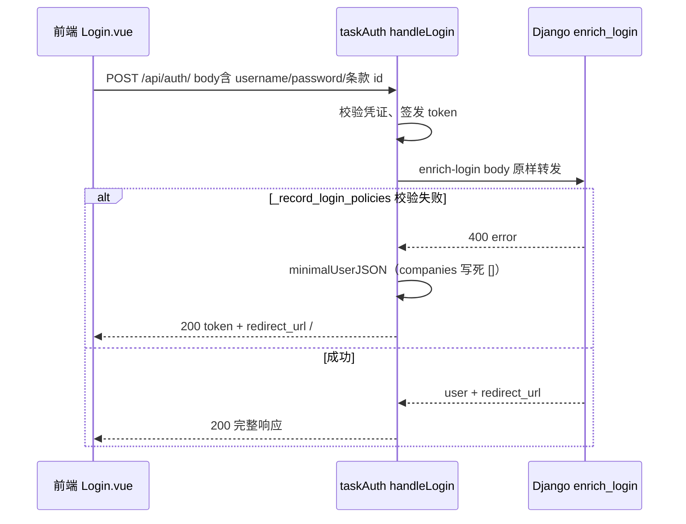

# 设计：修复 enrich-login 失败后的 taskAuth 兜底登录响应

**日期**：2026-06-04  
**状态**：已实现（方案 A）  
**问题**：邮箱/密码经 taskAuth 登录时，Django `enrich-login` 返回 4xx（条款校验）后，taskAuth 仍返回 HTTP 200，且 `user.companies: []`、`redirect_url: /`，与真实 SaaS 状态（已有 CompanyMember）不一致。

---

## 1. 背景与根因（已核实）

### 1.1 现象

| 路径 | 结果 |
|------|------|
| `POST /api/auth/`（taskAuth） | 200，`companies: []`，`redirect_url: /` |
| `POST /api/internal/taskauth/enrich-login/`（直连 Django，无条款 id） | 400，隐私条款校验错误 |
| 同上（带正确 `accepted_privacy_policy_id` / `accepted_license_agreement_id`） | 200，`companies: [...]`，`redirect_url: /projects/` |

### 1.2 因果链



### 1.3 根因分解（两个独立缺陷）

**缺陷 A — Django：`_record_login_policies` 过于严格**

- 位置：`accounts/taskauth_internal_views._record_login_policies`
- 每次登录都调用 `validate_accepted_privacy_policy_id(body.get(...))` / `validate_accepted_license_agreement_id(...)`，**要求请求体 id 与当前生效版完全一致**。
- 未使用已有能力：`privacy_policy.services.user_has_consent_for_policy`、`license_agreement.services.user_has_consent_for_agreement`（注册/历史登录已落库同意记录时仍强制校验 body）。
- body 中 id 为空字符串、加载竞态、或勾选与后端当前版不一致时 → `ValidationError` → `enrich_login` 返回 400。

**缺陷 B — taskAuth：enrich 失败时「假成功」兜底**

- 位置：`taskAuth/src/auth_login.go` 119–131 行
- `status >= 400` 时仍 `writeJSON(200)`，使用 `minimalUserJSON`（`companies: []`）和硬编码 `redirect_url: /`。
- 掩盖 Django 业务错误，前端无法展示条款错误，用户误以为已正常登录。

### 1.4 已排除的误判

- **USER_CREATED / task-events 未消费**：该用户 Redis 流已有 `COMPANY_CREATED`，`accounts_company` / `accounts_company_member` 已写入 `db/saas/saas.sqlite3`。
- **MQ 未连接**：本机 `18025` readiness `mq_connected: true`。

---

## 2. 目标与非目标

### 2.1 目标

1. 邮箱/密码登录成功后，客户端收到的 `user.companies` 与 `redirect_url` 与 Django `serialize_principal_for_login` + `_login_redirect_url` 一致。
2. 条款校验失败时，客户端收到**可识别的错误**（4xx + 结构化 message），而不是 200 假成功。
3. 已同意当前生效版隐私/许可的用户再次登录时，**不强制**重复提交 checkbox id（幂等、与注册同意记录一致）。

### 2.2 非目标

- 不改 task-events 消费链路。
- 不重构整条登录到 taskAuth 的架构（Inc-6 边界保持）。
- 不在本需求内修复 profile 403 / APISIX forward-auth（另案）。

---

## 3. 领域概念清单（供 `/5-ddd`）

| 类型 | 候选 |
|------|------|
| 限界上下文 | **用户与认证**（taskAuth + enrich-login）、**合规同意**（privacy / license） |
| 实体 | PrincipalAccount、Company、CompanyMember、PrivacyPolicy、LicenseAgreement |
| 值对象 | AcceptedPolicyId、LoginRedirectPath |
| 领域事件 | （无新增）已有注册时 USER_CREATED |
| 领域服务 | LoginPolicyConsentService（建议抽取 `_record_login_policies` 逻辑） |

---

## 4. 价值流影响（`value-stream.yaml`）

| 流 / 步骤 | 影响 |
|-----------|------|
| `user-auth` → `login` | **直接修改**：enrich-login 行为、登录 API 响应契约 |
| `user-auth` → `email-register` | **间接**：注册已写同意记录，登录应对其幂等 |
| `user-auth` → `frontend-auth-guard-redirect` | **间接**：登录后 `redirect_url` 正确可减少误进 `/` |
| `company-management` | **只读依赖**：`redirect_url` 依赖 `CompanyMember` 是否存在 |

**字段**（无新表列，行为变更）：

- `saas-backend.accounts_company_member.user_id` — enrich 成功后 profile/redirect 逻辑可读
- `saas-backend.user_privacy_policy_consent.*` / `user_license_agreement_consent.*` — 登录时幂等写入

**测试**：

- 新增/扩展：`test_enrich_login_*`（Django）、`auth_login_test.go`（taskAuth）
- 回归：`AuthLogin.projects-console.playwright.test.js`、现有 `UserViewSet_login_test.py`

---

## 5. 方案对比

### 方案 A（推荐）：Django 条款幂等 + taskAuth 失败透传

**Django**

- 重构 `_record_login_policies`（或抽到 `accounts/services/login_policy_consent.py`）：
  - 若存在当前隐私条款且 `user_has_consent_for_policy(user, current)` → **跳过** `validate_accepted_*`，可选 `record_*` 幂等（已存在则 no-op）。
  - 若未同意当前版 → 必须 `validate_accepted_*` + `record_*`（与 `LoginSerializer` 一致）。
  - 许可协议同理。
- `enrich_login` 仅在「必须补同意却未提供合法 id」时 400；其它错误保持现有状态码。

**taskAuth**

- `handleLogin`：`enrich` 返回 `status >= 400` 时 **原样返回 status + body**（与 `proxyToDjangoAuth` 一致），**删除** 200 + `minimalUserJSON` 兜底。
- 仅当 `djangoEnrichLogin` **网络/连接错误**（`err != nil`）时返回 502，不伪造 user。

**优点**：修根因；契约清晰；复用已有 `user_has_consent_*`。  
**缺点**：需改 Go + Python 两处；历史依赖「假 200」的客户端若有则需适配（当前前端应处理 error）。

### 方案 B：enrich 拆分为「档案」与「条款」

- 新增 `enrich-login-profile`（只序列化 user + redirect，不写条款）。
- 条款写入异步或独立接口。

**优点**：登录主路径更短。  
**缺点**：接口增多；与 Inc-5/6 内聚设计相悖；**不推荐**为首版。

### 方案 C：仅加强前端，保证 body 必带条款 id

- 登录前强制 `currentPrivacyPolicy` / `currentLicenseAgreement` 加载完成。

**优点**：改动小。  
**缺点**：不解决 taskAuth 假 200；老用户/脚本登录仍失败；**仅作辅助**，不能单独采用。

### 推荐组合

**A（主） + C（辅）**：后端幂等与透传 + 前端在 id 为空时禁用提交（已有大部分逻辑，补 E2E 等待策略）。

---

## 6. 详细设计（方案 A）

### 6.1 Django：`record_login_policy_consents(user, body, request_meta)`

伪逻辑：

```
for (privacy, license) in current_policies():
  if user_has_consent(user, current):
    continue  # 不要求 body 中带 id
  policy = validate_accepted_*(body.get('accepted_*_id'))
  record_user_*_consent(user, policy, LOGIN_PASSWORD|LOGIN_PHONE_CODE, request)
```

- 与 `LoginSerializer.validate` 对齐语义，避免 enrich 比 forward-login 更严。
- 注册后首次登录：注册流程已 consent → 登录走 `continue` 分支 → enrich 成功 → `companies` 有值。

### 6.2 taskAuth：`handleLogin` 错误处理

| enrich 结果 | HTTP | 响应 |
|-------------|------|------|
| 200 | 200 | enriched + token |
| 4xx | 同 status | Django JSON（error / non_field_errors） |
| 5xx | 同 status | 透传 |
| 网络失败 | 502 | `django enrich unavailable` |

移除：`minimalUserJSON` 成功路径（可保留函数供诊断，不用于生产登录）。

### 6.3 前端（辅助）

- `Login.vue`：提交前断言 `accepted_privacy_policy_id` / `accepted_license_agreement_id` 非空（当前条款存在时）；失败则不走 `requestSubmit`。
- 登录 API 非 2xx：展示 Django 返回的条款错误（已有 modal 链路可复用）。

### 6.4 API 契约变更（Breaking note）

- **之前**：enrich 400 → 客户端仍可能收到 200 + 空 companies。
- **之后**：enrich 400 → 客户端收到 400。属 **bugfix 级契约修正**，需在发布说明中注明。

---

## 7. 测试计划

| 层级 | 用例 |
|------|------|
| Django 单元 | 已 consent 用户 enrich 无 body id → 200 + companies |
| Django 单元 | 未 consent 且无 id → 400 |
| Django 单元 | 未 consent 且 id 正确 → 200 + 写入 consent |
| Go 单元 | enrich 400 → 响应 status 400，无 token 假成功字段矛盾 |
| Go 集成 | mock Django 400/200 |
| Playwright | 登录后 URL `/projects/`，控制台无 error（依赖 profile 另案） |

---

## 8. 风险与回滚

| 风险 | 缓解 |
|------|------|
| 客户端依赖假 200 | 搜代码中对登录 200 且 `companies.length===0` 的假设 |
| 条款合规「登录不再强制勾选」 | 仅当 DB 无当前版 consent 时才强制 validate；法务逻辑与注册一致 |
| 回滚 | 恢复 taskAuth 兜底 + 旧 `_record_login_policies`（不推荐） |

---

## 9. 实施顺序建议

1. Django `_record_login_policies` 幂等（可单独验证 enrich-login curl）。
2. taskAuth 透传 4xx/5xx。
3. 前端 + Playwright 回归。
4. 价值流 `user-auth.login` 测试文件备注更新（`/3-value-stream`）。

---

## 10. 待确认问题（评审时回答）

1. **条款策略**：已同意当前版的用户，登录页是否仍展示勾选 UI（仅 UX），还是后端静默即可？建议：UI 仍可展示，后端以 DB consent 为准。
2. **502 vs 503**：identity 不可用保持 503 透传，是否同意 taskAuth 不再 200 兜底？

---

## 11. 评审结论

- [ ] 批准方案 A
- [ ] 需修订：___________
- [ ] 选择其它方案：___________

批准后下一步：用户选择 Worktree 隔离 或 直接进入 `/3-value-stream-价值流` / `/6-plans-实施计划`。
