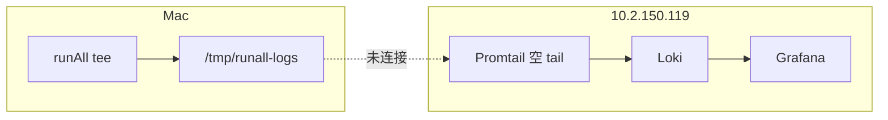
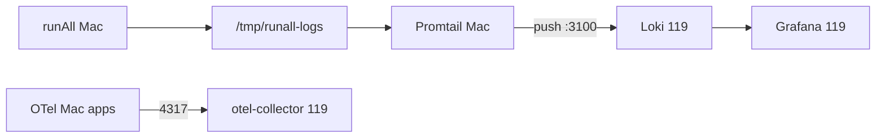

# 设计：runAll 远程可观测 — 本机 Promtail 推送远程 Loki（方案 A2）

**日期**：2026-06-04  
**状态**：已实现（方案 A2）  
**触发**：Grafana `trace-log-explore` 在 `http://10.2.150.119:3000` 无日志；Loki `{job="runall"}` 为空，而本机 `/tmp/runall-logs` 含 `trace_id`  
**关联**：
- `2026-06-02-runall-remote-docker-no-tunnel-sync-design.md`（Mac 应用 + 远程 AiMonitor）
- `2026-05-28-centralized-logs-grafana-traceid-design.md`（tee → Promtail → Loki 同机假设）
- `2026-05-31-runall-grafana-clear-all-logs-design.md`（清空可观测数据）

---

## 1. 问题陈述

### 1.1 现象

| 检查项 | 结果 |
|--------|------|
| 本机 `/tmp/runall-logs/*.log` | 有 JSON 行，含 `trace_id` |
| 远程 `10.2.150.119:/tmp/runall-logs` | **空目录** |
| 远程 Loki `{job="runall"}`（24h） | **0 streams** |
| 远程 Promtail `/var/log/runall` | **空挂载** |
| Promtail / Loki / Grafana YAML | **已配置**，非缺失 |

### 1.2 根因

远程 Docker 拆分后：

- **runAll tee** 写在 **Mac** `logging.file_root`（`/tmp/runall-logs`）
- **Promtail** 随 AiMonitor 跑在 **119**，只 tail **119 上**的同路径
- Promtail 职责是 **读本地文件 + HTTP push Loki**，**不做** Mac→119 文件同步



### 1.3 已排除

- 不是缺少 `promtail.yaml` / `loki-config.yaml` / Grafana Loki datasource
- 不是 trace-log-explore LogQL 写错（Loki 无数据时任何 `trace_id` 均为空）
- 不是 A1 文件 rsync（用户选择 **A2**）

---

## 2. 决策：方案 A2

**本机 Promtail tail 本机 tee 文件，HTTP push 到远程 Loki；tee 路径与 `conf/runAll.yaml` 不变。**



| 原则 | 说明 |
|------|------|
| tee 位置不变 | `logging.file_root: /tmp/runall-logs` |
| 远程栈保留 Loki/Grafana/Tempo/Prometheus | 仅调整 Promtail 部署位置 |
| 复用现有 pipeline | JSON `trace_id` / runAll tee 前缀剥离与 `promtail.yaml` 一致 |
| SSOT | `conf/docker-infra/config.yaml` → `host` 作为 Loki push 目标 |

---

## 3. 目标与非目标

### 3.1 目标

1. Mac 启动 runAll 并产生 tee 后，**60s 内** 远程 Loki 可查到 `{job="runall"}` 且 `|= "<trace_id>"` 命中。
2. Grafana `trace-log-explore` 深链（`var-trace_id=`）可展示对应日志。
3. runAll UI 可观测栏标明：**本机 Promtail → 远程 Loki**（含就绪/失败提示）。
4. 「清空 Grafana 可观测数据」同时处理 **本机 Promtail positions**（与远程 Loki reset 一致）。

### 3.2 非目标

- 不把 platform 应用迁到远程（保持 Mac 热重载）。
- 不做 Mac→119 日志文件 rsync（A1）。
- 不改变 Loki retention、trace-log-explore 面板结构。
- 生产多租户 / Loki 鉴权（dev 栈 `auth_enabled: false` 保持不变）。

---

## 4. 领域概念清单（供 `/5-ddd`）

| 类型 | 候选 |
|------|------|
| **限界上下文** `dev-observability` | 日志采集、远程 infra 端点 |
| **实体** `LogShipperDeployment` | 本机 vs 远程 Promtail 实例 |
| **值对象** `LokiPushEndpoint` | `http://{infra_host}:3100/loki/api/v1/push` |
| **值对象** `TeeLogRoot` | `/tmp/runall-logs`（与 `RUNALL_LOG_ROOT` 一致） |
| **领域服务** `LocalPromtailLifecycle` | 启停、健康、push 可达性探测 |
| **领域事件**（可选）`ObservabilityLogShippingDegraded` | push 失败时 UI 告警 |

---

## 5. 价值流影响

**域**：`platform-centralized-logging`（`value-stream.yaml`）

| 问题 | 结论 |
|------|------|
| 影响 stream | `platform-centralized-logging` 全链路 |
| 新 step（建议） | `increment-remote-promtail-push`（planned → active） |
| 字段（三段名） | 见下表 |
| 测试 | 新增 `AiMonitor/scripts/test_promtail_local_push_config.py`；扩展 `verify_trace_stack.py` 使用 `INFRA_HOST` |
| 业务 DB | 无 |

| fields.name | description |
|-------------|-------------|
| `ai-monitor.promtail.remote_push_enabled` | 本机 Promtail `clients.url` 指向远程 Loki |
| `ai-monitor.loki.trace_id` | 远程 Loki 可按 trace 行过滤（回归） |
| `runall.runtime.local_promtail_status` | runAll `/api/observability` 返回 local_promtail 状态 |

完整切片与 YAML 更新由 `/3-value-stream-价值流` 完成。

---

## 6. 技术方案

### 6.1 Compose 拆分

| 部署位置 | Docker context | 服务 |
|----------|----------------|------|
| **远程 119** | `zcpu-remote` | prometheus, loki, tempo, otel-collector, grafana, blackbox — **不含 promtail** |
| **Mac 本机** | `desktop-linux` | **仅 promtail**（新 overlay） |

**远程** `AiMonitor/docker-compose.yaml`：

- 将 `promtail` 移入 **`profiles: [legacy-remote-promtail]`** 或删除服务块（推荐 **删除 + 文档说明**，避免误启空 tail）。
- `grafana` / `loki` 等 `depends_on` 去掉对 promtail 的依赖（若有）。

**本机** 新增 `AiMonitor/docker-compose.promtail-local.yaml`：

```yaml
# 概念示例 — 实施时 pin 版本与主 compose 一致
services:
  promtail:
    image: grafana/promtail:3.4.2
    container_name: aimonitor-promtail-local
    command: -config.file=/etc/promtail/promtail-local.yaml
    volumes:
      - ./promtail/promtail-local.yaml:/etc/promtail/promtail-local.yaml:ro
      - ${RUNALL_LOG_ROOT:-/tmp/runall-logs}:/var/log/runall:ro
      - promtail_local_data:/var/lib/promtail
    extra_hosts:
      - "host.docker.internal:host-gateway"
    restart: unless-stopped
```

### 6.2 Promtail 配置

新增 `AiMonitor/promtail/promtail-local.yaml`：

- `scrape_configs` / `pipeline_stages`：**与 `promtail.yaml` 相同**（DRY：实施阶段可 `docker run` 合并或 CI 测试断言二者 pipeline 段一致）。
- `clients.url`：由环境变量注入，例如  
  `http://${LOKI_PUSH_HOST:-10.2.150.119}:3100/loki/api/v1/push`
- `LOKI_PUSH_HOST` 默认从 `conf/docker-infra/config.yaml` 的 `host` 解析（脚本 `runall-local-promtail.sh` 读取）。

**连通性**：Mac 容器访问 LAN `10.2.150.119:3100`（已用 curl 验证可达）。不使用 `http://loki:3100`（该主机名仅存在于远程 compose 网络）。

### 6.3 启停与 runAll 集成

| 入口 | 行为 |
|------|------|
| `scripts/runall-local-promtail.sh` | `up` / `down` / `status`；`desktop-linux` context；启动前检查 `RUNALL_LOG_ROOT` 存在 |
| `runAll` 启动 platform 组后（可选） | 调用 local promtail `up`（`runAll.yaml` 开关 `observability.local_promtail: true`） |
| `AiMonitor/run.sh`（远程） | 打印提示：日志采集由 **Mac local promtail** 负责 |
| `/api/observability` | 增加 `local_promtail_status`、`loki_push_host` |
| `clear-all` | 除远程 `reset_observability_storage.sh` 外，**down + 删 `promtail_local_data` volume** 或 truncate positions |

### 6.4 配置 SSOT

```yaml
# conf/runAll.yaml（增量）
observability:
  grafana_url: "http://${INFRA_HOST}:3000"
  loki_url: "http://${INFRA_HOST}:3100"
  local_promtail: true          # 默认 true（远程拆分环境下）
  loki_push_host: ""            # 空则继承 INFRA_HOST / docker-infra host
```

`INFRA_HOST` 解析逻辑复用现有 `resolveInfraHostTemplates()`（`conf/docker-infra/config.yaml` → `10.2.150.119`）。

### 6.5 验收标准

```bash
# 1. 本机 promtail up，runAll 已有 tee
bash scripts/runall-local-promtail.sh up

# 2. 远程 Loki 有数据（将 TRACE 换为实际 id）
curl -G "http://10.2.150.119:3100/loki/api/v1/query_range" \
  --data-urlencode 'query={job="runall"} |= "web-xxxxxxxx"' \
  --data-urlencode 'limit=5' ...

# 3. Grafana
open "http://10.2.150.119:3000/d/trace-log-explore/...&var-trace_id=web-xxxxxxxx"
```

自动化：

- `test_promtail_local_push_config.py`：`clients[0].url` 含 `3100/loki/api/v1/push`，且不含 `http://loki:3100`
- `verify_trace_stack.py`：Loki 查询 host 可 `LOKI_HOST` 环境变量覆盖（默认 `127.0.0.1` → 文档说明远程时用 `10.2.150.119`）

---

## 7. 方案对比（记录）

| 方案 | 结论 |
|------|------|
| A1 文件 rsync → 远程 Promtail | 未选；多一套同步与 positions 一致性 |
| **A2 本机 Promtail → 远程 Loki** | **已选** |
| B 全栈 AiMonitor 回 Mac | 与 infra 远程化目标冲突 |
| C runAll 迁远程 | 改动过大 |

---

## 8. 风险与缓解

| 风险 | 缓解 |
|------|------|
| Mac 未启 local promtail | runAll UI 黄色提示；`run.sh` / README 说明启动顺序 |
| 119 防火墙阻断 3100 | preflight：`curl -sf http://${INFRA_HOST}:3100/ready` |
| 双 Promtail 误启（远程+本机） | 远程 compose 移除 promtail；文档 + `docker ps` 检查名 `aimonitor-promtail-local` |
| clear-all 后本机 positions 导致不重读 | 清空时删除 `promtail_local_data` volume |
| `run.sh` 读 `../runAll.yaml` 路径错误 | 顺带改为 `../conf/runAll.yaml`（若仍引用旧路径） |

---

## 9. 实施清单（供 `/6-plans`）

- [ ] `promtail-local.yaml` + `docker-compose.promtail-local.yaml`
- [ ] 远程 `docker-compose.yaml` 移除或 profile 隔离 promtail
- [ ] `scripts/runall-local-promtail.sh`
- [ ] `conf/runAll.yaml` + runAll `/api/observability` 字段
- [ ] `clear-all` / `reset_observability_storage` 文档与脚本补充本机 volume
- [ ] 测试与 `verify_trace_stack` / README / `AiMonitor/run.sh` 提示
- [ ] `value-stream.yaml` 新 increment（`/3-value-stream`）

---

## 10. 文档修订

| 文档 | 动作 |
|------|------|
| `2026-05-28-centralized-logs-grafana-traceid-design.md` | 增加「远程拆分」脚注，指向本文 |
| `2026-06-02-runall-remote-docker-no-tunnel-sync-design.md` | 增加 § 日志采集：A2 |
| `docs/superpowers/specs/2026-05-29-grafana-distributed-tracing-runbook.md` | 更新「日志为空」排查：先查 local promtail |
