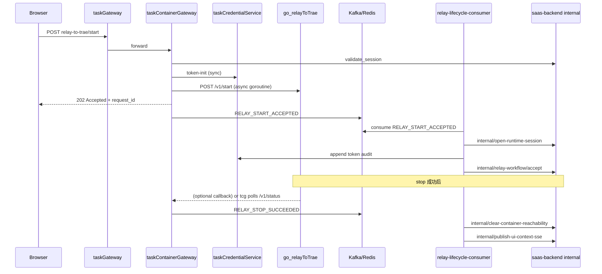

# 设计文档：relay start/stop/register 绕开 Django + 副作用事件化消费者

**日期：** 2026-07-05  
**状态：** Inc 1–4 已交付（2026-07-05）  
**动机：** Phase 1 已将 L0 outbound、job-stream、relay health/status 迁出 Django；`relay-to-trae/register|start|stop` 仍经 Django 编排，占用 saas-backend 单线程并耦合 audit / runtime session / workflow 等非转发逻辑。用户提议：**公网入口直调 go_relay，副作用由独立 Go 消费者异步处理**。

**关联：**
- `docs/superpowers/specs/2026-07-05-task2app-api-go-split-brainstorm-design.md`（Phase 1 relay 公网入口）
- `docs/superpowers/specs/2026-05-31-relay-stop-stale-container-endpoint-invalidation-design.md`（`clear_container_reachability`）
- `docs/superpowers/specs/2026-07-01-relay-precheck-go-service-design.md`（token SSOT）
- `docs/architecture/v4-*-20260705-1531-claude.puml`（v4 target）
- `docs/architecture/v4-*-20260705-1531-claude.archimate`（v4 架构变迁与数据流）

---

## 架构基线确认

根据当前架构设计稿（`docs/architecture/`），系统现状如下：

| 维度 | 内容 |
|------|------|
| **current 基线** | v1 enterprise-landscape + application-integration |
| **target 积压** | v2 token SSOT、v3 claude-agent、**v4 task2app Go 拆分（部分已交付）** |
| **容器栈** | taskContainerGateway (:8014) → Django internal；go_relayToTrae (:8797) subprocess 生命周期 |
| **领域事件** | taskEvents 18 个 Go consumer（Kafka/Redis）；`CLOUD_SERVER_STOPPED` handler 仍为 **TODO 空实现** |
| **relay 现状** | health/status 经 tcg 直转；register/start/stop 仍 `relay_to_trae_proxy.py`（threading + ORM + 同步 audit） |

📋 **架构版本历史（近期）：**

- v4 (2026-07-05) 🎯 target — taskContainerGateway 完整 outbound；go-relay 公网入口（health/status 已落地，lifecycle 未落地）
- v1 (2026-07-01) ✅ current — 39 组件 + 18 事件消费者基线

**本次迭代将在 v4 target 基础上，补全 relay lifecycle 公网绕 Django + 副作用事件化。**

---

## 问题陈述

### Django relay 入口当前职责（过重）

| 职责 | 类型 | 可否异步 |
|------|------|----------|
| session 校验 | 转发前置 | ❌ 同步（tcg 已有 `validate_session`） |
| token-init / TEIP 守卫 | 编排 | ❌ 同步（须在 forward 前拿到 access_token） |
| 组装 runtime env + trace | 编排 | ❌ 同步 |
| HTTP → go_relay `/v1/{register,start,stop}` | 转发 | ❌ 同步（stop 可 fire-and-forget） |
| `CloudServerConfig.get_or_create` | ORM | ✅ 可异步（register-reachability 前完成即可） |
| `open_runtime_session` | ORM + 规则 | ✅ 可异步（start 202 后） |
| `clear_container_reachability` + SSE | ORM + SSE | ✅ 可异步（stop 200 后） |
| `append_container_token_audit_event` | 审计 | ✅ 可异步（已有 eventization 价值流） |
| `RelayTwoStepStartupService` workflow | ORM | ⚠️ 部分同步（202 前 accept）；收敛可异步 |
| `_persist_feature_params_source` → Todo | ORM | ✅ 可异步 |
| `publish_relay_to_trae_status_sse` | SSE | ⚠️ 用户可见 — 宜快；可 tcg 直发或 consumer |
| `_relay_lifecycle_lock` | 并发 | 迁至 go_relay `lifecycleMu`（已有） |

**结论：** 可以绕开 Django **处理 HTTP 公网请求**；但 **不能** 假设所有副作用都可延迟——仅「非用户等待路径」适合事件消费者。

---

## 方案结论（Executive Summary）

| 问题 | 答案 |
|------|------|
| **能不能绕开 Django 调用 register/start/stop？** | **能**。推荐 `Browser → taskGateway → taskContainerGateway → go_relayToTrae`，与 health/status 同路由族。 |
| **clear_container_reachability / audit / workflow 能否全放事件消费者？** | **大部分能**；token-init、TEIP、202 受理响应须留在 **同步编排层（tcg）**。 |
| **消费者放哪？** | 推荐 **taskEvents 新 intent**（与现有 18 consumer 一致），而非 tcg 内嵌 goroutine 写 ORM。 |
| **Django 角色** | 瘦身为 **internal 真源 API**（runtime session、reachability、workflow 持久化、SSE dispatch），由消费者回调。 |

---

## 目标架构



### 同步 vs 异步边界

```
┌─────────────────────────────────────────────────────────────┐
│  taskContainerGateway 同步路径（用户等待）                    │
│  validate_session → token-init → 组装 env → forward go_relay │
│  → 立即 HTTP 响应（200/202/4xx）                             │
└─────────────────────────────────────────────────────────────┘
                              │ publish
                              ▼
┌─────────────────────────────────────────────────────────────┐
│  taskEvents relay-lifecycle consumer（最终一致）              │
│  audit · runtime session · reachability · workflow · todo   │
└─────────────────────────────────────────────────────────────┘
                              │ internal HTTP
                              ▼
┌─────────────────────────────────────────────────────────────┐
│  saas-backend Django internal（ORM + SSE 真源）              │
└─────────────────────────────────────────────────────────────┘
```

---

## 领域概念清单（供 DDD）

| 概念 | 边界上下文 | 说明 |
|------|------------|------|
| **RelayLifecycleCommand** | 容器运行时 | 聚合：register/start/stop 一次用户意图 |
| `RelayStartAccepted` | 已有 domain event | 扩展为 **bus 事件**（现仅进程内） |
| `RelayStopSucceeded` | 新增 | stop 成功且 go_relay 已停 |
| `RelayRegisterSucceeded/Failed` | 新增 | register 结果 |
| **RuntimeSession** | 云平台与资源 | open/close；消费者调 Django internal |
| **ContainerReachability** | 同上 | clear + SSE；stop 后最终一致 |
| **TokenAuditEvent** | taskCredentialService | 消费者写 SSOT（非 Django 表） |
| **RelayStartupWorkflow** | relay 可靠性 | 两阶段启动状态机；消费者更新收敛 |

---

## 方案对比

### 方案 A — tcg 内 goroutine 直接调 Django internal（不推荐单独使用）

- start/stop 后在 tcg goroutine 里同步调 `clear_container_reachability` internal。
- **优点**：实现快；stop→清 reachability 延迟低。
- **缺点**：与 job-stream 模式重复；审计/workflow 仍散落；失败无重试/DLQ；不符合「18 consumer」统一运维。

### 方案 B — 全副作用走 taskEvents 消费者（**推荐**）

- tcg / go_relay 仅 **publish** 领域事件；新 consumer `relay_lifecycle` 多 intent 处理。
- **优点**：与 `CLOUD_SERVER_STOPPED`、billing、registration chain 一致；可重试、可观测、可独立扩缩。
- **缺点**：SSE/UI 更新有 **数百 ms～数 s** 最终一致窗口；须前端 optimistic UI（已有 `onContainerReachabilityCleared`）。

### 方案 C — APISIX 直转 go_relay，事件由 go_relay publish（备选）

- 跳过 tcg；go_relay 自己调 CRED + publish。
- **优点**：最少一跳。
- **缺点**：go_relay  today 是 **sidecar worker**，不应承担 session 校验、租户 scope、trace 标准；与 v4「tcg = compute outbound SSOT」冲突。

**推荐：方案 B**，同步编排在 **taskContainerGateway**，事件总线用现有 **taskEvents** 基础设施。

---

## 详细设计

### 1. 公网路由扩展

`taskGateway/routes/routes.yaml` — 扩展 `relay-to-trae-proxy`：

```yaml
# 新增（与 health/status 同 upstream taskContainerGateway）
- /api/tenant/*/workspace/*/task/*/cloud/compute/relay-to-trae/register*
- /api/tenant/*/workspace/*/task/*/cloud/compute/relay-to-trae/start*
- /api/tenant/*/workspace/*/task/*/cloud/compute/relay-to-trae/stop*
```

Django 侧：`@require_django_forward` 对这 3 个 action 返回 **410**（与 L0 outbound 一致）。

### 2. taskContainerGateway 同步编排

扩展 `relay_handlers.go`：

| action | 方法 | 同步步骤 | 响应 |
|--------|------|----------|------|
| `register` | POST | validate → TEIP check (CRED) → token-init if needed → forward `/v1/register` | 200/4xx |
| `start` | POST | validate → token-init → ensure cfg stub (optional internal) → build env → **async** forward `/v1/start` | **202** + request_id |
| `stop` | POST | validate → **async** forward `/v1/stop` | 200 ok（与现网一致） |

**lifecycle 串行：** 依赖 go_relay 已有 `lifecycleMu`；tcg 不再持 Django `_relay_lifecycle_lock`。

**start 异步：** 与现 Django `threading.Thread` 等价，改为 tcg goroutine + `tracelog` forward_stage。

### 3. 领域事件契约（新增/扩展）

| EventType | 发布者 | 触发时机 | Payload 要点 |
|-----------|--------|----------|--------------|
| `RELAY_REGISTER_ATTEMPTED` | tcg | forward 前 | tenant, workspace, task, trace_id |
| `RELAY_REGISTER_SUCCEEDED` / `_FAILED` | tcg | forward 后 | status, error_code |
| `RELAY_START_ACCEPTED` | tcg | 202 返回前 | request_id, workflow_id, trace_id |
| `RELAY_START_DISPATCH_SUCCEEDED` / `_FAILED` | tcg goroutine | go_relay 响应后 | logs excerpt |
| `RELAY_STOP_REQUESTED` | tcg | stop 受理 | scope |
| `RELAY_STOP_SUCCEEDED` / `_FAILED` | tcg goroutine | go_relay stop 后 | reason |

> 注：`RelayTwoStepStartupService` 已有进程内 `RelayStartAccepted` 等类型；本设计将其 **映射为 bus 事件**，避免两套命名。

### 4. taskEvents 消费者（新组）

建议新 event slug：`relay_lifecycle`，端口段 `:18038+`（避开现有 cloud 段 :18030-37）。

| Intent | 订阅事件 | 动作 |
|--------|----------|------|
| `1_append_token_audit` | `RELAY_*` | → taskCredentialService audit API（SSOT） |
| `2_open_runtime_session` | `RELAY_START_ACCEPTED` | → Django internal `open-runtime-session` |
| `3_clear_reachability` | `RELAY_STOP_SUCCEEDED` | → Django internal `clear-container-reachability` |
| `4_relay_workflow_update` | `RELAY_START_*` | → Django internal `relay-workflow/transition` |
| `5_persist_feature_params` | `RELAY_START_ACCEPTED` | → Django internal（可选，payload 含 fp_source） |

**复用 `CLOUD_SERVER_STOPPED`？** 不建议混用——VM stop 与 relay stop 字段/原因不同；保持独立事件，消费者可共享 `clear_reachability` **internal handler**。

**扩展 `cloud_server_stopped` handler？** 仅当 VM stop 也改为发同一 internal API；relay 专用事件更清晰。

### 5. Django internal API（新增，薄封装）

| 路径 | 职责 | 幂等 |
|------|------|------|
| `POST .../internal/task-container-gateway/open-runtime-session/` | 包装 `open_runtime_session()` | request_id |
| `POST .../internal/task-container-gateway/clear-container-reachability/` | 包装 `clear_container_reachability()` | stop_event_id |
| `POST .../internal/task-container-gateway/relay-workflow/transition/` | 包装 `RelayTwoStepStartupService` 状态迁移 | workflow_id + transition |

> `publish-relay-status-sse` 已删除：Gateway / Cloud 直接发 Kafka `SSE_MESSAGE`。

鉴权：复用 `internal_auth.py`（与 validate/publish job-stream 相同 secret）。

### 6. audit 归属

按 `relay-token-audit-full-chain-eventization` 价值流，**审计写入目标为 taskCredentialService**，非 Django ORM。消费者 intent `1_append_token_audit` 直调 CRED，Django `append_container_token_audit_event` 在 Phase 2 删除。

### 7. SSE / 前端体验

| 场景 | 策略 |
|------|------|
| stop | 前端 **optimistic** `containerEndpointRegistered=false`（已实现）；consumer 清 DB 后 SSE 对齐 |
| start 202 | 仍靠 relay status SSE + workflow 收敛（consumer 更新 workflow 后 tcg/GR 推 status） |
| register | 同步 200，无额外 SSE |

**NFR：** reachability 清理 p95 < 3s（consumer + internal）；须监控 consumer lag。

---

## 价值流影响

| 现有 stream | 影响 |
|-------------|------|
| `task-detail-runtime-relay` | start/stop 路径改 tcg；relay-stop-refresh 仍有效 |
| `relay-token-audit-*` | audit 写入迁 CRED consumer |
| `relay-token-audit-full-chain-eventization` | **激活** — 本设计为其落地载体 |
| `gateway-relay-health-status-proxy` | 扩展为 `gateway-relay-lifecycle-proxy` |
| `gateway-django-forward-stub` | 新增 register/start/stop 410 |

**新 stream 建议：**

```yaml
- name: relay-lifecycle-event-consumer
  status: planned
  steps:
    - name: relay-lifecycle-clear-reachability
      test_file: tests/test_relay_stop_clears_container_endpoint.py  # 改 consumer 集成测
    - name: relay-lifecycle-token-audit
      test_file: tests/test_container_token_audit_integration.py
```

---

## 迁移分期

| 阶段 | 内容 | 风险 |
|------|------|------|
| **Inc 1** | tcg proxy register/start/stop + 事件 publish（consumer 仅 audit） | ✅ 2026-07-05 |
| **Inc 2** | consumer `clear_reachability` + `open_runtime_session`；Django internal API | ✅ 2026-07-05 |
| **Inc 3** | workflow consumer + tcg SSE internal；Django 410 已覆盖 | ✅ 2026-07-05 |
| **Inc 4** | Django relay audit 双写关闭（网关启用时）；v5 arch target | ✅ 2026-07-05 |

**回滚：** `TASK_CONTAINER_GATEWAY_ENABLED=false` + 路由切回 Django（410 stub 已支持 fallback 模式）。

---

## 风险与缓解

| 风险 | 缓解 |
|------|------|
| stop 后 stale reachability 窗口 | 前端 optimistic + consumer lag 告警 |
| 事件重复消费 | consumer 幂等键 = `event_id` 或 `request_id` |
| consumer 失败不清 DB | DLQ + 人工 replay；pytest 覆盖 at-least-once |
| workflow 与 go_relay 状态漂移 | tcg goroutine 仍发 `RELAY_START_DISPATCH_*`；保留 status 轮询 |
| token-init 失败 | 保持同步失败返回 502（不进 bus） |
| 双写期 audit | Inc 1-2 Django+CRED 并行写，Inc 4 删 Django |

---

## 与 v4 架构差异（预定 v5 target）

| 变更 | 类型 |
|------|------|
| taskContainerGateway 承担 relay lifecycle 同步编排 | 🟡 MODIFIED |
| taskEvents 新增 relay-lifecycle consumer 组 | 🟢 NEW |
| saas-backend 新增 4 个 internal 回调 | 🟢 NEW |
| Django `relay_to_trae_proxy` 公网路径 | 🔴 DEPRECATED |
| go-relay 职责不变 | — |

**已交付架构文件**（基于 v4 application-integration）：

- ✅ `docs/architecture/v5-application-integration-20260705-1700-claude.puml`
- ✅ `docs/architecture/v5-application-integration-20260705-1700-claude.archimate`（含 v4→v5 架构变迁视图）
- ✅ `docs/architecture/v5-application-integration-20260705-1700-claude.mermaid.md`

---

## 验收标准

1. register/start/stop **不经 Django 公网**（410 stub + gateway 路由）。
2. stop 成功后 **3s 内** DB `server_url` 清空（consumer 路径）。
3. token audit 事件可在 CRED 按 trace_id 查全链。
4. 现有 pytest + Playwright relay stop→start 回归通过。
5. consumer lag / DLQ Grafana 面板可见。

---

## 待决问题（实现前需确认）

1. **start 的 `CloudServerConfig.get_or_create`**：放 tcg 同步 internal 还是 `RELAY_START_ACCEPTED` consumer？（建议 consumer，register-reachability 前仍有窗口）
2. **relay status SSE**：由 tcg goroutine 直发 internal，还是独立 `RELAY_START_DISPATCH_*` consumer？（建议 goroutine 直发 — 用户可见低延迟）
3. **是否合并到 go_relay publish**（方案 C）—— 默认 **否**，保持 tcg SSOT。

---

## 🏛️ 架构变更影响（草案）

- **迭代版本**: v5 🎯 target（待批准）
- **迭代名称**: relay lifecycle 公网绕 Django + 副作用事件消费者
- **作者**: claude
- **设计日期**: 2026-07-05
- **基于**: v4 target（task2app Go 拆分）
- **新增文件**（仅 `application-integration` 视图变更）:
  - 🆕 `docs/architecture/v5-application-integration-<YYYYMMDD-HHMM>-claude.puml`
  - 🆕 `docs/architecture/v5-application-integration-<YYYYMMDD-HHMM>-claude.archimate`（含 Plateau/Gap/WP 架构变迁视图）
  - 🆕 `docs/architecture/v5-application-integration-<YYYYMMDD-HHMM>-claude.mermaid.md`
- **已有文件（未修改）**:
  - `docs/architecture/v4-*-20260705-1531-claude.puml` (target)
  - `docs/architecture/v1-*-20260701-1630-claude.puml` (current)
- **变更明细**: 🟢 relay-lifecycle consumer / internal APIs；🟡 tcg relay 编排；🔴 Django relay 公网代理

### .archimate 架构变迁要点

| 元素类型 | 内容 |
|----------|------|
| **Plateau v4** | Target 基线 — health/status 已公网绕 Django，lifecycle 仍经 Django proxy |
| **Plateau v5** | Target — register/start/stop 公网经 tcg→go_relay；副作用事件化 |
| **Gap** | Django 同步 ORM/audit/SSE；relay 公网路径未完全绕开 |
| **WorkPackage** | Inc 1 路由+410 stub → Inc 2 consumer+internal API → Inc 3 删 Django 代理 |
| **视图** | `架构变迁 v4→v5 — relay lifecycle 事件消费者`（可导入 Archi 打开） |
