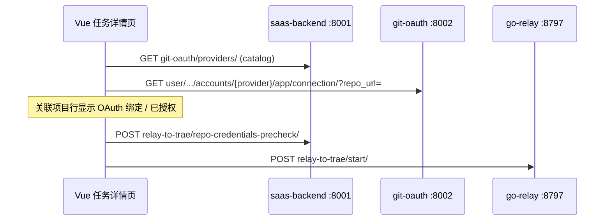

# 任务详情 relayToTrae：OAuth 绑定按钮与启动按钮状态不同步

**日期：** 2026-07-05  
**状态：** 已实施（2026-07-05）  
**页面：** `http://183.250.1.132:4000/tenant/850256677331562496/workspace/857903329669984256/task-detail/860371538948571136/?relayToTrae=true`  
**关联价值流：** `task-detail-oauth-binding-guidance`、`task-detail-oauth-repo-url-row-action`（`conf/value-stream.yaml`）

---

## 1. 问题陈述

在 `?relayToTrae=true` 任务详情页，「关联项目」某仓库行仍显示 **「OAuth 绑定」**，但「直接启动」Tab 中的 **「启动」按钮仍可点击**。

期望行为（产品规则）：

> 只要存在需要 OAuth 且尚未完成绑定的仓库，「启动」应禁用，并给出可操作的引导。

---

## 2. 当前架构理解（Archimate 基线）

根据 `docs/architecture/` 当前视图：

| 视图 | 文件 | 状态 |
|------|------|------|
| 企业全景 | `v1-enterprise-landscape-20260701-1630-claude.puml` | ✅ current |
| 应用集成 | `v1-application-integration-20260701-1630-claude.puml` | ✅ current |
| 目标演进 | v2/v3 target 文件 | 🎯 target |

**与本次问题相关的组件链路：**



- **前端**：`TaskDetail.vue` → `TaskDetailLinkedProjectsPanel`（OAuth 行级 UI）+ `ServerConfig.logic.vue` / `ServerConfigRelayDirectPanel`（启动按钮）
- **OAuth 判定**：git-oauth 按 `repo_url` 返回 `connected`
- **启动预检**：Django `repo-credentials-precheck`（409 + `missing_repo_credentials`）

本次为 **纯前端状态同步 + 时序** 问题，**不涉及** 新服务组件，**不需要** 更新 Archimate target 文件。

**架构版本历史：** 当前基线 v1 ✅；v2/v3 为 target，与 OAuth UI 无关。

---

## 3. 现状代码路径

### 3.1 「OAuth 绑定」按钮何时显示

`TaskDetailLinkedProjectsPanel.vue`：

```javascript
shouldShowRepoOAuthBindButton(repoUrl) {
  const provider = resolveRepoOAuthProvider(repoUrl)      // 依赖 heuristic + cachedCatalog
  const startApiUrl = resolveRepoOAuthAuthorizeUrl(provider)
  if (!provider || !startApiUrl) return false
  return repoOAuthBoundByUrl[key] !== true                // connection API 结果
}
```

### 3.2 「启动」按钮何时禁用（已实现逻辑）

`TaskDetail.vue` 接收子组件事件：

```javascript
relayStartBlockedByUnboundOAuth =
  relayToTraeEnabled && hasOAuthRepos && !allBound
```

`TaskDetailLinkedProjectsPanel` 通过 `repo-oauth-readiness` 事件上报：

```javascript
{
  allBound,        // 所有 OAuth 目标仓库 connected
  loading,         // 检测中
  unboundRepoUrls,
  hasOAuthRepos,   // collectTaskRepoOAuthTargets().length > 0
}
```

### 3.3 两路判定的共同依赖

`collectTaskRepoOAuthTargets()` 与 `shouldShowRepoOAuthBindButton()` **应** 使用相同条件：

- `resolveRepoOAuthProvider(repoUrl)`（heuristic 或 **模块级** `cachedCatalog`）
- `resolveRepoOAuthAuthorizeUrl(provider)`

---

## 4. 根因分析

### 根因 A（高概率）：远端未部署最新前端

本地代码已包含：

- `start-blocked-by-unbound-oauth` prop 传递链
- `ServerConfigRelayDirectPanel` 的 `isStartDisabled`
- `startRelayToTrae()` 前置守卫

若 `183.250.1.132:4000` 仍运行旧 bundle，则：

- 「OAuth 绑定」行级按钮（较早迭代）**可见**
- 「启动」阻断逻辑（近期迭代）**不存在**

**验证：** 在浏览器 DevTools 搜索 `start-blocked-by-unbound-oauth` / `relay-to-trae-oauth-unbound-guide` / `repo-oauth-readiness` 是否存在于已加载 JS。

---

### 根因 B（确定存在）：Git OAuth Catalog 非响应式，导致 readiness 与 UI 脱节

| 机制 | OAuth 绑定按钮 | readiness / 启动阻断 |
|------|----------------|----------------------|
| Provider 解析 | `resolveRepoOAuthProvider` 读 **模块级** `cachedCatalog` | 同左 |
| Catalog 加载 | `bootstrapGitOAuthCatalog()` 更新 `cachedCatalog` | 同左 |
| Vue 响应式 | ❌ **catalog 变化不触发重算** | ❌ **computed 不重新 emit** |

`useProjectGitOAuthCatalog.js` 提供了 `gitOAuthCatalogVersion` ref，但 **`TaskDetail.vue` 只调用 `bootstrapGitOAuthCatalog`，未把 version 传入子组件，也未触发 OAuth 状态重拉**。

**典型竞态（自托管 GitLab / IP 仓库，如 `183.250.x.x:8012`）：**

1. 任务详情加载 → `fetchGithubRepoBindingStatus()` 执行  
2. 此时 catalog 尚未就绪 → `collectTaskRepoOAuthTargets()` 返回 `[]`  
3. emit `{ hasOAuthRepos: false, allBound: true }` → **启动不被阻断**  
4. catalog 异步加载完成 → provider 可解析  
5. 若随后 `taskProjectsWithDetails` 引用更新触发 re-fetch → 状态可能修正  
6. 若 **无第二次 re-fetch** → readiness 永久停留在「无 OAuth 仓库」，但用户手动刷新或编辑任务后绑定按钮才出现 → **不同步窗口可长期存在**

---

### 根因 C（确定存在）：readiness 初始态过于乐观

`TaskDetail.vue` 初始值：

```javascript
repoOAuthReadiness = {
  allBound: true,       // 乐观：假定已全部绑定
  hasOAuthRepos: false, // 假定无需 OAuth
  loading: false,
}
```

阻断条件 `hasOAuthRepos && !allBound` 在首次 emit 之前 **恒为 false**。

在 relay 场景下，更安全的默认是 **「未知 = 阻断」**（pessimistic default）。

---

### 根因 D（产品范围）：仅阻断 OAuth，未阻断「保存账号 / 克隆身份」

价值流 `task-detail-oauth-binding-guidance` 定义 **两阶段**：

1. OAuth 绑定  
2. 为每个仓库选择并 **保存** 授权账号 / 克隆 Git 身份  

当前启动阻断 **只看 OAuth connected**，不看：

- GitHub `github-credential-approve` 是否已保存  
- `repoCloneIdentityByUrl` 是否已持久化  

因此可能出现：OAuth 已授权（无「OAuth 绑定」按钮），但预检仍 409 —— 与本报告「同时看到 OAuth 绑定 + 可启动」略不同，但属于同一体验缺陷族。

---

### 根因 E（低概率）：connection API 与 UI 判定不一致

`isProviderConnectedForCurrentUser` 在 `connections.some(item => item.connected)` 时返回 true（**账号级** connected），而 UI 可能需要 **repo_url 级** 绑定。

若 API 对某 repo 返回 connected=false 但全局 connected=true，理论上 bind 按钮应隐藏；与「仍显示 OAuth 绑定」矛盾。需用 Network 面板核对具体 `connection` 响应。

---

## 5. 推荐方案（方案 A — 单一事实来源 + 悲观默认）

### 5.1 设计原则

1. **Single Source of Truth**：启动阻断与「OAuth 绑定」按钮共用同一 readiness 模型  
2. **Pessimistic until proven**：`relayToTrae=true` 时，在 readiness 明确 `ready` 之前默认禁用启动  
3. **Reactive catalog**：catalog 版本变化必须触发 OAuth 目标重算 + connection 重检  
4. **可测试**：Playwright 断言「见 OAuth 绑定 ⇒ 启动 disabled」

### 5.2 具体改动

#### Step 1 — 抽取 composable `useTaskRepoOAuthStartReadiness.js`

职责：

- 接收 `taskProjectsWithDetails`、`gitOAuthCatalogVersion`（响应式）
- 暴露 `readiness` ref：`{ phase: 'unknown'|'loading'|'ready'|'blocked', unboundRepoUrls, missingAccountRepoUrls }`
- 内部调用与 panel 相同的 `collectTaskRepoOAuthTargets` + connection 检测

#### Step 2 — 修复 catalog 响应式

`TaskDetail.vue`：

```javascript
const { gitOAuthCatalogVersion, bootstrapGitOAuthCatalog } = useProjectGitOAuthCatalog(apiFetch)
// 传入 LinkedProjectsPanel + readiness composable
watch(gitOAuthCatalogVersion, () => refreshOAuthReadiness())
```

`TaskDetailLinkedProjectsPanel` 增加 prop `git-oauth-catalog-version`，watch 变化时 `fetchRepoOAuthConnectionStatusByRepoUrl()`。

#### Step 3 — 悲观初始态

```javascript
// relayToTrae 场景
const defaultReadiness = {
  phase: 'unknown',  // 触发启动禁用
  ...
}
relayStartBlockedByUnboundOAuth = computed(() =>
  relayToTraeEnabled && readiness.phase !== 'ready'
)
```

#### Step 4 — 启动阻断与按钮显式对齐（防御性）

除 readiness 事件外，在 `ServerConfigRelayDirectPanel` 增加 derived check：

> 若 DOM/testid 存在可见的 `[data-testid="task-repo-oauth-bind-btn"]`（需在 bind 按钮上加 testid），则强制 disabled。

优先以 composable 状态为准，DOM 检查仅作 E2E 辅助。

#### Step 5 — 扩展至两阶段（Increment 2，可选同 PR）

阻断条件扩展为：

| 条件 | 阻断启动 |
|------|----------|
| 任一 OAuth 目标 `connected !== true` | ✅ |
| OAuth 检测中 | ✅ |
| GitHub 仓库未保存 PR 账号 | ✅（Increment 2） |
| 未保存克隆 Git 身份 | ✅（Increment 2） |

与 value stream `oauth-binding-two-phase-guidance` 对齐。

#### Step 6 — 测试

| 类型 | 文件 | 场景 |
|------|------|------|
| 单元 | `useTaskRepoOAuthStartReadiness.test.js` | catalog 延迟加载后 readiness 从 unknown→blocked |
| 单元 | `TaskDetailLinkedProjectsPanel.test.js` | catalog version 变化触发 re-fetch |
| E2E | `TaskDetail.relay-oauth-start-blocked.playwright.test.js` | 见 OAuth 绑定按钮时 `#relay-to-trae-start-btn` disabled |
| 回归 | 既有 precheck 测试 | 启动仍走 repo-credentials-precheck |

#### Step 7 — 部署

重新构建并发布 `front_project` 至 `183.250.1.132:4000`，确认 hash 与本地 commit 一致。

---

## 6. 方案对比

| 方案 | 说明 | 优点 | 缺点 |
|------|------|------|------|
| **A（推荐）** | composable + catalog 响应式 + 悲观默认 | 根治时序；可测；与 value stream 一致 | 中等改动量 |
| B | 仅部署现有代码 | 零开发 | 不解决 catalog 竞态；远端外仍复发 |
| C | 仅依赖 start 时 precheck 409 | 后端已有 | 用户体验差；按钮可点后才报错 |
| D | 轮询 readiness | 实现简单 | 浪费请求；仍可能首屏窗口 |

---

## 7. 价值流影响

| 流 | 影响 |
|----|------|
| `task-detail-oauth-binding-guidance` | Increment 2「预检可视化引导」前移至 **被动 UI 阻断** |
| `task-detail-oauth-repo-url-row-action` | 新增/激活步骤：`repo-row-oauth-start-button-sync`（建议 status: active） |
| `task-detail-runtime-relay` | 直接启动前增加 OAuth readiness gate |

**建议新增 value-stream step（实施时写入 YAML）：**

```yaml
- name: relay-start-blocked-until-oauth-bound
  status: active
  test_file: playwright/front_project/tests/TaskDetail.relay-oauth-start-blocked.playwright.test.js
  fields:
    - name: git-oauth.api_githubappusercredential.bind_status
      description: repo_url 级 connected 驱动启动按钮
```

---

## 8. 验收标准

1. 在 [任务详情 relay 页](http://183.250.1.132:4000/tenant/850256677331562496/workspace/857903329669984256/task-detail/860371538948571136/?relayToTrae=true) 上，**任意**仓库行显示「OAuth 绑定」时，`data-testid="relay-to-trae-start-btn"` 为 `disabled`  
2. catalog 异步加载完成后 2s 内状态自动收敛，无需手动刷新  
3. 全部 OAuth 绑定完成后，「启动」自动变为可点（仍受镜像选择、stale repo 等其它 gate 约束）  
4. 点击「启动」时若仍被阻断，`startRelayToTrae` 不发起 `token-init`（双重守卫）  
5. Playwright 回归通过  

---

## 9. 诊断清单（现场排查）

在修复部署前，可在浏览器按序确认：

1. **Network**：`/api/accounts/git-oauth/providers/` 与 `.../connection/?repo_url=` 的时序  
2. **Console**：搜索 `repo-oauth-readiness` 相关 log（可加临时 debug）  
3. **Elements**：启动按钮是否有 `disabled` 属性  
4. **Sources**：bundle 是否含 `startBlockedByUnboundOAuth` / `relay-to-trae-oauth-unbound-guide`  
5. **仓库 URL 形态**：是否为 IP:port 自托管 GitLab（高度依赖 catalog）；**SSH `git@IP:...` 亦须按 hostname 命中 catalog**（2026-07-09 修复）

---

## 11. 变更记录

- 2026-07-05：初版（启动可点但见 OAuth 绑定按钮）
- 2026-07-09：反向缺陷——见 OAuth 引导但无绑定按钮。根因：`resolveRepoOAuthProviderFromCatalog` 仅按 HTTP origin 匹配，SSH 无 origin；且 `onRepoOAuthReadiness` 无条件忽略空目标导致悲观 `startBlocked` 永驻。修复：hostname catalog 回退 + catalog 就绪后接受空快照。

---

## 10. 领域概念清单（供后续 DDD 步骤）

| 概念 | 说明 |
|------|------|
| **RepoOAuthTarget** | 任务关联项目中、需要 OAuth 的仓库（provider + repo_url） |
| **RepoOAuthReadiness** | 聚合：targets + per-repo connected + loading phase |
| **RelayStartGate** | 直接启动前置条件（镜像、OAuth、账号、stale repo） |

Bounded Context：任务协作（Task Detail UI）↔ git-oauth（OAuth 连接查询）

---

## 11. 架构变更影响

- **迭代版本**：无新版本 Archimate 文件（前端 UI 状态同步，不改组件拓扑）
- **变更类型**：Bugfix + UX 加固

---

## 12. 建议实施顺序

1. 现场确认根因 A（是否未部署）  
2. 实施方案 A Step 1–4（catalog 响应式 + 悲观默认）  
3. 补 E2E  
4. 部署 `183.250.1.132`  
5. （可选）Increment 2 两阶段完整阻断  

---

**状态：待评审。** 批准后可进入 `/7-plans-实施计划` 或 `/8-build-构建` 直接落地。
