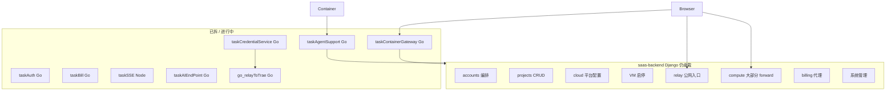

# 设计文档：task2app 接口业务归属梳理与 Go 拆分可行性

**日期：** 2026-07-05  
**状态：** 已设计（v4 target 架构已写入）  
**动机：** task2app（saas-backend Django :8001）频繁出现进程假死/死锁；需梳理全部对外 API 的业务归属，识别可独立拆出并用 Go 重写的边界，降低单进程拥塞风险。

> **与元规则 / CI 的关系（2026-07-13）：**  
> - **新增**服务与接口默认落 Go：`.ai/01_project_constraints/20_go_service_first_apis.md`  
> - 机器可读「接口 → 服务」对照与 Django 新增路由门禁：`db/api_route_ownership.yaml`、`docs/architecture/api-route-to-owner.md`、`db/scripts/ci/check_django_new_api_routes.py`  
> - **本文继续作为存量 Django 公网 API 的迁出节奏与优先级权威**；元规则与 CI **管新增、不强制一次性迁完存量**。

---

## 架构基线确认

根据当前架构设计稿（`docs/architecture/`），系统现状如下：

| 维度 | 内容 |
|------|------|
| **架构视图（current）** | v1 enterprise-landscape、v1 application-integration |
| **架构视图（target 积压）** | v2 taskAIEndPoint + taskCredentialService；v3 claude-agent Go 重写 |
| **业务层** | Developer / Platform Admin / Enterprise Customer；IDE Workspace、Task Management、Cloud Resource、Billing |
| **应用层（task2app 相关）** | `saas-backend` Django (:8001)、`ai-provider` Django (:8010)、以及已拆出的 Go/Node 侧车 |
| **已拆 Go/Node 服务** | taskAuth (:8003)、git-oauth (:8002)、taskBill (:8009)、taskSSE (:8007)、taskAgentSupport (:8011)、taskAIEndPoint (:8013)、taskContainerGateway (:8014)、taskCredentialService (:8015)、go_relayToTrae (:8797) |
| **技术约束** | runAll 下 saas-backend 使用 `runserver --noreload`（**单线程 WSGI**），与开发模式多线程不同 |

📋 **架构版本历史（近期）：**

- v1 (2026-07-01) ✅ current — 39 服务组件初始基线
- v2 (2026-07-01) 🎯 target — taskAIEndPoint + taskCredentialService token SSOT
- v3 (2026-07-02) 🎯 target — claude-agent Go sidecar

本次迭代在 v1 current + 既有 target 拆分经验基础上，聚焦 **task2app 剩余 Django 接口的 Go 化边界**。

---

## 问题分析：为何 task2app 容易「死锁/假死」

### 根因分类

| 类型 | 机制 | 典型场景 | 证据来源 |
|------|------|----------|----------|
| **A. 单线程拥塞** | runAll `--noreload` → 同一时刻仅处理 1 个 HTTP 请求 | 120s 容器 git-push 阻塞 heartbeat / 登录 / 换票 | `runall-saas-backend.sh`；2026-05-28 task-agent-support 设计 |
| **B. 进程内 self-call** | 持锁/占线程的请求再 HTTP 调自身 | relay precheck → `127.0.0.1:8001/.../repo-clone-credentials/` | 2026-07-01 relay-precheck-selfcall-deadlock |
| **C. 长连接 + threading** | SSE/StreamingHttpResponse + Redis 订阅线程 | `handle_server_startup_status_sse`（urls.py 内联 ~170 行） | saas_project/urls.py |
| **D. 出站 HTTP 竞态** | 全局/共享 `requests.Session` + daemon 轮询线程 | container job-stream、layer-graph forward | container_forward_requests.py 注释；taskContainerGateway 设计 |
| **E. Python 侧车锁重入** | `threading.Lock` 不可重入 | 历史 relayToTrae Python 版（已迁 Go） | `.ai/03_technical_implementation/10_python_sidecar_web_concurrency.md` |

> **结论：** 「死锁」一词在运维口语中常混指 **真死锁（锁重入）** 与 **单线程/长 I/O 排队假死**。task2app 主站以 **A + B + D** 为主因；C 在 TASK_SSE 未启用时仍走 Django 内联 SSE。

### 非根因（不宜作为 Go 化首要理由）

- 普通 CRUD（项目/工作空间/成员列表）—— 低并发、短请求，单线程拥塞时仍会排队，但 **不是** 120s 级阻塞源。
- ORM 事务复杂度 —— 迁移到 Go 仍需访问同一 PostgreSQL/SQLite，不自动消除 DB 锁。

---

## task2app 服务边界

task2app 目录含 **两个独立 Django 进程**：

| 进程 | 端口 | 职责 |
|------|------|------|
| **Saas_project / saas-backend** | 8001 | 主 SaaS 平台（本文重点） |
| **Saas_Ai_Provider / ai-provider** | 8010 | AI Provider  marketplace（OIDC 登录、vendor catalog） |

以下 API 归属均以 **saas-backend (:8001)** 为主；ai-provider 单独标注。

---

## API 业务归属总览

按 **有界上下文（Bounded Context）** 分组，并标注 **流量特征** 与 **Go 拆分状态**。

### 图例

| 标记 | 含义 |
|------|------|
| ✅ 已拆 | 公网入口已在 Go/Node，Django 仅 internal |
| 🟡 部分 | Go 网关 + Django internal 双跳 |
| 🔴 未拆 | 仍由 Django 直接处理公网请求 |
| ⭐ 高优先 | 长耗时/高并发/已知假死源 |

---

### 1. 用户与认证（accounts）

**价值流：** `user-auth`、`oauth-*`、`gitoauth-*`

| 路由前缀 | 代表接口 | 业务归属 | 状态 | 说明 |
|----------|----------|----------|------|------|
| `/api/auth/` | login | 认证编排 | 🔴 | 转发 taskAuth，短请求 |
| `/api/accounts/`、`/api/user/{uid}/accounts/` | users CRUD、profile | 用户档案 / 租户成员 | 🔴 | ORM 重，业务规则多 |
| `/api/internal/taskauth/` | enrich-login、forward-login、post-register… | taskAuth 回调 | 🔴 internal | 仅 taskAuth 调用 |
| `/api/accounts/sso/` | OIDC SSO | 单点登录桥 | 🔴 | 与 taskAuth 协作；须经 `/api/` → APISIX |
| Git OAuth start | `github/gitlab/oauth/start*` | OAuth 发起 | 🔴 | 回调在 git-oauth |
| `/api/user/{uid}/accounts/github\|gitlab/app/connection/` | 连接状态 | Git 绑定查询 | 🔴 | 读 gitOauth 状态 |

**Go 化建议：** **低优先**。认证 SSOT 已在 taskAuth；Django 侧是编排与 enrich。**除非**要把 enrich/post-register 全部迁入 Go（工作量大、收益有限）。

---

### 2. 组织与租户（accounts.companies）

**价值流：** `company-management`、`cross-company-data-isolation`

| 路由 | 业务 | 状态 |
|------|------|------|
| `companies/`、`members/`、`groups/` | 公司、成员、组 | 🔴 |
| `admin/tenant-options/` | 超管租户选项 | 🔴 |

**Go 化建议：** **保留 Django**。典型 CRUD + 权限，非拥塞源。

---

### 3. 项目与工作空间（projects）

**价值流：** `project-workspace`、`project-detail-*`

| 路由前缀 | 代表接口 | 业务 | 状态 |
|----------|----------|------|------|
| `/api/tenant/{tid}/projects/` | ProjectViewSet CRUD、branches、gitlab 批量 | 项目生命周期 | 🔴 |
| `/api/tenant/{tid}/workspaces/`（已废弃 `/api/workspaces/`） | taskProjectService Go CRUD | 工作空间 | 🟡 已迁 Go |
| `workspace-access/*` | 权限、协作者 | 工作空间 ACL | 🔴 |
| `.../todos/` | TodoViewSet（任务） | 任务 CRUD | 🔴 |
| `.../tasks/{id}/comments/` | CommentViewSet | 任务评论 | 🔴 |
| `deliverable-systems/`、`progress-systems/` | 交付体系 | 租户配置 | 🔴 |
| `validate-git-repo/`、`batch-from-gitlab-repos/` | Git 校验/导入 | 项目 onboarding | 🔴 |
| `/api/tasks/{id}/feature-params*` | 功能参数绑定 | 任务配置 | 🔴 |

**Go 化建议：** **保留 Django（Phase 3+ 可选读服务拆分）**。领域模型与前端耦合深；拥塞不来自此层。

---

### 4. 云平台与资源（cloud）— ⭐ 核心拥塞域

**价值流：** `cloud-integration`、`task-detail-runtime-relay`、`container-token-*`、`relay-*`

#### 4a. 容器 inbound（容器/relay → SaaS）

| 路由 | 业务 | 状态 |
|------|------|------|
| `.../cloud/server-container-token/exchange-refresh` | refresh→access 换票 | ✅ taskCredentialService |
| `.../refresh-access` | access 续期 | ✅ taskCredentialService |
| `.../cloud/server-container-token/exchange-refresh` | refresh→access 换票 | ✅ taskCredentialService |
| `.../refresh-access` | access 续期 | ✅ taskCredentialService |
| `.../register-reachability` | 注册 business_api | ✅ taskAgentSupport → taskCloudService |
| `.../heartbeat` | 容器心跳 + SSE 触发 | ✅ taskAgentSupport → taskCloudService |
| `.../task-detail` | 任务上下文 bootstrap | ✅ taskAgentSupport → taskCredentialService（含 `project_repos`） |
| `.../repo-clone-credentials` | 克隆凭据 | ✅ taskAgentSupport → taskCredentialService（snake_case 契约） |
| `.../git-clone-progress`、`layer-*-push` | 进度/层快照上报 | ✅ taskAgentSupport → taskCloudService |
| `.../layer-github-oauth-access-tokens` | 层内 OAuth 换票 | ✅ taskAgentSupport → taskCredentialService（`LayerOauthService`） |
| `.../server-container-token/feature-params-env` | 功能参数 env | ✅ taskAgentSupport → taskCloudService（鉴权）→ **Go 完整层级 resolve**（personal→workspace→company）+ sub-token proxy 改写 + TaskApiKeyUsage + append-only snapshot 写；**无** Django fallback |
| `.../relay-to-trae/status-push` | relay 状态审计 | ✅ taskAgentSupport → taskCloudService（立即 ack）→ **同进程** Redis converge + Kafka `SSE_MESSAGE`（Django `publish-relay-status-sse` / `relay-status-push-effects` **已删除**） |
| `.../model-budget-usage` | LLM 用量上报 | ✅ taskAgentSupport → taskCloudService（校验 items）→ **Go 直写 `db/task_budget/task_budget.db` 账本**（`/api/internal/budget/record-usage/`）；Django 不再 ORM 写 usage；saas 旧 usage 已归档并 **DROP** `*_legacy` |
| `.../repo-reclone/` | 用户触发重克隆 | 🔴 |
| `.../server-userdata-verify/` | 云厂商 userdata 探针 | 🔴 |

**Go 化建议（Phase 2）：** 将 **internal_dispatch 背后的 Django 视图逻辑** 逐步迁入 Go。**已完成（2026-07-09）：** 高频 inbound（heartbeat / register-reachability / git-clone-progress / layer-*-push → taskCloudService；task-detail / repo-clone-credentials / layer-github-oauth → taskCredentialService）。Django `instance_callback_urls` 与 `internal_dispatch` 不再注册这些 action（命中返回 410 `ACTION_MIGRATED`）。**已完成（2026-07-09 薄壳）：** 三条热路径公网 → TAS → taskCloudService 鉴权。**已完成（2026-07-09 业务编排下沉）：** Cloud 不再整请求转发 `container-inbound` 重视图；改为：
- `model-budget-usage` → Cloud 校验 items → **Go 直写** `projects_task_model_budget_usage`（幂等表同写，库=`task_budget.db`）；Django `budget/record-usage-batch` thin **已删除**
- `feature-params-env` → Cloud 鉴权 → **Go 完整层级 resolve** + append-only snapshot 写（对齐 `FeatureParamsResolver` / `FeatureParamsApplicationService`）；Django `feature-params-env-resolve` compat **已删除**
- `relay-status-push` → Cloud 立即 `{status,task_id,ack}` → **同进程** Redis converge（`relay:startup:wf:` / `relay:startup:scope:`）+ Kafka `SSE_MESSAGE`；Django `publish-relay-status-sse` / `relay-status-push-effects` **已删除**
- **taskAIEndPoint** `reserve-or-deny` / `commit-usage` → **直打** Cloud `/api/internal/budget/*`（Django thin **已删除**）
旧 `container-inbound/{action}/` 与带 token 的 Django 整视图已删除；FeatureParams / relay-status-push / budget-batch / AI-endpoint-budget 测试改测 Go 或断言 Django 404。**`instance_callback_urls.py` 仅剩** `repo-reclone`、`server-userdata-verify`；**本轮保持 Django 公网 inbound，不迁出。**

**变更记录（2026-07-10）：** Budget 账本写路径完全迁入 taskCloudService；FeatureParams 读路径 MVP（company + snapshot）迁 Go，snapshot 写暂留 Django。
**变更记录（2026-07-10 续）：** FeatureParams 完整层级 resolve + snapshot 写迁入 Go；去掉 Cloud → Django fallback。
**变更记录（2026-07-10 proxy/usage）：** `rewrite_sub_token_providers_for_proxy` 与 `TaskApiKeyUsage` 写入迁入 taskCloudService（失败不阻断 env）。
**变更记录（2026-07-10 relay-status-push）：** converge 编排迁入 taskCloudService（同进程读/写 Redis session + SSE publish）；token-init/start 由 Gateway→Cloud upsert 直写 Redis（方案 B）；Django transition 默认不写 session；`relay-status-push-effects` 曾降为 compat。
**变更记录（2026-07-10 compat 删除）：** 删除 Django `feature-params-env-resolve` / `relay-status-push-effects` 及 `feature_params_env_resolve.py`；热路径仅 Go。
**变更记录（2026-07-10 剩余可选收尾）：** proxy rewrite + TaskApiKeyUsage 已在 Go；Budget 多副本 Postgres 评估结论暂缓（见 `003_budget多副本Postgres评估`）；saas usage 已归档为 `*_legacy`。
**变更记录（2026-07-10 后续优化）：** saas `*_legacy` **DROP**；删除 Django `budget/record-usage-batch` thin；Cloud 从 conf 加载 `task-ai-endpoint` 使 proxy rewrite 与 Django 对齐；live smoke `PROXY_REWRITE_OK`；Postgres 仍暂缓。
**变更记录（2026-07-13）：** taskAIEndPoint Budget **直打 Cloud**；删除 Django `task-ai-endpoint/budget/reserve-or-deny` / `commit-usage` thin。
**变更记录（2026-07-13 续）：** validate/resolve-route/upstream-credentials 迁出 Django（Credential + Cloud `/api/internal/ai-endpoint/*`）；Django `task-ai-endpoint` include 卸除；控制台删死代码写路径与 `budget_cloud_client` HTTP 壳。
**变更记录（2026-07-14）：** 控制台限额 CRUD 经 Cloud admin API 闭环（`budget_cloud_config_client`）；删除 Python `rewrite_sub_token_providers_for_proxy`（Go SSOT）。

#### 4b. 容器 outbound（浏览器 → 容器 via SaaS）— ⭐⭐

| 路由前缀 | 代表 action | 业务 | 状态 |
|----------|-------------|------|------|
| `.../cloud/compute/container-*` | layer-graph、git-push、job-stream、clone-log…（30+） | 转发 onlineServiceJS | ✅ taskContainerGateway L0（含 graph/commit/log 专用 handler）；Django guard 410 |
| `.../cloud/compute/relay-to-trae/*` | register、start、stop、token-init、precheck、health、status、clear-logs、env-prepare | relay 生命周期 | ✅ taskContainerGateway；Django guard 410 |
| `.../cloud/compute/start-vm`、`stop-vm` | 云 VM 启停 | 阿里云 API | 🔴 / 部分已在 Go cloud |
| `.../cloud/compute/mock-run-container/*` | 本地 mock 容器 | 开发用 | 🔴 |

**Go 化建议（Phase 1 — 最高优先）：**

1. **taskContainerGateway L0 + relay** — ✅ 已切流（Django guard 410 + APISIX → :8014）。
2. **job-stream 轮询** — 若仍有长轮询压力，继续在 Go goroutine 侧加固（D 类）。
3. **L3 git-push** — ✅ 2026-07-09：Gateway 编排 + Django internal prepare/PR；浏览器不再经 Django 同步打容器。

**暂留 Django internal（L3 辅助）：** git-push prepare / PR complete / auth-context；复杂 git identity 同步仍可后续迁。

#### 4c. 云平台配置（租户级）

| 路由 | 业务 | 状态 |
|------|------|------|
| `cloud-platform-authorizations/` | 云授权 CRUD | 🔴 |
| `ai-model-authorizations/` | AI 模型授权 | 🔴 |
| `oauth-tokens/`、`oauth/aliyun/*` | 云 OAuth | 🔴 |
| `vpcs/`、`vswitches/`、`security-groups/` | 网络资源 | 🔴 |
| `regions/`、`images/`、`server-images/` | 镜像/地域 | 🔴 |
| `compute/`（非 container 前缀） | VM 配置查询 | 🔴 |
| `server-startup-status/`、SSE | 启动进度 | 🟡 SSE 应走 taskSSE |

**Go 化建议：** **中低优先**。Admin 配置类，频率低；VM 启停涉及云 SDK，可 Phase 4 独立 `taskCloudProvisioner`（Go + 阿里云 SDK），非紧急。

---

### 5. 实时推送（SSE）

| 路由 | 业务 | 状态 |
|------|------|------|
| `.../server-startup-status-sse/` | 容器/VM 启动进度 | 🟡 TASK_SSE_ENABLED 时 503 引导 taskSSE；否则 Django 内联 threading+Redis |
| task-events internal `realtime/dispatch/` | SSE 消息分发 | 🔴 internal |

**Go 化建议：** **强制启用 taskSSE**，删除 Django 内联 SSE 实现（C 类根因）。无需新 Go 服务。

---

### 6. 计费与订阅（billing_bridge + subscriptions）

**价值流：** `billing-*`、`recharge-*`、`paypal-*`

| 路由 | 业务 | 状态 |
|------|------|------|
| `/api/tenant/{tid}/billing/*` | BillingProxyView → taskBill | 🟡 Django 代理 |
| `/api/internal/taskbill/*` | emit-billing-event、enrich | 🔴 internal |
| recharge_phone/sms/paypal | 充值 | 🔴 Django 编排 |
| `/api/subscriptions/` | 计划/订阅 | 🔴 |

**Go 化建议：** **低优先**。taskBill 已是 SSOT；Django 代理可改为 APISIX 直连 taskBill（网关层解决，非重写）。

---

### 7. 系统管理（cloudSystemAdmin + column_systems + frontend_app 遗留）

| 路由 | 业务 | 状态 |
|------|------|------|
| `/api/system-admin/*` | Dashboard、用户管理 | 🔴 |
| `/api/system_admin/*` | 云/项目/隐私/协议 | 🔴 |
| `column_systems/*` | 进度体系模板 | 🔴 |
| `frontend_app` 内 `/api/tenant/.../manage-*` | 遗留 Django 模板 API | 🔴 待 Vue 迁移 |

**Go 化建议：** **保留 Django**。管理面低 QPS。

---

### 8. 平台横切（core）

| 路由 | 业务 | 状态 |
|------|------|------|
| `/api/health/`、`/api/live/` | 探活 | 🔴 |
| `/api/internal/task-events/realtime/dispatch/` | 事件→SSE | 🔴 |
| `/api/internal/task-ai-endpoint/*` | LLM 网关 internal | 🟡 |
| `/api/internal/task-container-gateway/*` | 容器网关 internal | 🟡 |
| `/api/public/*` | Mock catalog（开发） | 🔴 |
| Swagger `/swagger/` | API 文档 | 🔴 |

**Go 化建议：** internal 随对应 Go 服务演进；health 保留 Django 轻量 endpoint。

---

### 9. AI Provider 独立服务（Saas_Ai_Provider :8010）

> **SUPERSEDED (2026-07-16 / v32):** 已全量迁 Go `taskAiProvider`，见 `2026-07-16-ai-provider-python-to-go-migration-design.md`。下列「不迁」Non-Goal 废止。

| 路由 | 业务 | 状态 |
|------|------|------|
| `/api/` marketplace | Vendor catalog、OIDC | 🔴 独立 Django |
| `/api/health/` | 探活 | 🔴 |

**Go 化建议：** **独立决策**。与 saas-backend 假死无直接耦合；若 marketplace 增长再考虑 Go 化，**不在本次 slice**。

---

## 已迁移 vs 待迁移（汇总）

---

## Go 拆分优先级矩阵

| 优先级 | 候选域 | 理由 | 预估工作量 | 依赖 |
|--------|--------|------|------------|------|
| **P0** | 完成 taskContainerGateway L0+L2 | 直接消除最长 pending（D） | 中（已有代码库） | Django internal resolve-target |
| **P0** | relay-to-trae 公网路由迁 Go（或 APISIX 直转 go_relay） | 消除 self-call（B） | 小 | go_relayToTrae API 稳定 |
| **P0** | 生产强制 TASK_SSE_ENABLED，删 Django SSE | 消除 threading SSE（C） | 小 | taskSSE 部署 |
| **P1** | taskAgentSupport Phase 3：heartbeat/repo-credentials 逻辑下沉 Go | 减少 Django internal 负载 | 大 | taskCredentialService、gitOauth client |
| **P1** | model-budget-usage → taskAIEndPoint 或 taskBill | 容器高频 POST | 小 | 契约对齐 |
| **P2** | billing Django 代理 → APISIX 直连 taskBill | 减一跳 | 小 | 网关路由 |
| **P2** | runAll saas-backend 改 gunicorn 多 worker | 缓解 A（非 Go 但立竿见影） | 小 | 进程内状态审查 |
| **P3** | VM 启停 cloud provisioner Go 化 | 云 SDK 隔离 | 大 | 阿里云 SDK Go |
| **P4** | projects/accounts CRUD | 仅当 Django 仍瓶颈 | 很大 | 全前端契约 |

---

## 推荐分阶段方案

### Phase 0 — 零重写应急（1–2 天）

1. runAll 评估 `gunicorn -w 2` 或 dev 去掉 `--noreload`（需验证 SQLite/内存状态）。
2. 确认 `TASK_SSE_ENABLED=true`，前端不再命中 Django SSE。
3. relay precheck 改 **进程内函数调用**（已有 2026-07-01 ssot-in-process 设计），禁止 HTTP self-call。

### Phase 1 — 容器交互 Go 化收官（2–4 周）

1. **taskContainerGateway** 覆盖全部 L0/L1 compute action；Django 仅 `validate-session` + `resolve-container-target` internal。
2. **relay-to-trae** 浏览器路径：`task-gateway` → `go_relayToTrae`，绕过 Django。
3. job-stream SSE 轮询迁入 taskContainerGateway goroutine。

**验收：** 任务详情 git-push 120s 期间，heartbeat/login 仍 <1s 响应。

### Phase 2 — inbound 业务下沉（4–8 周）

1. taskCredentialService 扩展：register-reachability 状态写回。
2. taskAgentSupport 内置：task-detail 组装、repo-clone-credentials（调 gitOauth HTTP）。
3. Django internal_dispatch 瘦身为 **只读 ORM 快照 API** 或 event sync。
4. **已完成（2026-07-09 MVP）：** FeatureParams / budget / relay-status 业务编排下沉 taskCloudService；Django 仅 thin resolve/write internal（见 §4a）。

### Phase 3 — 平台配置可选拆分（按需）

- 独立 `taskCloudAdmin` Go 服务处理 cloud-platform-authorizations（低 QPS）。
- **不建议** 优先动 projects/accounts。

---

## 价值流影响

| 价值流 | 影响 |
|--------|------|
| `task-detail-runtime-relay` | Phase 0+1 直接受益 |
| `relay-precheck-*` | self-call 消除 |
| `container-token-go-migration` | Phase 2 延续 |
| `task-container-gateway` | Phase 1 交付 |
| `task-agent-support-phase2-internal-scoped` | Phase 2 扩展 |
| `task2app-outbound-governance` | Phase 1 出站归 Go |
| `user-auth` / `project-workspace` | **无变更**（除非 Phase 4） |

---

## 领域概念清单（供 /5-ddd 使用）

| 有界上下文 | 关键实体 | 候选聚合 | 领域事件 |
|------------|----------|----------|----------|
| **Container Runtime** | CloudServerConfig, ContainerTokenSession | TokenSession 聚合 | heartbeat, reachability_registered |
| **Container Proxy** | ContainerTarget, ForwardAction | —（无状态网关） | — |
| **Relay Lifecycle** | RelayStartupSession | RelaySession | relay_status_pushed |
| **Task Workspace** | Todo, Project, Workspace | Todo 聚合 | task_completed |
| **Cloud Platform** | CloudPlatformAuthorization | Authorization 聚合 | cloud_platform_authorization_created |
| **Credential** | RepoCloneCredential, OAuthToken | — | token_refreshed |

Go 化 **不改变** 聚合边界，仅 **迁移应用服务执行位置**。

---

## 明确不拆（Non-Goals）

1. **projects / accounts 全量 ORM 重写** — 投入产出比低。
2. **ai-provider marketplace** — 独立服务，非本次假死主因。
3. ~~**git-oauth 迁 Go** — 已有独立 Django，OAuth 状态复杂。~~ **已废止（2026-07-15）**：见 `docs/superpowers/specs/2026-07-15-gitoauth-python-to-go-migration-design.md` 与架构 v29；落点为 Go 服务 `taskGitOauth`（:8002），随后清理 Python `gitOauth/`。
4. **一次性删除 Django（saas-backend 主站）** — Django 仍为 **领域编排与 ORM 真源**（与 taskAgentSupport 设计一致）。**不含**已独立的 git-oauth 进程。

---

## 🏛️ 架构变更影响

- **迭代版本**: v4 🎯 target
- **迭代名称**: task2app 接口 Go 拆分 — 容器交互出站/relay 公网入口
- **作者**: claude
- **设计日期**: 2026-07-05 15:31
- **新增文件**:
  - 🆕 `docs/architecture/v4-enterprise-landscape-20260705-1531-claude.puml`
  - 🆕 `docs/architecture/v4-application-integration-20260705-1531-claude.puml`
  - 🆕 `docs/architecture/v4-enterprise-landscape-20260705-1531-claude.archimate`（含 Plateau/Gap/WP 架构变迁视图）
  - 🆕 `docs/architecture/v4-application-integration-20260705-1531-claude.archimate`（含 v1→v4 迁移与容器双向流量视图）
  - 🆕 伴生 `.mermaid.md`（每个视图）
- **已有文件（未修改）**:
  - `docs/architecture/v1-*-20260701-1630-claude.puml` (current)
  - `docs/architecture/v3-*-20260702-1500-claude.puml` (target)
- **变更明细**: 🟢 Container/Relay API / Implementation 变迁层 / 🟡 CGW+relay+AGT+BE 瘦身 / 🔴 Django SSE+relay proxy

### .archimate 架构变迁要点

| 元素类型 | 内容 |
|----------|------|
| **Plateau v1** | Current 基线 — Django 全量 API 单进程 |
| **Plateau v4** | Target — 容器 Go 拆分交付态 |
| **Gap** | outbound in Django / relay self-call / Django inline SSE |
| **WorkPackage** | Phase 0 应急 → Phase 1 Gateway → Phase 2 inbound 下沉 |
| **视图** | `架构变迁 v1→v4 — task2app Go 拆分`（可导入 Archi 工具打开） |

---

## 开放问题（Goal 执行 2026-07-05 已自主决策）

1. **生产部署形态：** runAll `saas-backend` 已改为 **gunicorn `-w 2 --threads 2`**（`runall-saas-backend.sh`）；生产可继续调 `SAAS_BACKEND_GUNICORN_WORKERS`。
2. **拆分激进程度：** Phase 2 仍按原设计 — Django 保留 ORM 真源 + internal 读 API；本次未动 inbound。
3. **SQLite 真源：** 维持 Django internal 读写；Go 经 `validate-session` / `resolve-container-target` 防腐层访问。

---

## Goal 执行记录（2026-07-05）

| 项 | 状态 | 说明 |
|----|------|------|
| Phase 0 precheck | ✅ 已满足 | `relay_to_trae_repo_credentials_precheck` 已走 Go taskCredentialService，无 Django self-call |
| Phase 0 TASK_SSE_ENABLED | ✅ | `conf/runAll.yaml` 显式 `TASK_SSE_ENABLED=true`；gateway 已有 SSE→taskSSE 路由 |
| Phase 0 gunicorn | ✅ | `runall-saas-backend.sh` 改 gunicorn 多 worker/线程 |
| Phase 1 L0 registry | ✅ | `taskContainerGateway/src/l0_registry.go` 覆盖 18+ L0 action + job-execution-log 合并 |
| Phase 1 L1 edit-run | ✅ | `handlers_job_edit_run.go`（2026-07-10）；Cloud 取消 exclude；Django 410（fallback 已删）；`container-outbound-l0` 含 `container-job-edit-run*` |
| Phase 1 relay 部分 | 🟡 | health/status 经 taskContainerGateway→go_relay；start/stop/token-init/precheck 仍 Django（需编排） |
| Phase 1 job-stream | ✅ | Go goroutine + Django `publish-container-job-stream` internal；已迁 action 移除 Python 线程轮询 |
| taskGateway 路由 | ✅ | `routes.yaml` 扩展 container-outbound-l0 + relay-to-trae-proxy |
| 设计文档对齐 | ✅ | 2026-05-31 container-gateway 系列：Vite → taskGateway |
| Inc 3 job-stream + S4 stub/obs | ✅ | 410 stub、`job_stream_publish` 日志 |

**变更文件：** `taskContainerGateway/src/*`、`conf/runAll.yaml`、`conf/gateway/task-container-gateway/config.yaml`、`taskGateway/routes/routes.yaml`、`task2app/scripts/runall-saas-backend.sh`、`conf/value-stream.yaml`、设计/计划文档、`cloud/task_container_gateway/django_forward_guard.py`、`cloud/views/cloud_compute_views.py`

---

## 建议下一步

批准本设计后：

1. **Phase 0 应急** — 可立即开干（小 diff）
2. **Phase 1** — 走 `/3-value-stream` 映射 `task-container-gateway` + `relay-precheck` 增量
3. ~~**架构 v4**~~ — ✅ 已写入 `docs/architecture/v4-*`（含 `.archimate` 架构变迁）
