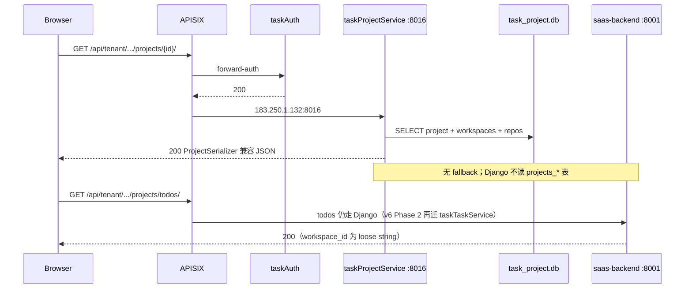

# 设计文档：项目域完全切流 Go — 移除 Django fallback 与 PostgreSQL 真源

- **版本**: v3 — 完全切流 Go（无 Django fallback）
- **作者**: claude
- **日期**: 2026-07-06 17:05
- **前置**: v2 Strangler 代理（Inc-1/2/3 已完成，现废弃 fallback 路径）
- **迭代**: v6 Phase 1 完成 — Project/Workspace 真源迁至 taskProjectService SQLite
- **traceId**: `web-1783327517041-ehv64nmurp`

---

## 1. 需求与决策

**用户指令**：去掉 `taskProjectService →（fallback）Django`；删除 Django 项目域 HTTP 接口与 PostgreSQL 表结构。

| 决策项 | 结论 |
|--------|------|
| 网关路由 | 保持 APISIX → taskProjectService (:8016)，**不回退** Django |
| 数据真源 | `data/task_project.db`（SQLite），一次性自 Django ORM 导出 |
| Django fallback | **删除** `proxyToDjango()` / 透明代理逻辑 |
| Django 公网 API | 移除 project/workspace/workspace-access/deliverable-system 路由 |
| Django 表 | 删除 `projects_project`、`projects_workspace`、`projects_projectrepo`、M2M、`projects_workspaceaccess` |
| Todo 域 | **保留** Django；`Todo.workspace_id`、`TaskProject.project_id` 改为 loose ID（无 FK） |

**不触发 Python 新增接口审批**：本迭代仅**删除** Django endpoint，不新增 Python 公网/internal 路由。

---

## 2. 当前架构理解

根据 `docs/architecture/` 与 `VERSION_HISTORY.md`：

| 层级 | 组件 |
|------|------|
| 网关 | APISIX Docker (:18081)，route `task-project-service` priority 864 |
| 项目 API | taskProjectService Go (:8016)，SQLite `data/task_project.db` |
| 任务 API | saas-backend Django (:8001)，PostgreSQL `projects_todo` 等 |
| 认证 | taskAuth Go (:8003) forward-auth |

**架构版本**：

- v1 ✅ current — Django 项目真源基线
- v6 🎯 target — 三 Go 服务拆分（taskProjectService / taskTaskService / taskCloudService）
- **本次** — v6 Phase 1 交付态：项目域真源在 Go，Django 退化为 Todo/GitHub/LLM 等

---

## 3. 问题背景（502 已修复）

v2 已解决 P0 upstream `127.0.0.1` 与 P1 Strangler fallback。v3 目标：**消除双真源**，Go 独立响应，Django 不再参与项目读路径。

---

## 4. 目标架构（v3）



---

## 5. Go 侧变更（✅ 已完成）

| 文件 | 变更 |
|------|------|
| `django_client.go` | 仅保留 `verifyCompanyExists()`；**已删** `proxyToDjango` |
| `project_response.go` | 新增 `loadProjectDetail()` — Django `ProjectSerializer` 形状 |
| `project_handlers.go` | 原生 CRUD；workspace-access CRUD；无 fallback |
| `main.go` | 子路径未实现返回 501（gitlab-sync、switch-workspace 等待 Phase 1b） |
| `db.go` | `project_repos`、`container_image_name`、`workspace_accesses.group_id` |

**数据迁移**：`export_project_domain_to_go --truncate`

```
Exported: projects=1, workspaces=10, workspace_accesses=11, deliverable_systems=2
目标项目 861581450509701120 已在 SQLite
```

**验证**：

| 检查项 | 结果 |
|--------|------|
| `go test ./src/...` | ✅ |
| GET project detail 直连 :8016 | ✅ 200，无 Django 调用 |
| `proxyToDjango` 代码 | ✅ 已移除 |

---

## 6. Django 侧变更（分阶段）

### Phase A — 路由摘除（Inc-4）

从 `projects/urls.py`、`saas_project/urls.py` 移除：

- `ProjectViewSet` list/detail/CRUD/branches
- `WorkspaceViewSet` CRUD
- `WorkspaceAccessViewSet` 全部 action
- `DeliverableSystemViewSet` / `CompanyDeliverableSystemViewSet`（公网 tenant 路径）
- `switch-workspace`、`associate-workspace`、`batch-delete`、`gitlab-remote-repos` 等 utility

**保留**（仍属 Todo 域或 workspace 子资源）：

- `projects/todos/` — TodoViewSet
- `urls_workspaces` 下 `column-system`、`cloud/platforms`、`model-budget-defaults`（workspace_id 路径参数，不依赖 Workspace ORM）

### Phase B — ORM 解耦（Inc-5）

| 模型 | 变更 |
|------|------|
| `Todo` | `workspace` FK → `workspace_id` CharField |
| `TaskProject` | `project` FK → `project_id` CharField（列名不变） |
| `WorkspaceFeatureParams` | `workspace` OneToOne → `workspace_id` CharField unique |
| `ProjectRepo` | **删除**（数据在 Go `project_repos` 表） |
| `Project` / `Workspace` / `WorkspaceAccess` | **DeleteModel** |

**跨域引用改造**：

- `todo_serializer.py` — `workspace_id` 用 CharField；协作者校验改调 Go `/workspace-access/` 或简化为 tenant 成员校验
- `todo_views.has_workspace_access` — 不再 `Workspace.objects.get`
- `gitlab_remote_projects.py` — 改调 Go API 或标记 deprecated

### Phase C — Migration 0051+（Inc-6）

```sql
-- 顺序：解 FK → 删 M2M → 删表
DROP TABLE projects_project_workspaces;
DROP TABLE projects_projectrepo;
DROP TABLE projects_workspaceaccess;
DROP TABLE projects_project;
DROP TABLE projects_workspace;
```

**保留表**（Todo 域仍用 workspace_id 字符串）：

- `projects_todo.workspace_id`
- `projects_taskproject.project_id`
- `projects_workspace_feature_params.workspace_id`
- `projects_workspace_model_budget_default.workspace_id`
- `projects_deliverablesystem_workspace.workspace_id`

---

## 7. 价值流影响

`conf/value-stream.yaml` **project-workspace** 域：

| 步骤 | 原测试 | v3 影响 |
|------|--------|---------|
| workspace-crud | `WorkspaceViewSet_test.py` | 迁至 Go 集成测试 / 新 `taskProjectService` 测试 |
| project-crud | `ProjectViewSet_test.py` | 同上 |
| deliverable-system | `DeliverableSystemViewSet_test.py` | Go handler 测试 |
| switch-workspace | `WorkspaceViewSet_switch_workspace_test.py` | Phase 1b Go 实现后更新 |
| create-task | `TodoViewSet_test.py` | 保留 Django；`workspace_id` 字段不变 |

**字段迁移**（value-stream 后续由 `/3-value-stream` 更新）：

- `saas-backend.projects_project.*` → `taskProjectService.projects.*`
- `saas-backend.projects_workspace.*` → `taskProjectService.workspaces.*`

---

## 8. 领域概念（轻量）

| 类型 | v3 归属 |
|------|---------|
| Bounded Context: Project | **taskProjectService**（唯一写模型） |
| Aggregate: Project, Workspace | Go SQLite |
| Todo Context | Django，通过 `workspace_id`/`project_id` 字符串引用 |
| 跨上下文 | taskAuth 认证；Django internal Company 校验（Go `verifyCompanyExists`） |

---

## 9. 已知缺口（Phase 1b）

Go 侧 Phase 1b 已实现（2026-07-06）：

| Endpoint | 状态 |
|----------|------|
| `POST .../projects/switch/`、`workspaces/switch/`、`/api/switch-workspace/` | ✅ SQLite 校验 + Django internal 持久化 member |
| `POST .../projects/batch-delete/` | ✅ SQLite 批量删除 |
| `GET .../projects/gitlab-remote-repos/` | ✅ Django internal OAuth + Go 合并 import 标记 |
| `POST batch-from-gitlab-repos` / `combined-from-gitlab-repos` | ✅ Django internal → go_client 写 SQLite |
| `GET .../projects/{id}/repo-access-check/` | ✅ Django internal token 校验 |
| `GET validate-git-repo` | ✅ Django internal 代理 |
| `projects/workspace-access/*` | ✅ Go SQLite + Django internal enrich/collaborators |

Django 新增 **internal** 路由（非公网）：`/api/internal/taskproject/*`

---

## 10. 实施计划

| 阶段 | 任务 | 状态 |
|------|------|------|
| Inc-1 | apisix upstream 修正 | ✅ |
| Inc-2 | Strangler fallback（v2，已废弃） | ✅ → 🗑️ |
| Inc-3 | Go 原生 handler + 删 fallback | ✅ |
| Inc-3b | 数据导出 + SQLite 验证 | ✅ |
| Inc-4 | Django 路由摘除 | ✅ |
| Inc-5 | ORM 解耦 + serializer 改造 | ✅ |
| Inc-6 | Migration drop 表 | ✅ |
| **Phase 1b** | Go utility endpoints | ✅ |
| Inc-7 | 价值流/测试迁移至 Go | ✅（view_test + gitlab/repo-access 核心用例） |
| **Arch v7** | 架构变迁文件交付 | ✅ |

---

## 11. 🏛️ 架构变更影响

- **迭代版本**: v7 🎯 target
- **迭代名称**: 项目域 Go 真源 — 移除 Django fallback 与 projects_* 表
- **作者**: claude
- **设计日期**: 2026-07-06 17:10
- **新增文件**（每个视图三类伴生格式）:
  - 🆕 `docs/architecture/v7-enterprise-landscape-20260706-1710-claude.puml`
  - 🆕 `docs/architecture/v7-application-integration-20260706-1710-claude.puml`
  - 🆕 `docs/architecture/v7-enterprise-landscape-20260706-1710-claude.archimate`（含 Plateau v6→v7 架构变迁视图）
  - 🆕 `docs/architecture/v7-application-integration-20260706-1710-claude.archimate`（含 v6→v7 迁移与 TPS→SQLite 数据流）
  - 🆕 伴生 `.mermaid.md`（每个视图）
- **已有文件（未修改）**: `docs/architecture/v6-*` (target 设计基线)
- **变更明细**: 🟡 taskProjectService SQLite 真源 / 🟡 Django 项目域下线 / ✅ Gap Project closed / ⏳ Phase 1b open

### .archimate 架构变迁要点

| 元素类型 | 内容 |
|----------|------|
| **Plateau v6** | 三 Go 服务拆分设计基线 |
| **Plateau v7** | Phase 1 交付 — taskProjectService live |
| **Gap (closed)** | Project/Workspace in Django — WP1 关闭 |
| **Gap (open)** | Phase 2 taskTaskService / Phase 3 taskCloudService |
| **WorkPackage** | WP1 ✅ / WP1b 进行中 / WP2-3 待续 |
| **视图** | `架构变迁 v6→v7 — 项目域 Go 真源`（含 sourceConnection 连线） |

---

## 12. 验收标准

1. 经网关 GET project detail → 200，响应来自 Go SQLite，Django 日志无对应 SQL
2. Django `:8001` 直连 `/api/tenant/.../projects/` → 404 或 410（路由已摘）
3. `projects_project` 表不存在（migration 后）
4. Todo 创建/列表仍可用，`workspace_id` 字符串有效
5. `go test ./src/...` 与关键 E2E project detail 通过
