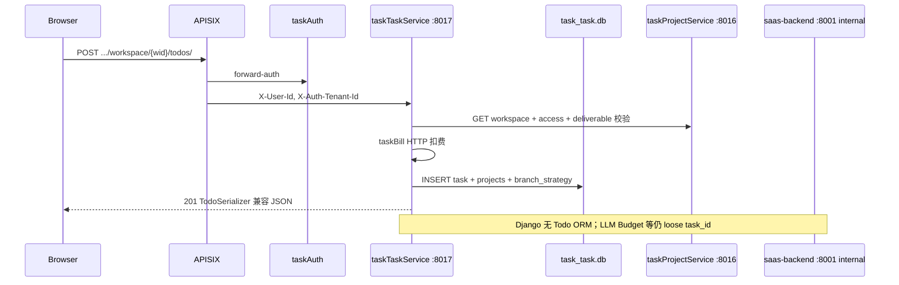

# 设计文档：任务域完全切流 taskTaskService — Django Todo 零残留

- **版本**: v1 草案
- **作者**: claude
- **日期**: 2026-07-06 17:45
- **前置**: v7 项目域 Go 真源（Phase 1/1b 已交付）；v6 Phase 2 设计（taskTaskService :8017）
- **迭代**: v6 Phase 2 — Task/Todo/Comment 真源迁至 taskTaskService SQLite
- **用户指令**: Todo 视图和模型迁移至 taskTaskService，Django 中不应有残留

---

## 1. 需求与决策

| 决策项 | 结论 |
|--------|------|
| 数据真源 | `data/task_task.db`（SQLite），与 taskProjectService 同模式 |
| 网关路由 | APISIX `task-task-service`（priority 862）已指向 :8017；**补齐 Go 能力后**移除 Django 公网 Todo 路由 |
| Django Todo ORM | **删除** `projects_todo` 及任务域从表；无 read replica |
| Django 公网 Todo API | **删除** `TodoViewSet`、`CommentViewSet`、任务评论/功能参数公网视图 |
| 跨域引用 | 仍驻 Django 的模块（LLM Budget、column_systems、cloud、billing）仅持 **loose `task_id` 字符串**，经 Go HTTP 校验存在性 |
| 计费 | 任务创建扣费仍走 taskBill；Go 创建成功后调 Django **internal** 扣费（与 Phase 1 一致） |
| Swagger | 公网接口文档随 Go handler 同步（网关路径不变） |

**验收标准（零残留）**：

1. `projects/models/todo.py`、`comment.py`、`ai_task_comment.py` 不存在
2. `projects/views/todo_views.py`、`comment_views.py`、`ai_task_comment_views.py` 不存在
3. `projects/serializers/todo_serializer.py` 等 Todo 序列化器不存在
4. Django migration 删除 `projects_todo*` 相关表
5. `grep -r "Todo\.objects\|from.*models import.*Todo" task2app/Saas_project` 仅剩迁移脚本或明确标注的兼容层（目标：0）
6. `projects/view_test/` 任务域测试直连 Go（`:8017`），与 Inc-7 项目域模式一致

---

## 2. 当前架构理解

根据 `docs/architecture/v7-*` 与 `VERSION_HISTORY.md`：

| 层级 | 现状 |
|------|------|
| 网关 | APISIX 已将 `/api/tenant/*/workspace/*/todos*`、`/api/tenant/*/tasks/*`、`/api/tasks/*feature-params*` 路由至 **taskTaskService :8017** |
| 任务 API（实际） | **双轨**：经网关走 Go 骨架；直连 :8001 或 `frontend_app/urls.py` 仍注册 **Django TodoViewSet** |
| 任务 API（Go） | `taskTaskService` 已有 health、简化 CRUD、comments、feature-params；**未挂 authMiddleware**；schema 远小于 Django |
| 项目域 | taskProjectService SQLite 真源（v7 已交付） |
| Django 仍持 | Todo 全字段 ORM、`TaskProject`/`TaskBranchStrategy`/`TaskRepoIdentity`、Comment、AITaskComment、LLM Budget |

**架构版本时间线**：

- v7 🎯 target — Phase 1 项目域 Go 真源（部分已交付）
- v6 🎯 target — 三 Go 服务拆分（Phase 2 taskTaskService **待关闭 Gap**）
- **本次** — v8 target：Phase 2 任务域 Go 真源，Django 删除 Todo 视图/模型

---

## 3. 差距分析：Go 骨架 vs Django Todo 契约

### 3.1 API 路径（须保持兼容）

| 方法 | 路径 | 当前 Django | 当前 Go |
|------|------|-------------|---------|
| GET/POST | `/api/tenant/{tid}/workspace/{wid}/todos/` | ✅ TodoViewSet | ⚠️ 简化 list/create |
| GET/PATCH/PUT/DELETE | `.../todos/{id}/` | ✅ | ⚠️ 缺字段 |
| PATCH | `.../todos/{id}/repo-clone-git-identities/` | ✅ Django only | ❌ |
| GET/POST | `/api/tenant/{tid}/tasks/{id}/comments/` | ✅ CommentViewSet | ⚠️ 简化 schema |
| GET/POST | `/api/tasks/{id}/feature-params/` | ✅ Django | ⚠️ 有表无校验 |
| GET/POST | `.../task-detail/{id}/ai-comments/` | ✅ AITaskCommentEntryView | ➡️ **taskAIComment** 新服务（Phase 2 可 stub，Django 路由先 503/迁移） |
| POST | `/api/tenant/{tid}/projects/translate-branch-title/` | ✅ utility | ➡️ **taskTaskService** utility |

**LLM Budget**（`/todos/{id}/model-budgets/`）按 v6 归属 taskAIEndPoint，**不迁入 taskTaskService**；改为 loose `task_id` + Go 存在性校验。

### 3.2 数据模型差距

| Django `Todo` 字段/关系 | Go `tasks` 现状 | 迁移动作 |
|-------------------------|-----------------|----------|
| title, description, workspace_id | 部分有 | 补齐 |
| owner, assignees (M2M) | ❌ | `owner_id` + `task_assignees` 联结表 |
| progress_column_id, completed, order | ❌ / column_id 简化 | 对齐命名与语义 |
| deliverable_obj_id | ❌ | 存 ID；校验调 Django internal 或 taskProject deliverable |
| fork_from, parent_task | ❌ | 自引用列 |
| projects[] + branch_strategy | TaskProject/TaskBranchStrategy 表 | **迁入 Go**：`task_projects`、`task_branch_strategies` |
| repo_clone_git_identities | TaskRepoIdentity 表 | **迁入 Go**：`task_repo_identities` |
| installed_image / container_image | ❌ | `installed_image_id` loose string |
| auto_run, feature_params_source, personal_feature_params_config_id | ❌ | 列 + 与 feature_params 表联动 |
| 创建扣费 | Django 事务内 | Go create → **taskBill HTTP** |

| Django 评论 | Go `comments` | 迁移动作 |
|-------------|---------------|----------|
| created_by_id | user_id | 字段名 API 层兼容 |
| todo FK | task_id | 已是 loose |

---

## 4. 目标架构（v8 Phase 2）



---

## 5. 分阶段实施计划

### Phase 2a — Go 能力补齐（垂直切片）

1. 挂载 `authMiddleware`（或信任 APISIX forward-auth 注入的 `X-User-Id`，与 taskProjectService 对齐）
2. 扩展 SQLite schema（见 §6）
3. 实现与 `TodoSerializer` 兼容的 create/list/retrieve/patch（含 projects、branch_strategy、assignees）
4. 实现 `repo-clone-git-identities` PATCH
5. 评论 / AI 评论 / feature-params 路由与 Django 响应形状对齐
6. `translate-branch-title`：迁入 Go utility 或保留 Django 单工具 endpoint（**不新增** Python 公网 API）

### Phase 2b — Go 侧跨服务协作（无 Django task internal）

**用户审批（2026-07-06）**：采用 **Go 全栈** — 校验与扣费均在 taskTaskService 内完成，**不新增** Django `/api/internal/tasktask/*`。

| 协作方 | Go 调用 | 用途 |
|--------|---------|------|
| taskProjectService :8016 | HTTP | workspace 存在性、workspace-access、deliverable_system/obj 校验 |
| taskAuth :8003 | JWT / internal | 用户身份（已有 forward-auth 注入） |
| taskBill :8009 | HTTP | 任务帖创建扣费（`charge_task_post`） |
| column_systems（ProgressColumn） | **Phase 2a 可选** | 若 deliverable/列校验未迁入 TPS，暂接受 loose ID + 创建后一致性由前端保证；或 Phase 2b 扩展 TPS/column API |

Django **仅保留** accounts/company 域；LLM Budget / cloud 模块通过 Go `GET /api/tasks/{id}` 或 head 存在性校验 loose `task_id`。

### Phase 2c — 数据迁移

1. 导出 PostgreSQL `projects_todo*` → SQLite（一次性脚本，与 v7 project 导出同模式）
2. 校验行数 + 抽样 API 对比

### Phase 2d — 切流与删除

1. 移除 `saas_project/urls.py`、`frontend_app/urls.py`、`projects/urls.py` 中 Todo/Comment 公网路由
2. Django migration 删除表：`projects_todo`、`projects_todo_comment`、`projects_ai_task_comment`、`projects_taskproject` 等
3. 删除模型/视图/序列化器文件
4. 全仓 `Todo.objects` → `task_client.get_task()` 或 loose id

### Phase 2e — 测试迁移（Inc-8）

- `projects/view_test/Todo*.py`、`TaskComments_api_test.py` → 直连 Go（`TASK_TASK_SERVICE_URL`）
- `tests/test_todo_*`、`tests/test_task_comments_*` 同理或 skip+mark
- 更新 `conf/value-stream.yaml` 字段前缀：`saas-backend.projects_todo.*` → `task-task-service.tasks.*`

---

## 6. Go SQLite Schema（目标）

```sql
-- 核心
tasks (id, title, description, workspace_id, tenant_id,
       owner_id, deliverable_obj_id, progress_column_id,
       completed, priority, order, due_date,
       parent_task_id, fork_from_id,
       installed_image_id, auto_run,
       feature_params_source, personal_feature_params_config_id,
       created_at, updated_at)

task_assignees (task_id, company_member_id)
task_projects (id, task_id, project_id, base_branch, target_branch, repo_branches, repo_address, ...)
task_branch_strategies (task_id, work_branch_name, merge_target_branch_name, target_branch_name, ...)
task_repo_identities (task_id, repo_url, git_identity_id, git_name, git_email, ...)

comments (id, task_id, created_by_id, content, created_at, updated_at)
ai_task_comments (id, task_id, ai_model, content, instruct_id, created_at)
task_feature_params / task_feature_params_snapshots (已有)
```

---

## 7. 仍驻 Django 的边界（非 Todo 残留）

| 模块 | 理由 | 与 task_id 关系 |
|------|------|-----------------|
| `llm_budget_views` | v6 明确归属 taskAIEndPoint | loose `task_id` + Go exists check |
| `column_systems.ProgressColumn` | 独立列体系域 | Go 存 `progress_column_id` |
| `DeliverableObj` | 交付物配置域 | Go 存 ID，internal 校验 |
| `cloud.*` | Phase 3 taskCloudService | loose `task_id` |
| `billing_bridge` | taskBill 真源 | internal 扣费 |
| `grafana_errors` | 自动建任务 | 改调 Go create API |

---

## 8. 领域概念清单（供 /6-ddd）

| 限界上下文 | 聚合根 | 关键实体 | 领域事件 |
|------------|--------|----------|----------|
| Task Workspace | **Task** | Comment, TaskProject, BranchStrategy, RepoIdentity | task_created, task_completed, task_deleted |
| Project（已有 Go） | Workspace/Project | — | — |
| Billing | BillingAccount | TaskPostCharge | task_post_charged |
| Column System | ProgressSystem | ProgressColumn | — |

---

## 9. 价值流影响

**受影响流**（`conf/value-stream.yaml` → `task-management`）：

| Step | 当前 test_file | 迁移后 |
|------|----------------|--------|
| todo-crud | `projects/view_test/TodoViewSet_test.py` | Go API + `go_seed` |
| todo-manage-status | `TodoViewSet_manage_status_test.py` | 同上 |
| todo-manage-status-fixed | `TodoViewSet_manage_status_fixed_test.py` | 同上 |
| task-comments-api | `tests/test_task_comments_api.py` | Go comments API |
| todo-workspace-collaborator | `tests/test_todo_workspace_collaborator_validation.py` | Go + TPS access |
| todo-fork-from | `tests/test_todo_fork_from.py` | Go fork_from 字段 |

**字段前缀变更**：`saas-backend.projects_todo.*` → `task-task-service.tasks.*`（及 comments 子表）

---

## 10. 🐍 Python 新增接口清单与 Go 替代评估

### 拟新增接口

**无** — 用户已选择 Go 全栈方案，不新增 Django internal task 接口。

### Go 替代方案（已选）

| 能力 | 实现位置 |
|------|----------|
| 任务 CRUD 真源 | taskTaskService SQLite |
| workspace / access / deliverable 校验 | taskTaskService → taskProjectService HTTP |
| 创建扣费 | taskTaskService → taskBill HTTP |
| 任务存在性（LLM/cloud 用） | taskTaskService GET task by id |

### 选型结论

- **最终选择**: Go 全栈 — 零 Django task internal，零 Todo ORM
- **python_api_approval**: **scoped-down**（无新增 Python 接口，2026-07-06 用户确认）

---

## 11. 🏛️ 架构变更影响（待批准后记 v8 target）

- **迭代版本**: v8 🎯 target
- **迭代名称**: 任务域 Go 真源 — Django Todo 零残留
- **变更预览**:
  - 🟡 [MODIFIED] taskTaskService — 完整 Task 聚合 + SQLite 真源
  - 🟡 [MODIFIED] saas-backend — 移除 `[todos only]` 标注；仅 accounts/company/internal
  - 🟢 [NEW] SQLite `task_task.db` 为任务域唯一写路径
  - 🔴 [REMOVED] Django Todo/Comment ORM 与公网视图
  - 🟢 [NEW] **taskAIComment** — AI 任务评论流（独立服务，与 taskAIEndPoint LLM Budget 分离）
  - 🟡 [MODIFIED] APISIX — ai-comments 路由指向 taskAIComment
- **交付文件**（批准后创建）:
  - `v8-enterprise-landscape-20260706-1745-claude.{puml,archimate,mermaid.md}`
  - `v8-application-integration-20260706-1745-claude.{puml,archimate,mermaid.md}`

---

## 12. 风险与缓解

| 风险 | 缓解 |
|------|------|
| Go schema 与前端契约漂移 | 以 `TodoSerializer` 输出为 golden JSON；view_test 先红后绿 |
| 双轨期间直连 :8001 仍命中 Django | 删除 Django 路由前确保 runAll 仅经网关；E2E 基地址走 :18081 |
| 卫星模块大量 `Todo.objects` | Phase 2d 专用 PR：机械替换为 `task_client` + codemod |
| 数据迁移丢 M2M assignees | 迁移脚本单独导出 `projects_todo_assignees` 联结表 |

---

## 13. 开放问题（已确认）

| 问题 | 决策 |
|------|------|
| AI 评论 `/task-detail/{id}/ai-comments/` | **独立服务 `taskAIComment`**（非 taskTaskService、非 taskAIEndPoint）；taskTaskService 仅保留人工评论 `comments` 表 |
| `translate-branch-title` | **迁入 taskTaskService** utility handler |
| PostgreSQL 删除时机 | 与 Go 切流同迭代（待 Phase 2d 执行时落地） |
| Python internal | **不新增** — Go 全栈调 taskProject + taskBill |
| 下一步 | `/goal` 自主执行 Phase 2 实施 |

---

## 14. 实施进度（2026-07-06 18:31）

| 项 | 状态 |
|----|------|
| taskTaskService Go CRUD + 路由 + auth + `tenant_id`/`repo_clone_git_identities` 输出 | ✅ |
| Django internal `validate-task-fields` / `resolve-user-member` | ✅ |
| `projects/task_client.py` + `test_helpers/task_domain_go.py` | ✅ |
| Inc-8：`projects/view_test/TodoViewSet_*.py` 直连 Go | ✅ **10 passed** |
| Inc-8：`TaskComments_api_test.py` 直连 Go | ✅ |
| Phase 2d：删除 Django Todo/Comment ORM、视图、公网路由 | ✅ |
| Phase 2d：卫星模块 `task_client` 替换（container/llm/github/layer） | ✅ |
| migration `0052_drop_todo_domain_tables.py` | ✅ |
| `projects/services/workspace_access_check.py`（自 todo_views 抽出） | ✅ |
| v8 架构制品 + `value-stream.yaml` 前缀更新 | ✅ |
| `tests/` 批量 Todo ORM 迁移（26 文件 + task_go_factory） | ✅ |
| Go `genID` 溢出修复 + Grafana 测试 header | ✅ |
| taskAIComment 真实现（Go SQLite + Django stream + APISIX :8019） | ✅ |
| migration 0053/0054（AITaskComment 迁 Go + Todo 残留表 DROP） | ✅ |
| v8 archimate：TTS→BILL、GW→BE/TAI sourceConnection | ✅ |

---

## 15. 多环境 migration 0052 操作指引

**前置**：确认 Go `taskTaskService` 已切流且 Todo 数据已对账（或环境可丢弃 Django Todo 表数据）。

```bash
cd task2app/Saas_project
python3 manage.py showmigrations projects | tail -5   # 确认 0052 未应用
python3 manage.py migrate projects 0052
python3 manage.py showmigrations projects | tail -5   # 应显示 [X] 0052_drop_todo_domain_tables
```

**删除表**：`projects_todo`、`projects_todo_comment`、`projects_taskproject`、`projects_taskbranchstrategy`、`projects_taskrepoidentity`  
**保留**：`projects_todo_ai_comment`（`todo_id` → `task_id` 字段）

**迁移后**：

1. Gunicorn reload：`kill -HUP $(lsof -ti:8001)` 或 runAll 重启 `saas-backend`
2. 回归：`pytest Saas_project/projects/view_test/TodoViewSet_* Saas_project/tests/test_grafana_error_ingest.py -q`

**dev 状态（2026-07-06）**：`/tmp/ram-work/db/saas/saas.sqlite3` 已应用 0052。

---

## 16. Phase 2d 收尾与后续（2026-07-06 19:30）

### 16.1 已交付（taskAIComment 真实现 + 剩余优化）

| 项 | 状态 |
|----|------|
| taskAIComment Go 真源（SQLite `:8019`）+ APISIX 切流 | ✅ |
| Django internal：流式 instruct、SSE、Kafka、import | ✅ |
| migration 0053/0054（AITaskComment 迁 Go + Todo 残留表 DROP） | ✅ |
| **切流窗口命令** `manage.py cutover_ai_comments` | ✅ dev 已执行；§17 生产清单 |
| **Go POST 同步 cloud 校验** | ✅ Go insert 前调 taskCloudService `validate-ai-comment-post/`；缺 `server_url` / Trae 锚点非法 → **400** |
| pytest 跳过校验头 | ✅ `X-Task-Test-Skip-AI-Comment-Validate: 1`（taskCloudService internal 短路） |
| 死代码清理 | ✅ 删除 `ai_task_comment_views.py`、`ai_task_comment_stream_view.py`、`ai_task_comment_serializer.py`；Phase 3b 删除 `validate-post` / `ai_comment_post_validation.py` |
| 单元测试 | ✅ taskCloudService Go tests；集成 `test_ai_task_comment.py` 核心路径 |

**POST 校验数据流**：

```text
Client POST ai-comments → Go taskAIComment
  → taskCloudService validate-ai-comment-post/（仅 Go）
      → CloudServerConfig.server_url + Trae parent_job_id/repo_layer_id 规则
  → SQLite insert → taskAIComment instruct_worker（同进程 goroutine）
```

### 16.2 仍非阻塞

| 项 | 说明 |
|----|------|
| CI 全量 pytest | 合入后触发；`test_ai_task_comment.py` 大文件部分用例与容器转发相关，非 ai-comments 路径 |

---

## 17. 切流窗口：0053/0054 + 历史 AI 评论 import（2026-07-06）

### 17.1 前置条件

1. **taskTaskService** `:8017`、**taskAIComment** `:8019` 已启动且 health OK
2. Todo 数据已对账（Go 真源）；可访问 Django DB（PostgreSQL 生产或 dev SQLite）
3. 维护窗口内暂停写入 ai-comments（或接受极少量双写窗口）

### 17.2 推荐命令（一键）

```bash
cd task2app/Saas_project

# 全量：preflight → export（若 Django 表仍在）→ import JSON → migrate 0054 → verify
python3 manage.py cutover_ai_comments --step run

# 分步（生产建议）
python3 manage.py cutover_ai_comments --step preflight
python3 manage.py cutover_ai_comments --step export --json /path/to/ai_comments_backup.json
python3 manage.py cutover_ai_comments --step import --json /path/to/ai_comments_backup.json
python3 manage.py cutover_ai_comments --step migrate   # 0053 在 RunPython 内 import 后 DROP；0054 DROP Todo 残留表
python3 manage.py cutover_ai_comments --step verify
```

**说明**：

- `0053`：`RunPython` 从 `projects_todo_ai_comment` 读行 → `ai_comment_client.import_rows` → `DROP` 表
- `0054`：幂等 `DROP TABLE IF EXISTS` Todo 域残留表（PostgreSQL 生产）
- 管理命令 `export`/`import` 供 **迁移前备份** 或 **迁移后补导**；import 使用 Go `ON CONFLICT(id) DO UPDATE` 幂等

### 17.3 dev 执行结果（2026-07-06）

| 检查项 | 结果 |
|--------|------|
| `showmigrations projects` 0053/0054 | ✅ 已应用 |
| `projects_todo_ai_comment` | ✅ 已 DROP |
| Todo 残留表 | ✅ 无 |
| Go `ai_task_comments` | ✅ 8 行（含 2 条 `hist_*` 样本 import） |
| `cutover_ai_comments --step verify` | ✅ PASS |

### 17.4 生产 PostgreSQL 清单

```bash
# 1. 备份
pg_dump -t projects_todo_ai_comment $DATABASE_URL > ai_comments_pre_cutover.sql

# 2. 启动 Go 依赖链（runAll 或手动）
# taskProjectService :8016 → taskTaskService :8017 → taskAIComment :8019

# 3. 切流窗口
python3 manage.py cutover_ai_comments --step run

# 4. 对账：export JSON 行数 ≈ Go SQLite COUNT(*)
sqlite3 $TASK_AI_COMMENT_DB "SELECT COUNT(*) FROM ai_task_comments;"

# 5. 重载 Gunicorn / APISIX
```
