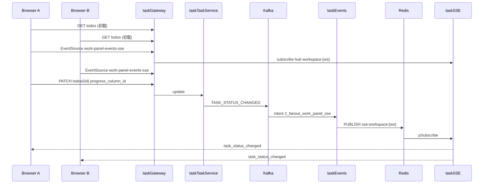

# Work Panel 任务状态 SSE 推送设计

日期：2026-07-18  
状态：已批准（goal-mode 自动采纳）  
迭代：`work-panel-task-status-sse`  
架构版本：v37（target）

## 1. 问题

工作面板 `/tenant/{id}/work-panel/` 任务卡片的进度列状态目前：

1. **首屏**通过 `GET .../todos/` 拉取；
2. **本浏览器**在拖拽/下拉改进度后 `PATCH` 再 `fetchTodos`；
3. **其他浏览器/标签页**无法及时获知变更，需手动刷新。

已有 taskSSE（任务详情启动态、充值完成），但缺少 **workspace 级看板** 订阅。

## 2. 目标与成功标准

| # | 标准 | 验证 |
|---|------|------|
| S1 | 首屏仍用 HTTP 拉取 todos / progress-system | 现有 `initData` 不变 |
| S2 | 页面打开后订阅 workspace SSE | EventSource 连上收到 `work_panel_sse_connected` |
| S3 | 任一客户端改任务进度列后，同 workspace 其他浏览器卡片列位更新（秒级） | 双标签：A 拖拽 → B 卡片列变化 |
| S4 | 不在业务写路径同步发 SSE；经 Kafka `TASK_STATUS_CHANGED` → taskEvents → Redis → taskSSE | 符合 `.ai` SSE 最佳实践 |
| S5 | 鉴权：仅网关注入的租户/用户可订阅；禁止伪造 query user | 无 gateway secret → 403 |
| S6 | Swagger/路由归属文档可见该 SSE 路径 | `api_route_ownership.yaml` + 网关路由 |

非目标（本迭代不做）：

- 机器/容器 runtime 指示的 SSE（仍可 15s 轮询）
- 任务创建/删除的实时推送（本浏览器仍走 `tasks-updated`；远程可后续扩事件）
- WebSocket

## 3. 方案比选（自动采纳 A）

| 方案 | 描述 | 结论 |
|------|------|------|
| **A. 扩展 taskSSE + taskEvents fan-out** | 新 endpoint；`TASK_STATUS_CHANGED` 新 intent 写 Redis `sse:workspace:{ws}` | **采纳**：复用侧车、鉴权、心跳、连接上限 |
| B. 在 taskTaskService 内嵌 SSE | Go 长连接 | 否：违反 SSE 侧车边界与「禁止业务路径同步 SSE」 |
| C. 前端短轮询 todos | 2–5s 拉列表 | 否：延迟与负载差，且用户明确要求推送 |

## 4. 架构



### 4.1 读端（taskSSE）

- **路径**：`GET /api/tenant/{tenant}/workspace/{workspace}/work-panel-events-sse/`
- **Hub key**：`workspace:{workspace_id}`
- **握手**：`event_name: work_panel_sse_connected`
- **心跳**：`event_name: work_panel_sse_heartbeat`（或 `type: heartbeat`）
- **鉴权**：与 billing SSE 相同 — 要求 `X-TaskGateway-Internal-Secret`；用户来自 `X-User-Id`（可不绑定 hub，仅审计）
- **连接上限**：复用 `maxConnections`

### 4.2 写/扇出（taskEvents）

- **既有**：`task_status_changed/1_release_servers_on_terminal` 不变
- **新增**：`task_status_changed/2_fanout_work_panel_sse`
  - 消费 `TASK_STATUS_CHANGED`
  - 取 `workspace_id`、`task_id`、`progress_column_id` 等
  - Redis `PUBLISH sse:workspace:{workspace_id}`，payload：

```json
{
  "task_id": "workspace:{workspace_id}",
  "status_data": {
    "event_name": "task_status_changed",
    "task_id": "<real task id>",
    "tenant_id": "...",
    "workspace_id": "...",
    "progress_column_id": "...",
    "previous_progress_column_id": "...",
    "completed": false,
    "previous_completed": false,
    "progress_column_name": "可选"
  }
}
```

与 billing 一致：`task_id` 字段承载 hub key，真实任务 id 在 `status_data.task_id`。

### 4.3 前端（WorkPanel）

- 新增 composable `useWorkPanelTaskStatusSse.js`
- `initData` / workspace 切换后：`fetchTodos` 完成再 `openWorkPanelTaskStatusSse`
- 收到 `task_status_changed`：增量 patch `todos` 中对应卡片的 `progress_column_id` / `completed`（找不到则触发一次 `fetchTodos`）
- 离开页面 / 切换 workspace：`close()`
- 断线：可选轻量重连（指数退避，上限 N 次）；失败不阻塞看板 HTTP 用法

### 4.4 网关与归属

- `taskGateway/routes/routes.yaml`：`sse-work-panel-events` → `taskSse`，`auth_mode: token`
- `db/api_route_ownership.yaml`：`target_owner: task-sse`
- `docs/architecture/api-route-to-owner.md` 同步一行

## 5. 权限

| 主体 | 能力 |
|------|------|
| 已登录且对租户有访问权的用户 | 订阅本租户下其有权访问的 workspace SSE（网关 token + 既有 workspace ACL） |
| 未授权 / 无 gateway secret | 403 |
| 跨 workspace 窃听 | 不可：hub 按 path 中 workspace_id 隔离 |

SSE 仅推送任务状态字段（无密钥、无机器凭证）。

## 6. 事件契约

| 意图 | 领域事件 | Topic | 消费者 |
|------|----------|-------|--------|
| 任务进度/完成态变更（已有） | `TASK_STATUS_CHANGED` | `task-status-changed` | 1_release… + **2_fanout_work_panel_sse** |
| 任务创建（含 Chrome 插件） | `TASK_CREATED` | `task-created` | **2_fanout_work_panel_sse**（同进程多 topic） |
| 任务删除 | `TASK_DELETED` | `task-deleted` | **2_fanout_work_panel_sse**（同进程多 topic） |
| （扇出副作用，非新业务事件） | Redis 帧 → 浏览器 | — | taskSSE |

纯查询例外：首屏 todos GET — 不投递事件。

## 7. 架构制品

- `docs/architecture/v37-application-integration-20260718-1810-claude.{puml,archimate,mermaid.md}`
- `VERSION_HISTORY.md` 增加 v37 target

## 8. 风险与缓解

| 风险 | 缓解 |
|------|------|
| 本端 PATCH 与 SSE 双更新闪烁 | 增量 patch 幂等；字段相同则跳过 |
| SSE 断线漏事件 | 重连后可选一次 `fetchTodos` 对账 |
| 连接数膨胀 | `maxConnections`；workspace 级比 task 级连接更省 |
| Kafka 延迟 | 与现有释放服务器路径同级，可接受秒级 |

## 9. 测试要点

- taskSSE：path 匹配、gateway secret、hub key、normalize workspace payload
- taskEvents：intent 单测 publish Redis channel + payload
- 前端 Vitest：收到事件后 todos 列 id 更新；heartbeat 忽略
- 手工/E2E：双标签拖拽同步（有环境时）
