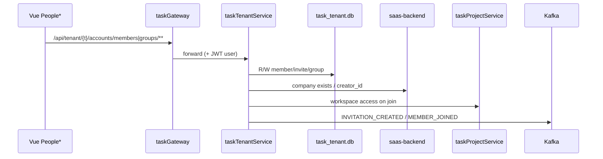

# 设计文档：人员页成员/邀请/分组 API 迁 Go

日期：2026-07-19  
状态：已批准（goal-mode 自动采纳）  
迭代：`people-member-group-go-migration`  
架构版本：v39（current）

## 1. 问题

租户人员三页（邀请人 / 管理人员 / 管理分组）及邀请落地页的公网 API 仍全部由 Django `CompanyMemberViewSet` / `CompanyGroupViewSet` 处理，走 `django-default` 网关回落。组织域写路径占用单线程 WSGI，且与「新增接口默认落 Go」元规则冲突。

## 2. 目标与成功标准

| # | 标准 | 验证 |
|---|------|------|
| S1 | 公网 `/api/tenant/{tid}/accounts/members/**` 与 `.../groups/**` 由 **taskTenantService** 提供 | 网关路由 + curl/单测 |
| S2 | 前端契约不变（路径、字段、权限语义与现网一致） | 三页手工/单测；`parseCompanyMembersResponse` 兼容 |
| S3 | 四表 owner 迁出 saas：`accounts_company_member` / `accounts_invitation` / `accounts_company_group` / `accounts_company_group_member` | `table_ownership.yaml` + 迁表脚本 |
| S4 | Django 公网 ViewSet 路由卸除或 410；无活跃公网入口 | urls 扫描 + 请求 404/410 |
| S5 | Django/他服务经 **internal HTTP** 协作，禁止旁路写新库 | `tenant_client` + ownership CI |
| S6 | 意图事件：`INVITATION_CREATED`、`MEMBER_JOINED` 仍由写路径发布 | Kafka / stub + 日志审计 |
| S7 | OpenAPI / `api_route_ownership.yaml` / runAll 已注册 | CI 对照 |

非目标：

- `accounts_company` 表迁出（仍 saas-backend）
- `users/me`、budget-permissions（已他服务）
- 前端 UI 改版

## 3. 方案比选（自动采纳 A）

| 方案 | 描述 | 结论 |
|------|------|------|
| **A. 新建 taskTenantService + 迁四表** | 公网+表 owner 在 Go；Company 仍 Django；Django 改 HTTP | **采纳**：符合 Go-first + 单表所有权 |
| B. 扩 taskAuth | 成员挂认证服务 | 否：边界污染 |
| C. 扩 taskProjectService | 与项目/工作区耦合 | 否：组织域≠项目域 |
| D. Go 薄代理 + 表留 Django | 公网迁、逻辑仍 Django | 否：未真正迁业务，且清理不彻底 |

## 4. 架构

### 4.1 服务

| 项 | 值 |
|----|-----|
| 目录 | `taskTenantService/` |
| runAll name | `task-tenant-service` |
| 端口 | `8020`（`0.0.0.0`） |
| DB | `data/task_tenant.db` |

### 4.2 表 → owner

| 表 | 原 owner | 新 owner |
|----|----------|----------|
| accounts_company_member | saas-backend | task-tenant-service |
| accounts_invitation | saas-backend | task-tenant-service |
| accounts_company_group | saas-backend | task-tenant-service |
| accounts_company_group_member | saas-backend | task-tenant-service |
| accounts_company | saas-backend | saas-backend（不变） |

### 4.3 Django 清理

- 卸除 `accounts/urls.py` 中 `members`/`groups` 公网 router 注册（或 ViewSet 一律 410）。
- `create_company_for_user`、`resolve_company_member_for_tenant`、taskproject internal resolve 等改为 `accounts/tenant_client.py` → Go internal。
- 迁表：export saas → `POST .../import` → Django migration DROP（或脚本）。

## 5. 事件对照

| 业务意图 | 事件 | 发布点 | 消费者 |
|----------|------|--------|--------|
| 发送/重发邀请 | INVITATION_CREATED | taskTenantService invite/resend | taskEvents 发邮/短信 |
| 接受邀请加入 | MEMBER_JOINED | taskTenantService join | 公司切换器等 |
| 纯查询（列表/校验） | — | — | 书面例外：只读 |

## 6. 架构制品

- `docs/architecture/v39-application-integration-20260719-0510-claude.{puml,archimate,mermaid.md}`
- `VERSION_HISTORY.md` 追加 v39 target

## 7. 风险

| 风险 | 缓解 |
|------|------|
| Django 残留 ORM 直连四表 | 迁表前改 client；CI ownership；测试修红 |
| company_members 预算 meta | 首版可简化 llm_budget=false；后续调 Cloud |
| 双写窗口 | 单次切流：停写 → import → 切路由 → DROP |

## 变更记录

| 日期 | 说明 |
|------|------|
| 2026-07-19 | goal-mode 自动采纳方案 A；启动实现 |
