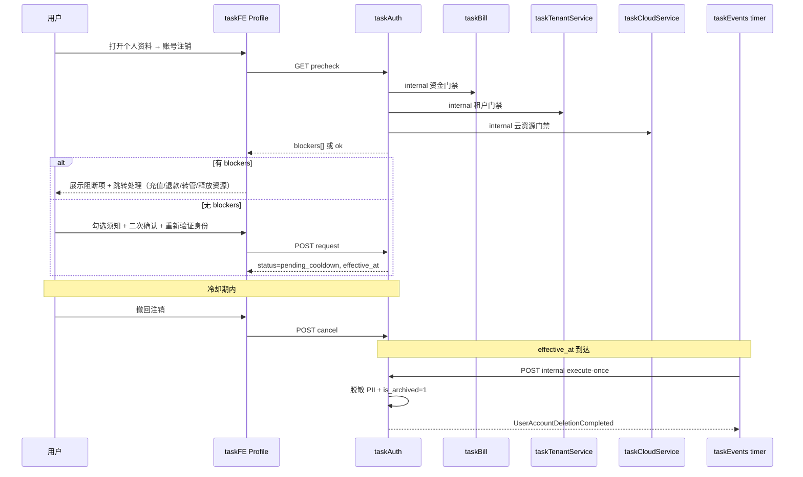

# 用户账号注销（PIPL 合规）— 设计

- **Date:** 2026-08-19
- **Status:** accepted
- **Iteration:** user-account-deletion-pipl
- **Compliance:** 以中国《个人信息保护法》（PIPL）为主；保留年限等细则标注「待法务书面确认」
- **User choices:** 1-A PIPL / 2-A 申请→冷却→归档+脱敏 / 3-D 三项前置均为硬门禁
- **python_api_approval:** not_applicable（全 Go + Vue；无新增 Python endpoint）
- **Architecture change:** 是（跨服务编排 + 新领域事件 → 目标 **v86 target**）

## Goal / 成功标准

1. 用户在个人资料页 `/user/{id}/profile/`（及 legacy `/profile/`）可发起**账号注销申请**，流程符合 PIPL「个人删除权」可行使形态。
2. **硬门禁（全部通过才可提交）**：
   - 账户/租户存在**可用余额、未完成订单、进行中退款申请**等资金未完成项；
   - 用户是某租户的**唯一管理员**且该租户仍有其他成员或仍有关联资源；
   - 用户名下仍有**运行中/未释放的云资源或有效订阅/配额**。
3. 提交后进入**可配置冷却期**（默认 **15 天**，`conf/auth/task-auth/config.yaml`），冷却期内可**一键撤回**；到期后自动执行注销编排。
4. 注销完成：`is_archived=1`、会话/令牌全部失效；**可识别 PII 脱敏或删除**；**支付/KYC/AML/审计/交易流水**按法定保留策略留存（不可恢复登录）。
5. 全链路可审计：申请/撤回/执行/阻断原因带 `trace_id`；超管可在系统管理查看注销记录（只读）。

## 现状

| 能力 | 位置 | 说明 |
|------|------|------|
| 超管归档 | `taskAuth` `POST /api/system-admin/users/{id}/archive/` | 同步 `is_archived=1`，**无**用户自助、**无**冷却、**无**跨服务检查 |
| 登录拦截 | `taskAuth` `loadUserAuthFlags` / gateway forward-auth | 已读 `is_archived`，归档用户无法鉴权 |
| 隐私/许可同意 | `taskBill` `billing_privacy_policies` + consents | 有合规文档基础，**无**注销专章 API |
| 退款申请 | `taskBill` 租户退款 | 进行中退款应阻断注销 |
| 个人资料 UI | `taskFE` `UserProfile.vue` | 头像/昵称/绑定，**无**危险区注销 |
| KYC/AML | `taskAuth` `auth_kyc_*` | 须保留，不可物理删 |

目标 URL 需登录；未登录重定向 `/auth/login/?next=...`（已验证）。

## 合规假设（待法务确认项）

> 本设计按 PIPL 第 47 条（删除权）与第 19 条（最小必要）预留；**具体保留年限以书面合规结论为准**。

| 数据类 | 处理策略 | 保留依据（草案） |
|--------|----------|------------------|
| 登录标识（邮箱/手机/openid） | 冷却结束后**不可逆脱敏**（哈希占位 + 释放 identifier 供未来注册） | 删除权 |
| 昵称/头像/个人简介 | 删除或置空 | 删除权 |
| 访问令牌 / 会话 | 立即吊销（申请提交时预吊销非必要会话可选；**执行日**全量吊销） | 安全 |
| KYC 档案、AML 筛查、KYC 审计 | **保留**，字段级访问收紧为 internal-only | 反洗钱 / 监管 |
| 支付流水、订单、退款、协议/隐私同意记录 | **保留**，用户 ID 可映射为「已注销用户」伪匿名 | 会计 / 税务 / 争议 |
| 任务/评论等业务 UGC | **伪匿名化**（显示「已注销用户」；不删业务事实） | 合同履行 / 协作完整性 |
| 注销申请审计日志 | 保留 ≥ 3 年（可配置） | 争议举证 |

## 用户旅程



## 前置硬门禁（3-D 细化）

`GET /api/accounts/users/me/account-deletion/precheck/` 聚合下列检查；**任一 `blocking: true` 则禁止 POST request**。

### B1 — 资金与订单（owner: taskBill）

| 检查项 | 条件 | 用户指引 |
|--------|------|----------|
| 租户账户可用余额 | 任一关联租户 `billing_account.balance > 0` 或冻结积分 > 0 | 前往 `/tenant/{id}/billing/` 消费或申请退款 |
| 未完成订单 | `billing_resource_order.status IN ('pending','awaiting_payment','processing')` 且 user/tenant 关联 | 完成支付或取消订单 |
| 进行中退款 | `billing_refund_application.status = 'pending'` | 等待审批或联系客服 |
| 待处理充值/支付 | `billing_payment_pending.status='pending'`，且无 `order_id` 或关联 `billing_resource_order.status='pending'`。已退款/已支付/已取消/已过期订单、以及 `paid`/`cancelled`/`refunded` 支付行均不算未完结 | 完成或取消支付：有 `order_id` → `/tenant/{id}/billing/orders/{order_id}/`，否则 `/tenant/{id}/billing/` |

实现：`taskAuth` 调 `taskBill` **internal** `GET /api/internal/taskbill/users/{user_id}/account-deletion-blockers/`（新建，只读）。

### B2 — 租户管理权（owner: taskTenantService）

| 检查项 | 条件 | 用户指引 |
|--------|------|----------|
| 唯一管理员 | 用户在某租户为**唯一** `tenant_admin` 且 `member_count > 1` | 转让管理员或移除成员：`/tenant/{id}/people/manage/` |
| 待处理成员邀请 | **不是硬门禁**。邀请属租户而非个人账号；过期/`is_accepted=0` 行也不会出现在人员管理「待处理邀请」列表，把它们做成阻断会导致「前往处理」无法消项。注销执行时邀请自然失效即可。 | — |

实现：`taskAuth` 调 `taskTenantService` internal `GET /api/internal/tenant/users/{user_id}/account-deletion-blockers/`。

### B3 — 云资源与订阅（owner: taskCloudService + taskBill）

| 检查项 | 条件 | 用户指引 |
|--------|------|----------|
| 运行中容器/云主机 | 与用户 comment/container 绑定且 runtime 非 stopped | 停止并释放 |
| 有效订阅/配额 | GitLab 资源 `provisioning_status=active`、任务帖配额等 | 取消或释放：`/tenant/{id}/settings/gitlab-connection/`（**不是**不存在的 `/billing/gitlab-resources/`，该路径会被 SPA catch-all 踢回首页） |

实现：`taskAuth` 并行调 `taskCloudService` + `taskBill` internal blockers API。

**Precheck 响应示例：**

```json
{
  "can_request": false,
  "blockers": [
    {
      "code": "BILLING_BALANCE_REMAINING",
      "blocking": true,
      "message": "租户「示例公司」仍有可用余额 12.50 元",
      "action_url": "/tenant/123/billing/"
    },
    {
      "code": "TENANT_SOLE_ADMIN",
      "blocking": true,
      "message": "您是租户「示例公司」的唯一管理员，请先转让管理员角色",
      "action_url": "/tenant/123/people/manage/"
    }
  ],
  "cooldown_days": 15
}
```

## 注销状态机

```
none → pending_cooldown → executing → completed
         ↓ cancel
       cancelled
```

| 状态 | 含义 |
|------|------|
| `none` | 无进行中的申请 |
| `pending_cooldown` | 已申请，等待 `effective_at` |
| `cancelled` | 用户冷却期内撤回 |
| `executing` | 定时触发，编排进行中（幂等） |
| `completed` | 已归档+脱敏完成 |

DB SSOT：`taskAuth.auth_account_deletion_request`（见 DDL）。

## API（公网 — taskAuth）

| 方法 | 路径 | 说明 |
|------|------|------|
| GET | `/api/accounts/users/me/account-deletion/precheck/` | 聚合门禁 |
| GET | `/api/accounts/users/me/account-deletion/status/` | 当前申请状态 |
| POST | `/api/accounts/users/me/account-deletion/request/` | 提交申请；body 含 `confirmation_text`（须等于「注销」）、`reauth_token`（密码/SMS 验证后颁发的一次性 token） |
| POST | `/api/accounts/users/me/account-deletion/cancel/` | 冷却期内撤回 |

鉴权：仅本人；归档/冷却中重复 request → 409。错误带 `data-traceId`。

## API（internal — 编排）

| 方法 | 路径 | 调用方 |
|------|------|--------|
| POST | `/api/internal/taskauth/account-deletion/execute-due/` | taskEvents timer worker（一次性） |
| GET | `/api/internal/taskbill/users/{id}/account-deletion-blockers/` | taskAuth precheck |
| GET | `/api/internal/tenant/users/{id}/account-deletion-blockers/` | taskAuth precheck |
| GET | `/api/internal/cloud/users/{id}/account-deletion-blockers/` | taskAuth precheck |

## 执行日编排（effective_at）

由 **taskEvents timer** + **一次性 internal API** 触发（遵守 ADR-0011 / 元规则 51，禁止 taskAuth 进程内 ticker）。

顺序（幂等键 = `deletion_request_id`）：

1. 再次跑 precheck（防止冷却期内状态漂移）→ 仍阻断则标记 `failed_blocked` + 通知用户（邮件/站内，若通道可用）
2. 吊销全部 `auth_customtoken`、access tokens、OIDC sessions
3. 脱敏 `auth_user` / `auth_login_method` / `auth_user_profile` / 微信绑定
4. `UPDATE auth_user SET is_archived=1, is_active=0`
5. 发布 `UserAccountDeletionCompleted` → 各服务 consumer 伪匿名化业务引用（taskTaskService 评论显示名等）
6. 写 `auth_account_deletion_audit` 终态

## DDL（taskAuth — dataMigrate）

`dataMigrate/taskAuth/035_account_deletion.sql`：

- `auth_account_deletion_request` — 申请主表（Snowflake id, user_id, status, requested_at, effective_at, cancelled_at, executed_at, last_precheck_snapshot JSON, idempotency_key UNIQUE）
- `auth_account_deletion_audit` — 步骤审计（request_id, step, detail_redacted, trace_id, created_at）

`auth_user` 增可选 `deletion_completed_at`（便于列表过滤）。

## 前端（taskFE）

在 `UserProfile.vue` 底部新增 **「账号注销」** 卡片（危险区样式）：

1. 简短说明 + 链接当前隐私政策（`/api/billing/privacy-policy/current/` 或既有弹窗）
2. 「检查注销条件」→ 调 precheck，列表展示 blockers（每项带 `<a href>` 真实跳转，禁止 router 拦截）
3. 无 blockers → 模态：勾选三条须知（数据删除不可逆、资金须清零、冷却期可撤回）+ 输入「注销」+ 重新验证（复用改密/绑手机验证组件）
4. 冷却中：展示倒计时、`effective_at`、**撤回注销**按钮
5. 错误展示带 `data-traceId`

不在 `UserCenterSidebar` 单独加菜单项（危险操作仅在个人资料页）。

## 业务意图 → 事件对照

| 业务意图 | 事件名（过去式） | MQ topic / 类型 | 发布点 | 消费者/副作用 |
|---------|-----------------|----------------|--------|--------------|
| 用户提交注销申请 | UserAccountDeletionRequested | `user-account-deletion-requested` | taskAuth outbox | taskEvents 审计；可选通知 |
| 用户撤回注销 | UserAccountDeletionCancelled | `user-account-deletion-cancelled` | taskAuth outbox | 审计 |
| 冷却期结束开始执行 | UserAccountDeletionExecutionStarted | `user-account-deletion-execution-started` | taskAuth | 审计 |
| 注销执行完成 | UserAccountDeletionCompleted | `user-account-deletion-completed` | taskAuth | taskTaskService 伪匿名；taskBill 标记；GitLab OAuth 撤销 |
| 执行被阻断 | UserAccountDeletionBlocked | `user-account-deletion-blocked` | taskAuth | 通知用户 |

幂等键：与 `deletion_request_id` 同粒度（NFR ≥ L3）。

## 领域概念清单（/6-ddd 输入）

| 类型 | 名称 | 归属 BC |
|------|------|---------|
| Aggregate Root | AccountDeletionRequest | Identity (taskAuth) |
| Entity | User (auth_user) | Identity |
| Value Object | DeletionBlocker | Identity（聚合 precheck 结果） |
| Domain Event | UserAccountDeletion* | Identity → 跨 BC |
| Policy | PiiRetentionPolicy | Compliance（配置驱动） |

## 价值流影响

| 流 | 影响 |
|----|------|
| 用户与认证 · 个人资料 | 新增「账号注销」步骤与测试点 |
| 合规 · KYC | 注销后 KYC 只读保留；超管 drawer 仍可见「已注销」标记 |
| 组织与成员 | 唯一管理员阻断 → 转让管理员 |
| 云平台与资源 | 须先释放运行资源 |
| 计费 · 退款 | 余额/订单/退款阻断 |

完整切片在 `/4-value-stream` 阶段写入 `value-stream.yaml` 与 `docs/flows/value-stream-test-integration.wsd`。

## 🕸️ Code Review Graph 分析

- **状态:** partial — 本机 graph 仅 17 文件 / 108 节点，未索引 `taskAuth`/`UserProfile`；已用源码检索补全。
- **直接变更面:** `taskAuth`（handlers + DDL + execute）、`taskFE/UserProfile.vue`、`taskBill`/`taskTenantService`/`taskCloudService` internal blockers、`taskEvents` timer intent、`docs/intents/user-account-deletion.intent.md`。
- **爆炸半径:** 登录/forward-auth 已依赖 `is_archived`；新增 request 路径不影响现有超管 archive；执行日 consumer 需幂等。

## 🐍 Python 新增接口清单与 Go 替代评估

**未触发** — 全部公网 API 落 `taskAuth` Go；blockers 为各 Go 服务 internal 只读接口。

## 🏛️ 架构变更影响（审批通过后写入 v86 target）

| 标记 | 组件 |
|------|------|
| 🟢 NEW | `auth_account_deletion_request`、timer intent `account-deletion-execute-due` |
| 🟡 MOD | taskAuth（用户自助注销 API）、taskFE Profile、taskBill/tenant/cloud internal blockers |
| 🟡 MOD | taskEvents Kafka topics + DLT |
| 无标记 | 超管 archive 路径保留（人工兜底） |

**交付文件（审批后生成，每视图四类）：**

- `v86-application-integration-20260819-1750-cursor.puml` + `.diff.archimate` + `.full.archimate` + `.mermaid.md`
- `v86-enterprise-landscape-...`（若仅 integration 变更可只升 integration；enterprise 若只加 Motivation 约束则同步）
- `docs/architecture/VERSION_HISTORY.md` 追加 v86 target 条目

## 非目标（一期）

- 法人租户整户注销（仅**个人用户账号**）
- 即时注销（无冷却）
- 物理 DELETE 行（采用归档+脱敏）
- 超管代用户发起注销（可二期）
- 数据打包导出（PIPL 可携权，单独迭代）

## 测试要点

- 单元：precheck 聚合、状态机、幂等 execute、PII 脱敏函数
- 集成：blockers 各分支 409、冷却 cancel、timer 触发 execute
- E2E：Profile 危险区流程、blocker 链接可点击、traceId 展示
- 回归：归档用户 login 403、超管 archive 仍可用

## 待确认默认值

| 项 | 建议默认 | 可改 |
|----|----------|------|
| 冷却期 | 15 天 | `conf/auth/task-auth/config.yaml` |
| 确认词 | 「注销」 | 配置 |
| 执行失败 | 标记 blocked + 邮件/站内 | 通知模板二期 |
