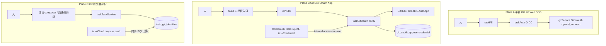

<!-- markdownlint-disable MD013 MD060 -->

# 设计文档：当前 Git OAuth 体系 as-is 盘点

- **日期**: 2026-08-20
- **作者**: cursor
- **迭代**: git-oauth-as-is-inventory
- **状态**: proposed（as-is 分析；**不改代码、不写架构 target**）
- **范围**: 盘点现网三条并行身份轨 + 配置/数据/事件/已知缺口
- **明确非目标**: 不新增服务、不改接口契约、不创建 `docs/architecture/v88-*`

---

## 0. 对当前架构的理解（口头确认）

根据 `docs/architecture/` **current** 与 `VERSION_HISTORY.md`：

- **current 视图（2 个，均为 v85）**:
  - `enterprise-landscape` — `v85-enterprise-landscape-20260818-1439-cursor.puml`
  - `application-integration` — `v85-application-integration-20260818-1439-cursor.puml`
- **业务层**: Developer / Admin / Enterprise；Identity & Access、Task Management、Cloud Resource、Billing、IDE Workspace
- **应用层**: `taskGitOauth (Go :8002)`、`taskAuth (Go :8003)`、`taskTaskService (:8017)`、`taskCloudService (:8018)`、`taskProjectService (:8016)`、`taskCredentialService (:8015)`、`taskContainerGateway`、APISIX、taskFE；多区域 `gitService`
- **技术层 / 数据**: `gitOauthDB`（landscape 有 DataObject）；GitLab CE 现网 + `tencent-sh-1`；OIDC issuer 在 taskAuth
- **上次已交付基线**: **v85 ✅ current** — 可插拔多区域 gitService（ADR-0014）
- **积压 target（与本次正交，不合并）**: v86 PIPL 注销、v87 taskFE nginx 静态常驻；另有 v83 评论级仓库身份（已设计，身份生命周期 Task→Comment）

📋 架构版本历史（与 Git 相关节选）：

| 版本 | 状态 | 摘要 |
|------|------|------|
| v29 | 已交付 | gitOauth Python → Go `taskGitOauth`，端口仍 8002 |
| v83 | target / 部分落地 | 评论级 Git 提交身份 + 选用已绑定 OAuth 账号 |
| v85 | ✅ current | 多区域 gitService + taskAuth 多 GitLab OIDC client |
| v86 / v87 | 🎯 target 积压 | 注销 / taskFE nginx；与 Git OAuth 正交 |

**关键缺口（图 vs 运行时）**: v85 **landscape 有** `taskGitOauth` 组件与 `gitOauthDB`；v85 **application-integration 几乎只画 Plane A**（taskAuth OIDC ↔ 各区域 GitLab），**几乎不画 Plane B 换票链**（Vue → APISIX → taskGitOauth → GitHub/GitLab OAuth App → access-for-user）。本次 as-is **不补图**（用户选定不改架构）；若后续要让架构图与运行时对齐，须另开迭代写 vN target 四类伴生文件。

本次需求将在此基础上**只做盘点**，不改变组件边界。

---

## 1. 问题与意图

「Git OAuth」在本仓库口语里常被当成**一件事**。现网实际是 **三条并行身份轨 + 一条租户自建 GitLab 连接 + 一条计费开通面**。混用会导致：

- 人已能打开 GitLab Web（SSO 成功），容器仍推送失败（未绑 OAuth App 或换票失败）
- 换票成功但 commit 署名失败（`task_git_identities` 查不到，2026-08-20 的 1146）
- 区域仓用了 default 实例 token（ADR-0014 禁止项）

本次意图：**把 as-is 拓扑、所有权、契约、事件与已知事故写成 SSOT 设计文档**，供后续专项迭代引用。

---

## 2. 三条身份轨（必须分开）



| 平面 | Owner | 人用它做什么 | 关键产物 | 不是什么 |
|------|-------|--------------|----------|----------|
| **A. 平台 GitLab Web SSO** | taskAuth + gitService | 登录 GitLab Web UI | GitLab 用户（SSO 首次可自动开通） | 不是 clone/push 的 HTTPS token |
| **B. Git Site OAuth App** | **taskGitOauth :8002** | 绑定 GitHub/GitLab OAuth App，给容器 HTTPS git | Fernet 加密 refresh + 短时 access | 不是 GitLab 网站登录 |
| **C. Git 作者身份** | **taskTaskService** `task_git_identities` | commit `user.name` / `user.email` | identity_id + name/email | 不是 OAuth token |

另两条易混面：

| 面 | Owner | 作用 |
|----|-------|------|
| **D. 租户自建 GitLab OAuth 连接** | taskGitOauth `git_oauth_tenant_gitlab_oauth_connections` | 每 company 至多一条自建 CE 的 OAuth App；成员再走 Plane B 个人绑定 |
| **E. 计费 GitLab 区域开通** | taskBill `billing_gitlab_region` + gitService Admin API | 租户买区域、建 group；**不是** OAuth App 换票 |

ADR：

- [ADR-0014](../../adr/0014-pluggable-multi-region-gitlab.md) — 多区域独立实例 / 独立 provider YAML
- [ADR-0016](../../adr/0016-gitlab-sso-only-no-self-signup.md) — Plane A：禁止自行注册与 Web/Git 账密，仅 SSO

---

## 3. Plane A — 平台 GitLab Web SSO

- **IdP**: taskAuth OIDC
- **RP**: 每个 `conf/infra/git-service*` 实例 OmniAuth `openid_connect`
- **强制三键**（须显式 `false`）: `signupEnabled` / `passwordAuthWeb` / `passwordAuthGit`
- **首次 SSO**: `omniauth_block_auto_created_users = false` → 可自动建 GitLab 用户（IdP 驱动开通，不是公开注册）
- **排障禁令**: 不得为「登不上」把注册或账密改回 `true`
- **与 Plane B 的关系**: 人登录 GitLab Web ≠ 容器能 `git push`。推送走 OAuth App access_token（或 SSH，不在本盘点范围）

v85 application-integration 画的就是这一条：`taskAuth → gitlabExisting / gitlabSh1` 的 OIDC issuer/callback。

---

## 4. Plane B — taskGitOauth（Git Site OAuth App）

### 4.1 服务边界

| 项 | 现状 |
|----|------|
| 进程 | `taskGitOauth`，runAll 名 `git-oauth`，端口 **8002**，listen **`0.0.0.0`** |
| 切流 | 2026-07-15 Python `gitOauth/` → Go（架构 v29）；同端口同库 |
| 配置 SSOT | `conf/auth/git-oauth/`（伴读 `conf/auth/git-oauth/ai.md`） |
| 库 | 仅本服务直连；表前缀 `git_oauth_` |
| 加密 | Fernet；`key = urlsafe_b64(sha256(SECRET_KEY))`（与历史 Python 互操作） |
| Session cookie | `gitoauth_sessionid`（避免覆盖主站 `sessionid`） |
| 出站 | 禁止继承环境 Proxy；GitHub 用 dial fallback + demote，**禁止** `outbound_proxy: socks5://127.0.0.1:1080` |

### 4.2 Provider 目录（现网 3 条 taskGitOauth 加载）

| YAML | `provider` | `service_provider` | `target.website` |
|------|------------|--------------------|------------------|
| `http-github-com--app-daydaymoney.yaml` | github | `github-official-daydaymoney` | `https://github.com` |
| `http-gitlab-daydaymoney-com.yaml` | gitlab | `daydaymoney-gitlab` | `${scheme}://${subdomains.gitlab}` |
| `http-gitlab-tencent-sh-1.yaml` | gitlab | `tencent-sh-1` | `${scheme}://${subdomains.gitlabTencentSh1}` |

存储 key 形态：`github:<service_provider>` / `gitlab:<service_provider>`（如 `github:github-official-daydaymoney`）。

**第二棵树**（换票消费方 catalog，**必须对齐** `service_provider`）:

- `conf/auth/task-credential/git-oauth-providers/`
- 现比 git-oauth 树**多** `http-synology-gitlab.yaml`、`http-localhost-8012.yaml`；GitHub 文件名也不相同（`http-github-com.yaml` vs `http-github-com--app-daydaymoney.yaml`）
- 历史 Django 目录 `conf/core/django/git-oauth-providers/` **已不存在**；伴读仍写「须与 Django 目录对齐」——文档滞后

不对齐的典型症状：`?github=ok` 回调成功，页面 summary 仍显示未绑定。

**已知配置缺陷**: `http-gitlab-tencent-sh-1.yaml` **整文件重复粘贴两遍**（两段相同 `provider:` 文档）。YAML 多文档时后一段覆盖前一段，现网碰巧同内容故未爆；清理见 OPT-20260820-020。

### 4.3 浏览器回调契约（三套并存）

| 代 | 路径 | 用途 | 状态 |
|----|------|------|------|
| **v2 SSOT** | `${scheme}://${subdomains.base}/redirect/gitsite/<gitsite>/oauth/callback/` | `<gitsite>` = `target.website` 主机名；APISIX priority 878 → `handleGitsiteCallback` | **新绑定必须用** |
| **v1 兼容** | `/api/accounts/<service_provider>/oauth/callback/`（gitoauth_api 子域，priority 830） | 旧 App 白名单 | **禁止删除**；`redirect_uri` 不得回退 |
| **租户自建** | `/api/accounts/tenant-{company_id}/oauth/callback/` | Plane D；与 v2 不同路径 | 仍为租户连接 SSOT（见 `domain/tenant_connection.go`） |

`allowedHost` 必须为 `${scheme}://${subdomains.base}`。改 YAML 后须重启 taskGitOauth，并按实例跑 `sync_local_oauth_app_scopes.sh`（区域 App 必须写入 **website 所属容器**，禁止把 sh-1 的 App 同步进默认 `gitlab` 容器）。

### 4.4 HTTP 面

**浏览器 / 网关**（`taskGitOauth/src/app.go`）:

- Start: `/api/git-oauth/{github,gitlab}-start/`、`-start-from-gateway/`、`-app-start/`
- Callback: `/api/git-oauth/{github,gitlab}-callback/` + 上表三套契约路径
- Catalog: `/api/git-oauth/providers/`
- 用户连接: `/api/git-oauth/user-app-connection/`
- 租户连接: `/api/git-oauth/tenant-connection/`
- Health / OpenAPI: `/api/health/`、`/api/schema/`、`/api/swagger/`

**Internal**（`X-GitOauth-Bridge-Secret`；空 secret → 401，上游常被映射成「未能换取 Git OAuth 凭据」）:

- 新契约: `/api/internal/{github,gitlab}/oauth/access-for-user/`
- 旧别名: `/api/internal/git-oauth/{github,gitlab}-access-for-user/` 及 refresh / delete / summary / audit / user-ids
- 租户: `/api/internal/git-oauth/gitlab-tenant-connection/`

消费方（同机 `http://127.0.0.1:8002`，env `GITOAUTH_BASE_URL`）:

- `taskCloudService` `git_push_oauth.go` — 层推送 prepare 换票
- `taskProjectService` — 分支预览 / 仓库操作
- `taskCredentialService` — 容器侧凭证

### 4.5 领域对象与表

| 概念 | 表 | 说明 |
|------|-----|------|
| `OauthCredentialBinding` | `git_oauth_appusercredential` | UNIQUE(provider, task2app_user_id, remote_user_id)；`bind_status` pending/active/failed；refresh Fernet |
| access 使用审计 | `git_oauth_appaccesstokenuseaudit` | site = Git 站点 host[:port] |
| 任务侧审计 | `git_oauth_taskcredentialaudit` | |
| `TenantGitLabOAuthConnection` | `git_oauth_tenant_gitlab_oauth_connections` | `company_id` UNIQUE；secret 加密 |

DDL: `dataMigrate/taskGitOauth/001_schema.sql`。价值流字段仍大量写历史名 `api_githubappusercredential`（见 §9）。

### 4.6 绑定状态机（简）

1. start → 写 pending（或复用）+ 跳转 IdP
2. callback 换 code → 落 refresh 密文
3. 主站 bind 成功 → `active`；失败保留行，`failed` + `bind_error`（不删记录）
4. access-for-user 仅使用 **active** 凭据；同 `provider_key` 刷新一次、多仓复用，避免 revoke 正在用的 access

---

## 5. Plane C — Git 提交者身份（不是 OAuth）

- Owner: **taskTaskService**，表 `task_git_identities`（`005_rename_table_prefixes.sql` 自 `git_identities` 改名）
- 用途: commit 署名；评论级运行把 `git_identity_id` 写入 `task_comments.repo_identities_json`（v83）
- **推送 prepare 顺序**（taskCloud `handleInternalLayerGitPushPrepare`）:
  1. 若 `identity_id` 非空 → 查身份（现状：跨库 `task_task.task_git_identities`）
  2. 身份门通过后再 `resolveLayerGitPushOauthMaps` → Plane B `access-for-user`
- 2026-08-20 事故: 查询仍用旧 FQN `task_task.git_identities` → MySQL 1146 → 「提交成功但推送失败」。已改为 `task_task.task_git_identities`
- **仍违反元规则 19**: cloud 直连 task 库。后续专项：OPT-20260820-016（改为 taskTaskService internal API）

OAuth 连接本身仍是**用户级**；评论 composer 只选「本次用哪个已连接账号 + 哪个 identity」，不把 refresh token 下沉到评论。

---

## 6. 层推送调用链（把三平面串起来）

```text
容器 git push
  → taskContainerGateway  .../container-layer-git-push/...
  → taskCloudService POST /api/internal/layer-git-push/prepare
       ① lookupUserCompanyGitIdentity          (Plane C)
       ② resolveLayerGitPushOauthMaps
            POST taskGitOauth /api/internal/{github|gitlab}/oauth/access-for-user/
            Header X-GitOauth-Bridge-Secret      (Plane B)
  → 把 access_token 注入容器 HTTPS remote
```

排障时先看失败文案落在 ① 还是 ②；不要把 SSO（Plane A）或 identity 1146 当成「OAuth 挂了」。

---

## 7. 领域概念清单（供 /6-ddd，本次不建模）

| 类型 | 名称 |
|------|------|
| Bounded Contexts | GitOauth（凭据绑定）、Auth（平台 IdP）、Task（提交者身份）、Cloud（推送编排）、Billing（区域开通）、GitService（托管面） |
| Key Entities | OauthCredentialBinding、TenantGitLabOAuthConnection、GitIdentity、GitlabRegion、PlatformUser |
| Candidate Aggregates | OauthCredentialBinding（user × provider × remote_user_id）；TenantGitLabOAuthConnection（company 至多一条）；GitIdentity（user × company） |
| Domain Events | 见下表 |

---

## 8. 业务意图 → 事件对照

| 业务意图 | 事件名（过去式） | 发布点 | 消费者/副作用 | 例外理由 |
|---------|----------------|--------|--------------|---------|
| 用户完成 Git Site OAuth 绑定 | `GIT_OAUTH_CREDENTIAL_BIND_ACTIVATED` | callback（意图文档） | 审计表 / 结构化日志 | **现网未投 Kafka**（v29 证据豁免仍有效；`events.go` 仅租户连接） |
| 绑定失败 | `GIT_OAUTH_CREDENTIAL_BIND_FAILED` | callback | 行置 failed | 同上 |
| access-for-user 换发成功 | — | `handleAccessForUser` | `git_oauth_appaccesstokenuseaudit` | 审计表为真源；无领域事件名 |
| 管理员保存租户自建 GitLab App | `TENANT_GITLAB_OAUTH_CONNECTION_UPSERTED` | taskGitOauth PUT | Kafka topic `tenant-gitlab-oauth-connection-upserted` | 有 bootstrap 才发 |
| 管理员删除租户连接 | `TENANT_GITLAB_OAUTH_CONNECTION_DELETED` | DELETE | 同族 topic；级联解绑 | 有 bootstrap 才发 |
| 人 SSO 登录 GitLab Web | — | GitLab OmniAuth | 可能自动建 GitLab 用户 | **无平台 Kafka 事件**（IdP/RP 协议内） |
| 保存/选用 Git identity | 随评论/任务写路径既有事件 | taskTaskService | `repo_identities_json` | 身份 CRUD 走任务/评论意图，非 GitOauth |
| health / providers / summary | — | — | — | 纯查询 |

绑定成功**没有**强制 MQ，与「意图:事件 ≥ 1:1」门禁的关系：已在 `docs/intents/backend/gitoauth_go_migration.intent.md` 书面豁免。若未来要让云侧缓存失效或 SSE 刷新绑定态，应取消豁免并补消费者 + DLT。

---

## 9. 价值流影响（输入给 /4-value-stream，本次不改 YAML）

受影响既有流（`conf/value-stream.yaml`）:

- `gitoauth-binding-state-persistence`（绑定状态机）
- `project-detail-repo-oauth-row-action`（项目页授权入口）
- `gitoauth-gateway-allowed-host` / `gitoauth-provider-config-loading` / `gitoauth-http-client-proxy-bypass`
- 任务详情 / 评论 composer 身份（v83，跨 `task-management`）

**文档漂移（不在本次修）**:

- 多处 `fields[].name` 仍为 `task-git-oauth.api_githubappusercredential.*`，表已是 `git_oauth_appusercredential`
- `bind-state-summary-contract-thin-slice.test_file` 仍指向已删除的 `gitOauth/api/tests.py`

不新增 value stream 条目；as-is 盘点本身无新步骤。

---

## 10. 🕸️ Code Review Graph 分析

| 项 | 内容 |
|----|------|
| 图状态 | `.code-review-graph/graph.db` 存在，但 Nodes/Edges/Files = 0 |
| 关键发现 | 无法做 impact / communities |
| 决策影响 | 拓扑与爆炸半径改由源码、companion、ADR、既有 spec 支撑 |
| skip 理由 | `unavailable` — `CRG unavailable: empty graph` |

---

## 11. 🐍 Python 新增接口

**不触发。** 无新 Python HTTP path。Git OAuth 已在 Go `taskGitOauth`。

---

## 12. 已知事故与约束（排障索引）

| 主题 | 表现 | 约束 / 修复落点 |
|------|------|-----------------|
| 死 SOCKS 代理 | 换票 46s 后 `connection refused :1080` | 禁止 provider YAML 写本机 `outbound_proxy` |
| github.com 拨号 | DNS IP TCP 不通 / HTTP 挂起 | `outbound_github_dial.go` fallback + demote |
| 区域 token 串用 | 对另一套 GitLab 调 API → 401 | 每区域独立 YAML；禁止 `gitlab:default` 借票 |
| redirect_uri 子域不一致 | GitLab/GitHub 拒 code | v2 必须 base 域 `/redirect/gitsite/...` |
| bridge secret 空 | access-for-user 401 | runAll 须注入与 git-oauth 相同 secret |
| 表前缀 1146 | identity 查询旧表名 | 已改 FQN；长期走 OPT-016 |
| Loki 空 | 有 data-traceId 查不到日志 | OPT-20260820-017 |
| access 审计 skip | 换票成功但 audit 无 trace | OPT-20260820-012 |

---

## 13. 方案决策（本次）

| # | 决策 | 理由 |
|---|------|------|
| D1 | **只落盘 as-is spec，不实现、不写架构 target** | 用户选定；无组件/数据流增删改 |
| D2 | 三平面术语作为后续设计/排障强制用语 | 避免再把 SSO / OAuth App / identity 混为一谈 |
| D3 | 不把绑定成功补 Kafka 纳入本次 | 已有意图豁免；改事件须单独 NFR/幂等审视 |
| D4 | 不在本次统一两棵 provider 树 | 对齐规则已在 companion；统一是独立迭代 |
| D5 | 不在本次把 identity 查找改为 HTTP | 已有 OPT-016；与 OAuth 换票正交 |

### 拒绝的方案

| 方案 | 拒绝原因 |
|------|----------|
| 把 GitLab SSO 与 OAuth App 合成一个服务 | 违反 taskAuth / taskGitOauth 边界（v29 已否决扩 taskAuth） |
| 用 GitLab 个人账密代替 OAuth App | 违反 ADR-0016 |
| 本次补 v88 application-integration 换票图 | 用户明确 as-is、不改架构；补图属于架构变更 |

---

## 14. 🏛️ 架构变更影响

- **迭代版本**: 无（不创建 vN）
- **判断**: 纯文档盘点，不新增/移除服务，不修改 Rel_Flow / 数据所有权
- **current 保持**: v85
- **target 积压警告**: v86、v87 仍未 ship；即使将来补「Git OAuth 换票链」视图，也建议先交付或显式与积压合并，避免第三份 target
- **每个视图四类伴生文件**: **不适用**（无新版本）

若后续批准「把 Plane B 画进 application-integration」，须从 v85 current 复制新文件，标注 🟡 taskGitOauth 换票 Rel_Flow，并交付 `.puml` + `.diff.archimate` + `.full.archimate` + `.mermaid.md`。

---

## 15. 后续可选专项（需另开头脑风暴）

1. **OPT-016** — Git identity 改 taskTaskService internal API，去掉跨库 SQL
2. 统一 `conf/auth/git-oauth/providers` 与 `task-credential/git-oauth-providers` + CI 对齐门禁；更新已失效的 Django 目录表述
3. 补架构图：Plane B 换票链（须新版本四类文件）
4. 绑定成功补 Kafka + 前端刷新消费者（取消 v29 豁免）
5. 价值流字段名与测试路径对齐现表 / Go 测试（OPT-20260820-020 含一部分）

---

## 16. 相关文档

- `conf/auth/git-oauth/ai.md`
- `docs/superpowers/specs/2026-07-15-gitoauth-python-to-go-migration-design.md`
- `docs/superpowers/specs/2026-07-15-tenant-gitlab-oauth-connection-design.md`
- `docs/superpowers/specs/2026-08-07-github-oauth-exchange-failed-fix-design.md`
- `docs/superpowers/specs/2026-08-16-comment-level-repo-identity-design.md`
- `docs/superpowers/specs/2026-08-18-pluggable-multi-region-gitservice-design.md`
- `docs/intents/backend/gitoauth_go_migration.intent.md`
- `docs/intents/backend/tenant_gitlab_oauth_connection.intent.md`
