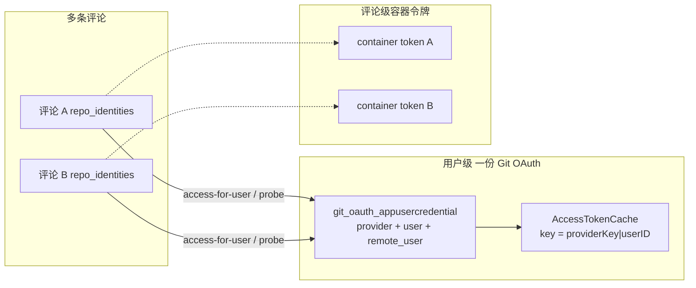

<!-- markdownlint-disable MD013 MD060 -->
# 多评论 × Git OAuth AccessToken：共用还是打架

- **日期**: 2026-08-22
- **作者**: cursor
- **迭代**: multi-comment-git-oauth-access-token-sharing
- **状态**: accepted（路径改为 `gitsite/{site}` 已批准；待实现）
- **相关 ADR**: [ADR-0005](../../adr/0005-comment-scoped-container-token.md)（容器令牌评论级）、[ADR-0009](../../adr/0009-comment-level-repo-identity.md)（评论只选身份，OAuth 连接仍用户级）
- **相关意图**: `docs/intents/frontend/task_detail/034_comment_level_repo_identity.intent.md`
- **架构变更**: **不需要**。不增删服务、不改数据所有权、不改调用拓扑；仅澄清既有粒度。若后续修 cache 键 / 行锁，视为 `taskGitOauth` 内部加固，仍不写新架构版本。

## 对当前架构的理解

根据 `docs/architecture/` 与 `VERSION_HISTORY.md`：

- 共有 2 个 current 视图：`enterprise-landscape`、`application-integration`，最新交付 **v96**（管理员订单分账；局部视图，不含 Git OAuth 全拓扑）。
- Git OAuth / 评论身份相关基线：v29 起 `taskGitOauth` :8002 持有 `git_oauth_*`；v83 🎯 target（评论级 `repo_identities_json`，ADR-0009）；v94 交付 PR 合并走 `taskGitOauth` merge-request。
- 业务层：用户绑定 GitHub/GitLab App；评论选用本次运行的 Git 提交身份 / GitHub 账号。
- 应用层：`taskFE`（评论区 probe）、`taskGitOauth`（用户级凭据 + 进程内 access cache）、`taskCredentialService`（评论级**容器**令牌 + 向 git-oauth 换票）、`taskProjectService` / `taskCloudService`（clone/push 换票）。
- 技术层：`git_oauth` 库表 `git_oauth_appusercredential` UNIQUE `(provider, task2app_user_id, remote_user_id)`；进程内 cache 键 `providerKey|userID`。
- 上次更新的架构版本是 **v96**。本次需求在此基础上做**语义澄清**，不写 target 文件。

📋 架构版本历史（与本题相关）：

- v83 🎯 target — 评论级仓库身份（OAuth **连接**保持用户级）
- v94 ✅ shipped — PR 回复 / 一键合并（换票仍走用户级 access-for-user）
- v96 ✅ current — 管理员订单分账（与本题正交）

## 结论（先答问题）

**同一平台用户、同一 Git provider（如同一个 GitLab 实例或同一个 GitHub App）下的多条评论，共用一份 Git OAuth AccessToken（及其 refresh），不是「每评论一张」。**

评论持久化的是**选用哪个已绑定账号 / 哪条 Git 提交身份**（`repo_identities_json`），不签发、不缓存独立的 Git OAuth AccessToken。

会不会打架：**日常多评论读同一份已缓存 access，不会互相覆盖。** 会打架的只有两类竞态，都发生在「同一用户同一凭据」上，不是「每评论一个 token」：

1. **GitLab refresh 旋转竞态**（并行换票 miss cache）
2. **多 GitHub 账号共享 cache 槽**（cache 键不含 `remote_user_id`）

另有一类完全不同的令牌：**容器 AccessToken**（ADR-0005）是 `(tenant, workspace, task, comment)` 一行一评论，**不会**和 Git OAuth AccessToken 抢同一把钥匙。

## 🔍 Trace 日志分析

无 `data-traceId` / 等价 trace。本轮未查 Loki。`CRG unavailable for Go taskGitOauth: graph.db 无 Go 符号（约 108 nodes，js/ts/py/bash）；已用源码 grep 替代。`

## 🕸️ Code Review Graph 分析

| 项 | 内容 |
|----|------|
| 状态 | `CRG unavailable: graph 不含 Go taskGitOauth / handleAccessForUser` |
| 替代 | grep `handleAccessForUser`、`cacheKey`、`FetchAccessToken`、`repo_identities_json` |
| 爆炸半径 | `taskGitOauth` cache + refresh；调用方 `taskProjectService.fetchGitAccessToken`、`taskCredentialService.GitoauthHTTPClient.FetchAccessToken` 均**不传** `github_user_id` |
| 社区 | Git OAuth 凭据 BC vs 评论身份 BC vs 容器令牌 BC，三者刻意分层 |

## 三种「AccessToken」不要混

| 种类 | 粒度 | 存在哪里 | 多评论是否共用 |
|------|------|----------|----------------|
| **Git OAuth AccessToken** | `task2app_user_id` + `provider`（DB 行还按 `remote_user_id` 唯一） | `git_oauth_appusercredential.refresh_token_cipher` + 进程 cache | **共用** |
| **评论身份选择** | 评论 | `task_comments.repo_identities_json`：`git_identity_id` / `github_user_id` | **不共用**（每评论可选不同账号） |
| **容器 AccessToken** | 评论 | `credential_container_tokens` UNIQUE `(company, workspace, task, comment)` | **不共用**（ADR-0005 就是为防并行评论抢同一容器令牌） |

意图 034 原文：「OAuth **连接**仍走用户级既有 bind；评论只保存本次选用的 `git_identity_id` / `github_user_id`。」



## 换票与探测路径（证据）

1. **内部换票** `POST /api/internal/{github|gitlab}/oauth/access-for-user/`（`taskGitOauth/src/internal_access_for_user.go`）
   - 入参：`user_id` + `provider_key`，可选 `github_user_id`
   - 先 `FindActiveCredential`，再 `Cache.Get(providerKey, userID)`；命中则**直接返回同一 access**，不 refresh
   - miss 后 `Begin()` + `GetCredentialByIDForUpdate` — **SQL 无 `FOR UPDATE`**；`BeginImmediate` 实为 `db.Begin()`
   - GitHub `ghp_`/`gho_`/`ghu_`/`github_pat_`：密文即 access，不旋转
   - GitLab：`grant_type=refresh_token`，成功时常带回**新 refresh**，旧 refresh 作废
2. **评论区探测** `GET .../user-app-connection/?probe_access_token=1`
   - 仍按用户 + provider 选行；响应**禁止**含 `access_token`
   - 前端按 **repo URL** once-guard，不是按 `comment_id`；同仓多评论只探一次
3. **调用方不带 GitHub 账号**
   - `taskProjectService.fetchGitAccessToken` 只传 `user_id` + `provider_key`
   - `taskCredentialService.FetchAccessToken` 同样
   - 因此 clone/push **忽略**评论 JSON 里的 `github_user_id`，落到「该用户该 provider 最近更新的那一行」

## 会不会打架：场景表

| 场景 | 共用哪把钥匙 | 会不会打架 | 说明 |
|------|--------------|------------|------|
| 同一用户、同一 GitLab、多条评论先后 clone | 同一 refresh/access | **否**（cache 命中后） | 第二次起读同一 cached access |
| 同上，两容器**同时**第一次 miss cache | 同一 refresh | **会**（GitLab） | 两次并行 refresh：先成功者作废旧 refresh，后到者 `gitlab refresh http 400` |
| 评论区 probe 与 clone 同时 miss | 同一 refresh | **会**（GitLab） | probe 写 cipher **无行锁**；access-for-user 名义 ForUpdate 也无 `FOR UPDATE` |
| 同一用户两个 GitHub 账号，两评论各选一个 | DB 两行，cache **一槽** | **会** | cache 键不含 `remote_user_id`；后写入覆盖；且 clone 路径不传 `github_user_id`，可能用错账号的 token |
| 同一任务、**两个作者**各发评论 | 两套用户凭据 | **否** | 按 `task2app_user_id` 隔离 |
| GitHub / GitLab 两个 provider | 两套凭据 | **否** | `provider` 不同 |
| 两评论并行跑容器 | 两套**容器** token | **否** | ADR-0005；与 Git OAuth 无关 |
| GitHub PAT 直持（`ghp_`） | 同一 PAT 字符串 | **否** | 不 refresh、不旋转 |

**「多评论共用」本身不是缺陷**，是 ADR-0009 的设计：Git 平台按 **OAuth App 用户**发 token，不能按评论发。打架来自 **并发 refresh** 和 **cache 粒度比 DB 唯一键粗**。

## Domain Concept Inventory

- **Bounded Contexts**: Git OAuth 凭据（`taskGitOauth`）；评论运行身份（`taskTaskService.task_comments`）；容器运行时令牌（`taskCredentialService`）
- **Key Entities**: `AppUserCredential`（用户+provider+remote_user）；`Comment.repo_identities`（选用，非令牌）；`ContainerToken`（评论级）
- **Candidate Aggregates**: 凭据聚合根 = credential 行；换票一致性边界应对**该行**加锁，而不是对评论加锁
- **Domain Events**: 本题为既有只读/换票路径分析，**无新业务意图**

## 业务意图 → 事件对照

| 业务意图 | 事件名（过去式） | 发布点 | 消费者/副作用 | 例外理由 |
|---------|----------------|--------|--------------|---------|
| 分析「多评论是否共用 Git OAuth AccessToken」 | — | — | — | **纯查询/分析**，不改变系统事实，无 MQ 事件 |
| （若批准加固）cache 键纳入 `remote_user_id` / refresh 行锁 | 无新领域事件 | `taskGitOauth` 内部 | 换票正确性 | 无跨聚合副作用；不发邮件/SSE/下游写 |

## 价值流影响

`conf/value-stream.yaml`：

- 受影响（只读澄清，不改 YAML）：`gitoauth-binding-state-persistence`（`git_oauth_appusercredential.*`）；`create-task-auto-run-git-identity` / 评论 `repo_identities_json`；任务详情 Git OAuth 芯片 / probe
- **不需要**新 stream：粒度已由 ADR-0005 / ADR-0009 切开
- Fields：不新增列。风险在运行时 cache 键，不在表结构
- Test：若批准加固，测例应覆盖「两 `github_user_id` 不塌缩到同一 cache」+「并发 GitLab refresh 不双花」
- Status：无 planned→active 变更

## GitLab 有没有类似 STS、每评论一张短时票？

结论：**GitLab OAuth 没有 AWS STS / AssumeRole 这种「从用户 OAuth 派生出互不旋转的会话票」。**
官方 OAuth 刷新会**同时作废旧 access 和旧 refresh**，所以多评论若各自 refresh，不但 refresh 打架，正在 clone 的旧 access 也会被掐掉。

来源（GitLab Docs，OAuth 2.0 identity provider API）：

> To retrieve a new `access_token`, use the `refresh_token` parameter.
> This request: **Invalidates the existing `access_token` and `refresh_token`**.
> Sends new tokens in the response.
> `expires_in`: **7200**（约 2 小时）。

`taskGitOauth` OpenAPI 虽写「换发 ephemeral access_token」，那是 **TTL 2h 的用户级票**，不是评论级隔离。

### 候选对照

| # | 方案 | GitLab 是否支持 | 每评论独立？ | 提交身份 | 代价 |
|---|------|-----------------|--------------|----------|------|
| A | 继续共用 OAuth access，refresh **串行加锁** + cache 至到期 | 正是 OAuth 契约 | 否（共用一把，但不双 refresh） | 仍是该用户 | 小改 `taskGitOauth`；**推荐先做** |
| B | 用户 OAuth → `POST /user/personal_access_tokens` 当 STS | **否**。官方限制自助建 PAT 的 scope **仅** `k8s_proxy`、`self_rotate`，不能要 `write_repository` | — | — | 推不了 git |
| C | 管理员 `POST /users/:id/personal_access_tokens` 每评论一张 PAT | Self-Managed / Dedicated；**必须实例管理员** | 是（各 PAT 不共享 refresh 族） | 仍是该用户 | 平台持有 GitLab admin token；合规与爆破面大；**不推荐** |
| D | `POST /projects/:id/access_tokens` 项目访问令牌 | 文档要求用 **PAT** 调此接口；默认 access_level **Maintainer(40)**；Developer 常建不了 | 仓级 bot 票，不是评论 STS | **项目 Bot**，不是评论作者 | 身份错、权限门槛高 |
| E | **自建 STS**：`taskGitOauth` 独占 refresh；容器只拿评论级短票，经我方 git HTTPS 代理换成上游 OAuth | 上游仍一把 OAuth；隔离在我方 | 是（我方票互不 refresh GitLab） | 仍是该用户 | **架构变更**（新代理或扩展 credential）；工作量大 |

GitHub 同样没有「每评论一张 OAuth STS」。GitHub App installation token 是 App 身份，不是用户身份。

不做「让每条评论各自对 GitLab 做一次 OAuth refresh」：官方明确 refresh **作废当前 access**，并行评论会互相踢下线。

## 推荐决策（已批准路径；实现待下一步）

1. **已批准**：换票主路径改为 `POST /api/internal/gitsite/{site}/oauth/access-for-user/`（v97）。
2. **仍建议同增量做 A**：refresh 行锁 + cache 到期前不重刷（防 GitLab 旋转打架）。不引入假 STS。
3. **不要 B/C/D** 冒充 GitLab STS。
4. **不做 E**，除非以后要把上游 token 与容器隔离。

## 路径契约问题：`{github|gitlab}` 应改为 `site`

用户指出：`POST /api/internal/{github|gitlab}/oauth/access-for-user/` 用产品族当路径参数是错的，**应改为 Git `site`**。

同意。这与审计列、浏览器回调 v2 一致；`github|gitlab` 只是 refresh 实现细节，不是换票路由键。

### 现状

| 层 | 实际用的键 | 例子 |
|----|------------|------|
| 浏览器回调 v2 | `gitsite` = website 主机名 | `/redirect/gitsite/<gitsite>/oauth/callback/` |
| 访问审计 | `site` = `url.Host` | `github.com`、`localhost:8012` |
| 凭据表 | `provider` = provider_key | `gitlab:tencent-sh-1` |
| **内部换票路径** | **产品族** github \| gitlab | `/api/internal/gitlab/oauth/access-for-user/` |
| 换票 body | `provider_key` | 区域 GitLab 全挤在同一条 gitlab 路径上 |

`providerFromPath` 只看路径里有没有 `gitlab` 字符串；`normalizeProviderKey` 若 body 的 key 与路径族不一致，会**把 provider_key 打回成族名**（如打成裸 `gitlab`），区域实例键丢失。

多 GitLab 站点（daydaymoney、tencent-sh-1、localhost:8012）共用一条 `/gitlab/` 路径，只能靠 body 区分，和「site 才是站点身份」冲突。

### 目标契约（proposed）

推荐与浏览器 v2 对齐（避免和现有 `/api/internal/github/` 族路径撞名）：

```text
POST /api/internal/gitsite/{site}/oauth/access-for-user/
```

- `{site}`：与审计相同的 `host[:port]`，路径内做 URL 编码（`localhost:8012` → `localhost%3A8012`）
- body：`user_id`；可选 `github_user_id`。**不再需要**用路径表达 github vs gitlab
- 服务端：`site` → YAML `website` Host → `provider_key` → 既有 FindActiveCredential
- 旧路径 `/api/internal/{github,gitlab}/oauth/access-for-user/` 与 `/api/internal/git-oauth/{github,gitlab}-access-for-user/` **保留别名**（OPT-20260807-071：删路径会 404→token_error）

不推荐裸 `/api/internal/{site}/...`：`site=github.com` 与历史 `/api/internal/github/` 前缀易混；`:` 在路径段不编码会断路由。

### 与「每评论 STS」的关系

改路径**不**等于每评论一张 GitLab 票。它只让换票按 **Git 站点** 寻址。同一用户同一 `site` 仍共用一把 OAuth refresh。

### 实现影响（批准后才做）

- 调用方：`taskProjectService` / `taskCredentialService` / `taskCloudService` 用 repo URL 解析出 site 再拼路径
- OpenAPI 新 path；旧 path deprecated
- 🟡 `taskGitOauth` Application_Interface；须写架构 v97 四件套
- 无新 Python 接口；无新 MQ 事件（仍是内部换票）

## 🐍 Python 新增接口

不触发。无新 Python endpoint。

## 🏛️ 架构变更影响

- **迭代版本**: v97 🎯 target
- **迭代名称**: gitsite-access-for-user-path
- **作者**: cursor
- **设计日期**: 2026-08-22 16:32
- **新增文件**（每个视图四类伴生格式）:
  - 🆕 `docs/architecture/v97-enterprise-landscape-20260822-1632-cursor.puml`
  - 🆕 `docs/architecture/v97-application-integration-20260822-1632-cursor.puml`
  - 🆕 `docs/architecture/v97-enterprise-landscape-20260822-1632-cursor.diff.archimate`（增量：Plateau v96→v97 + Gap + WP + 🟢/🟡 元素）
  - 🆕 `docs/architecture/v97-application-integration-20260822-1632-cursor.diff.archimate`
  - 🆕 `docs/architecture/v97-enterprise-landscape-20260822-1632-cursor.full.archimate`（全量拓扑：换票按 site）
  - 🆕 `docs/architecture/v97-application-integration-20260822-1632-cursor.full.archimate`
  - 🆕 伴生 `.mermaid.md`（每个视图）
- **已有文件（未修改）**: `docs/architecture/v96-*-cursor.puml`（current）
- **变更明细**: 🟢 gitsite access-for-user 接口 / 🟡 taskGitOauth 与三家调用方 / 旧 github|gitlab 路径别名

### .archimate 架构变迁要点

| 文件 | 内容 |
|------|------|
| **`.diff.archimate`** | Plateau v96 → Gap「路径用产品族」→ WP-gitsite-access-for-user → Plateau v97；目标拓扑为三服务 → gitsite 接口 → taskGitOauth |
| **`.full.archimate`** | 变迁后换票拓扑（调用方、新旧接口、凭据表）；Archi 打开可看连线 |
