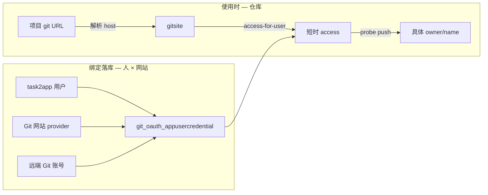

<!-- markdownlint-disable MD013 MD060 -->

# 设计文档：Git OAuth 绑定粒度（仓库 / 个人 / 网站）

- **日期**: 2026-08-29
- **作者**: cursor
- **迭代**: git-oauth-binding-granularity
- **状态**: proposed（as-is：L1 连接粒度）
- **后续**: 使用层（项目/评论站内标记）见 [git-oauth-resource-grant-marker](./2026-08-29-git-oauth-resource-grant-marker-design.md)
- **范围**: 回答「Git OAuth 是绑定仓库、绑定个人、还是绑定网站」；对齐存储键、换票路径、项目页徽章
- **明确非目标**: 不把绑定改成 per-repo；不新增服务/接口；不创建 `docs/architecture/v118-*`
- **前序**: [2026-08-20 Git OAuth as-is](./2026-08-20-git-oauth-as-is-system-brainstorm-design.md)（三条身份轨）；[2026-08-22 AccessToken 共用](./2026-08-22-multi-comment-git-oauth-access-token-sharing.md)

---

## 0. 对当前架构的理解

根据 `docs/architecture/` **current** 与 `VERSION_HISTORY.md`：

- 共有 **2** 个 current 视图：`enterprise-landscape`、`application-integration`
- 业务层（近期迭代）：邀请人 / 被邀请人、成员加入（v117 开放邀请）
- 应用层（与本问题相关、未在 v117 图中展开）：`taskFE`、`taskGateway`、`taskGitOauth`、`taskProjectService`、`taskCloudService`、`taskCredentialService`、`taskAuth`、多区域 `gitService`
- 技术层：`gitOauthDB`（`git_oauth_*` 表仅 `taskGitOauth` 直连）；GitHub.com；平台 GitLab 多实例（ADR-0014）
- **上次更新的架构版本是 v117 ✅ current**（开放式邀请链接，2026-08-29 13:10）

📋 架构版本历史（与 Git 相关节选）：

| 版本 | 状态 | 摘要 |
|------|------|------|
| v29 | 已交付 | gitOauth Python → Go `taskGitOauth` |
| v83 | 部分落地 | 评论级 Git **提交身份**（Plane C，不是 OAuth token） |
| v85+ | 已交付 | 多区域 gitService；Plane B 按 `target.website` 独立 provider |
| v97 | 已交付 | 换票主路径 `gitsite/{site}/oauth/access-for-user/` |
| v117 | ✅ current | 开放邀请；与 Git OAuth **正交** |

本次需求将在此基础上**只澄清绑定粒度**。不增删服务、数据流或基础设施 → **不需要**新架构 target 四类伴生文件。

---

## 1. 结论（先回答问题）

**Git OAuth（Plane B）绑定的是「平台用户 × Git 网站（provider）× 远端 Git 账号」，不是某一个仓库。**

| 口语 | 是否绑定单元 | 实际含义 |
|------|----------------|----------|
| **网站** | **是（分区键）** | 一个 `target.website`（如 github.com、gitlab.daydaymoney.com、tencent-sh-1）对应一条 OAuth App / provider YAML；换票按 **gitsite host** 解析 `provider_key` |
| **个人** | **是（主体）** | 平台用户 `task2app_user_id` + 远端账号 `remote_user_id` / `remote_login`；UNIQUE `(provider, task2app_user_id, remote_user_id)` |
| **仓库** | **否（使用时探测）** | 仓库 URL **只用来选网站** 和 **探测该人在该站的 token 能否写这个仓**；库表**没有** repo slug 列 |

一句话：**授权一次，覆盖该网站上该 Git 账号有权限的所有仓；换项目仓库不会重新发一张「该仓专属」OAuth。**

这与 OAuth 协议一致：GitHub/GitLab OAuth App 签发的是 **user-to-server** 票，不是 repo-scoped grant（GitHub App **安装范围**是供应商侧约束，见 §4，仍不是本库的绑定行）。

---

## 2. 三层分别干什么

### 2.1 网站（Git site / provider）

- 配置 SSOT：`conf/auth/git-oauth/providers/*.yaml` 的 `target.website`
- 存储键：`provider` = `{github|gitlab}:{service_provider}`（例 `github:github-official-daydaymoney`、`gitlab:daydaymoney-gitlab`、`gitlab:tencent-sh-1`）
- 换票：`POST /api/internal/gitsite/{site}/oauth/access-for-user/`；`{site}` = 仓库 URL 的 host（可含端口）
- **禁止**跨网站借票（ADR-0014）：上海 GitLab 的 token 不得拿去打默认 CE
- 浏览器回调 v2：`/redirect/gitsite/<gitsite>/oauth/callback/`，`<gitsite>` = website 主机名

租户自建 GitLab（Plane D）是 **company × 自建 website 的 OAuth App 配置**（`git_oauth_tenant_gitlab_oauth_connections.company_id` UNIQUE），成员仍要各自走 Plane B 个人绑定。

### 2.2 个人（两套 ID）

| ID | 含义 |
|----|------|
| `task2app_user_id` | 本平台用户 |
| `remote_user_id` + `remote_login` | 该网站上的 GitHub/GitLab 账号 |

同一平台用户可在**同一网站**绑多个远端账号（UNIQUE 含 `remote_user_id`）；缓存键 `provider_key|r:{remote_user_id}`，避免串票。

**不是**「绑定到项目」或「绑定到租户成员身份」。同事换了项目 git URL，用的仍是**当前登录用户**在该站的那一行凭据。

### 2.3 仓库（非绑定单元）

项目 `git_repos[]` URL 的作用：

1. **选站**：host → provider → `FindActiveCredential(provider, user, …)`
2. **鉴权探测**（项目详情，2026-08-29 起）：有票后对 **该 URL** 调 GitHub/GitLab API，写权限才显示「已授权」

因此：把项目从自己的仓改成 `test-ruandao/helloworld` **不会**新建/删除 OAuth 绑定行；只会让探测失败 → 徽章从「已授权」变为「授权异常」。这是预期语义，不是「OAuth 绑错了仓」。

Autorun / 克隆路径仍可 `probe_access=false`（只要有票就换），与详情徽章解耦。

---

## 3. 易混的另外两件事

| 概念 | Owner | 绑定什么 | 与 Plane B 关系 |
|------|-------|----------|-----------------|
| **Plane A** GitLab Web SSO | taskAuth + gitService | 人登录 **平台 GitLab 网站** | 能打开 GitLab UI ≠ 容器能 `git push` |
| **Plane C** `task_git_identities` | taskTaskService | 人在某评论/任务上的 **commit 署名** | 可选用已绑 OAuth 的远端账号，但行本身不是 token |
| **GitHub App 安装范围** | GitHub 组织管理员 | App 装到哪些 org/repo | 同一 `ghu_` 用户票，未安装的私有仓 API 仍 404；**本库仍无 per-repo 行** |

---

## 4. 为何不能理解成「绑仓库」

若产品把「已授权」读成「这个仓库已授权给本项目」：

- 换仓后徽章滞留（已修：探测写权限）
- 会误以为要再走一遍 OAuth 才能换仓；实际缺的是 **远端账号对该仓的 push**，或 GitHub App **未安装到该仓所属组织**

若未来真要 **per-repo 绑定**，须新增数据对象（例如 `git_oauth_repo_grant`）+ 新绑定 UX + 架构 target。**本次不采用。**

---

## 🕸️ Code Review Graph 分析

| 项 | 内容 |
|----|------|
| 图状态 | `Nodes: 114` / `Edges: 1012` / `Files: 18`；语言 javascript, typescript, python, bash；`main` @ `1ebb2ebbfd33`；Last updated 2026-08-29T13:01:08 |
| 关键发现 | `search FindActiveCredential` / `git_oauth_appusercredential` → **0 nodes**。根图未索引 Go `taskGitOauth` / `taskProjectService` |
| 决策影响 | 绑定粒度以 DDL + `FindActiveCredential` + gitsite 换票路径为准；CRG 对本题无爆炸半径证据 |
| 降级 | 根图偏前端/脚本；Go 符号未入图。`CRG partial: Go oauth symbols not indexed` |

---

## Domain Concept Inventory

| 类型 | 概念 |
|------|------|
| Bounded Contexts | GitOauth（凭据绑定）、Project（仓库 URL + 探测徽章）、Task（提交身份 Plane C）、Auth（Plane A SSO） |
| Key Entities | `OauthCredentialBinding`（人×provider×remote_user）；`GitSite`（website/host）；项目 `git_repos` URL（非实体绑定） |
| Candidate Aggregates | `git_oauth_appusercredential` 一行 = 一次绑定；租户连接独立聚合 |
| Domain Events | 见下表；本次澄清 **无新意图** |

## 业务意图 → 事件对照

| 业务意图 | 事件名（过去式） | 发布点 | 消费者/副作用 | 例外理由 |
|---------|----------------|--------|--------------|---------|
| （本次无新写意图） | — | — | — | 纯查询/语义澄清；绑定成功事件仍沿用 as-is 文档 v29 Kafka 豁免 |
| 用户完成 Git Site OAuth | `GIT_OAUTH_CREDENTIAL_BIND_ACTIVATED` | callback | 审计/日志 | 现网未强制 Kafka（既有豁免） |

---

## Value Stream Impact

现有流 `project-detail-oauth-token-status-aware` / `project-detail-oauth-button-token-status-aware` / `project-detail-oauth-callback-refresh`：

- **字段**：仍是 `git_oauth_appusercredential` 的 provider + user，**不**增加 repo 列
- **步骤语义**：徽章 = 「当前用户在该 URL 所属网站上的凭据，对该仓是否有写权限」；不是「项目已绑定该仓的专属 OAuth」
- **新 stream**：不需要
- 全量切片交给 `/4-value-stream`（若本设计仅文档、无实现则跳过）

---

## 🏛️ 架构变更影响

- **判定**: 不更新架构。无组件/数据流/基础设施增删改。
- **已有文件（未修改）**: `docs/architecture/v117-*-20260829-1310-cursor.puml` 及伴生 `.diff.archimate` / `.full.archimate` / `.mermaid.md`
- **Python 新增接口**: 不触发（无新 endpoint）

---

## 5. 建议产品文案（若改 UI，须另批实现）

| 现状文案 | 更不易误解的方向（未实施） |
|----------|---------------------------|
| 「已授权」 | 「当前账号对该仓库可写」或「GitHub/GitLab 已连接，且对本仓有推送权限」 |
| 「授权异常」+「重试」 | 「无法推送该仓库」+「重新连接 Git 账号」 |

文案变更属前端/意图文档，**须单独批准后再改**；本设计默认只固化语义。

---

## 6. 决策待批

1. **保持 as-is**：绑定 = 人 × 网站 × 远端账号；仓库仅探测。文档即交付。
2. **改产品模型为 per-repo 绑定**（大改）：新表、新 UX、新架构 target。本设计不展开实现。
3. **仅改文案**：徽章不再叫「已授权」，避免用户以为绑的是仓库。
