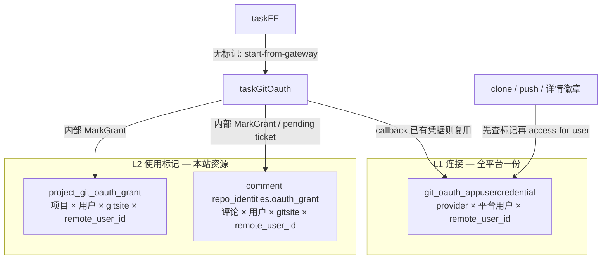

<!-- markdownlint-disable MD013 MD060 -->

# 设计文档：Git OAuth 凭据（remote_userId）+ 项目/评论站内使用标记

- **日期**: 2026-08-29
- **作者**: cursor
- **迭代**: git-oauth-resource-grant-marker
- **状态**: accepted（2026-08-29 总体批准；v118 已交付为 current）
- **拟 ADR**: [ADR-0049](../../adr/0049-git-oauth-resource-grant-marker.md) accepted
- **前序**: [绑定粒度 as-is](./2026-08-29-git-oauth-binding-granularity-design.md)；[AccessToken 共用](./2026-08-22-multi-comment-git-oauth-access-token-sharing.md)；[ADR-0009](../../adr/0009-comment-level-repo-identity.md)
- **明确非目标**: 不按仓库 slug 再存一份 refresh；不把标记写到 GitHub/GitLab 网站；不新增 Python 接口；标记不进 `git_oauth_appusercredential`

---

## 0. 对当前架构的理解

根据 `docs/architecture/` **current** 与 `VERSION_HISTORY.md`：

- 共有 **2** 个架构视图：`enterprise-landscape`、`application-integration`
- 业务层（v117）：邀请人 / 多名被邀请人、开放邀请链接
- 应用层（本题相关、v117 图未展开）：`taskFE`、`taskGateway`、`taskGitOauth`、`taskProjectService`、`taskTaskService`、`taskCloudService`、`taskCredentialService`
- 技术层：`gitOauthDB` 仅 `taskGitOauth` 直连；凭据 UNIQUE `(provider, task2app_user_id, remote_user_id)`
- **上次更新的架构版本是 v118 ✅ current**（Git OAuth 资源使用标记，2026-08-29）

📋 架构版本历史（与本题相关）：

| 版本 | 状态 | 摘要 |
|------|------|------|
| v29 | 已交付 | `taskGitOauth` 持有用户级凭据 |
| v83 / ADR-0009 | 部分落地 | 评论只存 `repo_identities`；**OAuth 连接仍用户级、使用不设闸** |
| v97 | 已交付 | `gitsite/{site}/oauth/access-for-user/` |
| v117 | ✅ current | 开放邀请（正交） |

本次需求将在此基础上：**保留一份 remote_userId 凭据；在项目/评论上增加本站使用标记；无标记不得换票使用。** 这会新增 DataObject 与调用约束 → **批准后**写 v118 四类伴生文件（每个视图 `.puml` + `.diff.archimate` + `.full.archimate` + `.mermaid.md`）。

---

## 1. 问题与意图

现状：平台对每个 `(provider, 平台用户, remote_userId)` **只持有一份** OAuth refresh。任意项目/评论只要 `user-app-connection` 为 connected，就可以拿这张票换 accessToken（再探测能否 push）。结果是：在 A 项目授权后，B 项目换别人的仓也会显示「已授权」。

用户意图：

> OAuth **连接**仍是 `remote_userId` 级、全平台一份；**使用**必须在本站（SaaS）对 **项目** 或 **评论** 打标记。有标记才允许用该 remote_userId 凭据换 accessToken 并使用；没有标记则提示需要 OAuth；OAuth **返回时**打上标记。

「网站内部标记」= **本平台**上的 grant 记录，不是 GitHub topic / GitLab badge。

---

## 2. 两层模型（决策）

| 层 | 存什么 | Owner | 有几份 |
|----|--------|-------|--------|
| **L1 连接** | refresh 密文 + remote_login | `taskGitOauth` | 每用户每 Git 站每远端账号 **一行** |
| **L2 使用标记** | 「允许把 L1 用在这个项目/这条评论」 | 项目表 → `taskProjectService`；评论 JSON → `taskTaskService` | 每个资源 × 用户 × **gitsite** 一行 |

L2 **不存** accessToken / refresh。换票仍走现有 `access-for-user`。

---

## 3. 标记键（网站粒度，不是仓库 slug）

与 L1 一致：标记按 **gitsite**（`target.website` 主机，可含端口），**不**按 `owner/name`。

| 字段 | 说明 |
|------|------|
| `resource` | `project` + `project_id` **或** `comment` + `comment_id` |
| `task2app_user_id` | 当前操作者（标记不可转给同事；同事各自 OAuth） |
| `gitsite` | 如 `github.com`、`gitlab.daydaymoney.com` |
| `remote_user_id` | 本次 OAuth 回调落库的远端账号（换账号授权则更新标记） |
| `granted_at` | 回调写入时间 |

同一项目同一用户同一 gitsite：**一行**；再授权覆盖 `remote_user_id`。项目内多个 GitHub 仓共享这一条标记；换仓后若无 push，仍靠现有 probe 显示「授权异常」，但「未标记」与「已标记但无写权限」必须区分。

### 项目 vs 评论：不互相继承（项目不会自动运行）

**项目不会自动运行。** 项目 L2 只给项目页使用（详情徽章、云端开发、分支预览）。自动运行是 **任务** 行为，只打在【自动运行】**评论**上。

| 资源 | 无标记时 | 有标记时 |
|------|----------|----------|
| 项目详情 / 云端开发 / 分支预览 | 提示 OAuth，**即使 L1 已有票** | 允许换票 + probe |
| 评论运行 / push / PR（含【自动运行】评论） | 提示 OAuth，**即使项目已标记、即使其它评论已标记** | 允许该评论换票 |

**禁止**：把项目 L2 复制到自动运行评论、或把「项目已授权」当成可以 auto_run。创建任务勾选自动运行时，OAuth 回流打的是 **即将创建的那条评论**（grant_ticket），不是项目。

### 3.1 自动运行：要绑的是「创建者 / 触发者」的 OAuth

现网事实（保持，本设计对齐而不是改主体）：

| 步骤 | 谁 |
|------|-----|
| 创建任务勾选自动运行 | 门禁看 **当前操作者**（创建者）的 L1；意图 `create_task_oauth_bind` |
| `ensureAutoRunAtComment` | `created_by_id = UserID`（操作者），空则回退 **任务 Owner** |
| 容器 clone / layer-oauth 换票 | **评论作者** 的 L1，不是「任务 Owner 若与作者不同」那个人（`TestResolveLayerOauthTokens_CommentAuthorOverridesTaskOwnerIdentity`） |

因此：**自动运行要用的票，就是【自动运行】评论作者的 remote_userId 凭据。** 创建任务时操作者 = 创建者 = 评论作者，所以门禁问的就是「创建者有没有 OAuth」。

**本设计锁定（自动运行）**：

1. **必须**要求启用自动运行的人走完 OAuth（L1 有票）。门禁看的是 **操作者本人**，不是「所选项目是否已标记」。
2. 创建【自动运行】评论时消费 **grant_ticket**（或回调已带的 pending），把 L2 写在 **该评论** JSON（`oauth_gitsite` / `oauth_remote_user_id`）。**不从项目 L2 复制。**
3. clone/push 只换该评论作者 + 该评论标记上的 `remote_user_id`。
4. **不要**用平台机器人 / 任务 Owner 的票去跑别人点的自动运行。
5. **Fork 并自动运行**：主体是 **点确认派生的人**。
6. **排队调度稍后开火**：用已写进【自动运行】评论的作者 L1+L2；禁止 `UserID=t.OwnerID` 覆盖。
7. **同事后来手动「提交并运行」**：另一条评论，自己打评论 L2。

`create_task_oauth_bind` 文案从「项目已绑定」改为「将用于自动运行评论的 Git 授权」；拦截条件 = 操作者对所选仓的 gitsite **本会话已完成 OAuth（持有可消费 ticket 或刚回流）**，而非项目行上有标记。

**不采用**：自动运行「只要任务 Owner 绑过即可、创建者不用绑」——克隆会用评论作者票，作者若是创建者则 Owner 的票用不上；若强行改成 Owner 票，提交者与 Git 作者不一致，且违反评论级身份。细节见 §3.2。

### 3.2 创建者 ≠ 任务 Owner（必须显式选主体）

任务上至少三个「人」字段，不能混成一个「创建者」：

| 角色 | 字段 | 典型含义 |
|------|------|----------|
| 创建操作者 | 创建请求 `X-User-Id` | 点「创建 / Fork / 勾选自动运行」的人 |
| 任务 Owner | `task_tasks.owner_id` | 负责人；可在创建时指定为别人，也可事后改派 |
| 经办 / 指派 | `task_tasks.operator_id` | 工作面板经办人，与 Git 换票无现成绑定 |

现网已经分叉：

| 时机 | 自动运行 `UserID` | 【自动运行】评论 `created_by_id` | 容器 clone 换票 |
|------|-------------------|----------------------------------|-----------------|
| 创建当下立刻 auto_run | 创建操作者 | 操作者（空才 Owner） | **评论作者** |
| 排队调度稍后开火 | **`t.OwnerID`**（`startQueuedMembership`） | 若已有自动运行评论则 **复用作者不改**；若没有则新评论写成 Owner | 仍按 **评论作者** |

因此：创建者绑了 OAuth、Owner 没绑 → 即时自动运行能克隆；排队若未复用评论、按 Owner 新建，会换成 Owner 的票（常失败）。创建者没绑、Owner 绑了 → 创建门禁拦住，Owner 的票用不上。

**已锁定（2026-08-29 用户确认；同日问卷再确认 `enabler_must_oauth`）**：OAuth 使用主体 = **启用自动运行的人**，或 **发出该条运行评论的人**。创建当下勾选自动运行时，这个人就是创建操作者，**必须拥有**该 gitsite 的 L1，并给【自动运行】评论打 L2。不是任务 Owner，不是经办人，除非那个人自己去启用/发评。

换票只认该评论 `created_by_id` 的 L1 + 该评论 L2。排队开火必须用已有自动运行评论的作者，禁止 `UserID=t.OwnerID` 覆盖。Owner 改派不改 Git 账号；若 Owner 要用自己的 Git，必须自己发评或显式再启用自动运行。

1. **换票只认【自动运行】评论作者的 L1 + 该评论 L2**（与 layer-oauth 已测行为一致）。
2. **作者锁定为启用自动运行时的操作者**；创建者把任务 Owner 填成同事，**仍用创建者的 Git**，除非同事自己再授权。
3. **排队开火禁止 `UserID=t.OwnerID` 覆盖**：有已有自动运行评论则 `UserID=created_by_id`；没有评论才允许用「入队时记录的 enabler_user_id」。Owner 改派 **不** 自动改 Git 账号。
4. 若产品要「交给 Owner 后用 Owner 的 Git 跑」：Owner 必须自己完成 L1+L2，并 **新开** 自动运行评论（或显式「以我的 Git 接管」），禁止静默挪用创建者 refresh。
5. `operator_id` **不**作为 OAuth 主体（除非另开需求）。

**拒绝**：创建门禁看创建者、运行却用 Owner 的票（或反过来）——两套人，L2 对不上，必现「创建过了排队挂」。

---

## 4. 主路径

### 4.1 已有资源（项目详情、已发出评论）

1. UI 查 L2：无标记 → 「需要 OAuth 授权」，真实 `<a href>` →  
   `/api/git-oauth/{github\|gitlab}-start-from-gateway/?grant_kind=project|comment&grant_id=…&repo_url=…&next=…`
2. `OAuthBrowserState` 增 `GrantKind` / `GrantID`（v2 字段；旧 state 无则不打标）。
3. GitHub/GitLab 返回（已授权过的账号会很快回来）→ `taskGitOauth` upsert L1（已有则复用）→ **同步**调用 owner 内部 API 写 L2 → 再 302 回 `next?github=ok`。
4. 换票方（`taskProjectService` / `taskCloudService` / `taskCredentialService`）**必须先**向 owner 确认 L2，再 `access-for-user`。禁止只看 L1。

### 4.2 资源尚不存在（composer 发评前、极少见的未保存项目）

Callback 无法写 `comment_id`。签发 **一次性 grant_ticket**（短 TTL，绑定 uid + gitsite + remote_user_id）：

- 出现在回调 redirect query（或仅存在 gitOauth session，由 FE 随 POST 提交）
- 评论 POST / 项目创建由 **owner 服务**调用 `taskGitOauth` internal `ConsumeGrantTicket`（一次性）后写入 L2
- **禁止**前端只传 `oauth_granted: true` 而不经 ticket / 回调

### 4.3 徽章语义（替换「有票=已授权」）

| UI | 条件 |
|----|------|
| 需要授权 | 无 L2 标记 |
| 已授权 | 有 L2 **且** L1 可换票 **且** probe 对该仓可写 |
| 授权异常 | 有 L2 但换票失败 / probe 无 push |
| 检查中 | 请求进行中 |

「已授权」= **本资源已标记且本仓可写**，不是「账号中心曾经连过 GitHub」。

---

## 5. 数据所有权与表

| 数据 | 服务 | 形态 |
|------|------|------|
| L1 凭据 | `taskGitOauth` | 现表不变 |
| 项目 L2 | `taskProjectService` | 新表 `project_git_oauth_grant`（前缀 `project_`）；DDL `dataMigrate/taskProjectService/` |
| 评论 L2 | `taskTaskService` | 扩展 `task_comments.repo_identities_json`：`oauth_gitsite` / `oauth_remote_user_id` / `oauth_granted_at`（与 ADR-0009 JSON 模式一致） |
| grant_ticket | `taskGitOauth` | 短时（session 或小表）；仅 internal consume |

**禁止** `taskGitOauth` 持久化 `project_id` / `comment_id` 作为凭据主键。标记属于资源 owner。

Internal 接口（Go，非 Python）：

| 方法 | 路径（草案） | Owner |
|------|----------------|-------|
| PUT | `/api/internal/projects/{id}/git-oauth-grants/` | taskProjectService |
| PUT | `/api/internal/tasks/comments/{id}/git-oauth-grants/` | taskTaskService |
| POST | `/api/internal/gitsite/{site}/oauth/consume-grant-ticket/` | taskGitOauth |

查询：项目 GET / 评论 GET 对当前用户带上 `git_oauth_grant`（或并入现有 `git_repos_status`：无标记时不要用「有票」冒充已授权）。

---

## 6. 业务意图 → 事件对照

| 业务意图 | 事件名（过去式） | 发布点 | 消费者/副作用 | 例外理由 |
|---------|----------------|--------|--------------|---------|
| 项目打上 Git OAuth 使用标记 | `PROJECT_GIT_OAUTH_GRANTED` | taskProjectService MarkGrant 成功 | 审计；可选 SSE 刷新项目页 | — |
| 评论打上 Git OAuth 使用标记 | `COMMENT_GIT_OAUTH_GRANTED` | taskTaskService MarkGrant / 发评消费 ticket | 审计；任务详情芯片 | — |
| 用户完成 L1 连接（首次或换账号） | `GIT_OAUTH_CREDENTIAL_BIND_ACTIVATED` | taskGitOauth callback | 沿用 as-is；现网 Kafka 豁免仍有效 | 无新副作用时可继续豁免，但 **L2 事件必须投递** |
| 换票 / 只读徽章 | — | — | — | 纯查询 |

幂等：同一 `(resource, user, gitsite)` 重复回调 = upsert，事件可带 `idempotency_key=grant:{kind}:{id}:{user}:{gitsite}`，重放空操作。

---

## 7. 对 ADR-0009 的修正

ADR-0009 §Decision.4：「OAuth **连接**保持用户级；评论只记录选用哪个已连接账号。」

**连接（L1）仍用户级。** 新增：**使用（L2）按评论（及项目）标记**。评论 JSON 在身份字段之外增加 grant 字段。拟 ADR-0049；ADR-0009 注明 *Superseded in part by ADR-0049*（仅「未绑 L1 才拦截」改为「无 L2 即拦截换票」）。

`create_task_oauth_bind`：自动运行拦截条件从「L1 `connected` 即可提交」改为「**启用自动运行的操作者**对本会话所选仓的 gitsite 已完成 OAuth（L1 有票 + 可消费的评论 grant_ticket / 刚回流）」。**不是**「项目行上已有 L2」。未勾选自动运行仍不拦截。

Autorun 克隆路径今日 `probe_access=false`：**改为无 L2 不得换票**（比 probe 更先失败）。

---

## 8. 存量与迁移

上线时 **不回填** L2（否则又变回「有票处处已授权」）。已有 L1 的用户在每个项目/每条要运行的评论上需再走一次 OAuth 回流（IdP 通常秒过）。须在发布说明写明。

---

## 9. 安全

- L2 只授权 **标记上的 remote_user_id**；换票必须把该 id 传给 `access-for-user`（已有 `github_user_id` 类参数则强制使用）。
- 同事不能消费他人的标记。
- grant_ticket 一次性、绑定 uid、短 TTL。
- 无 L2 时 access-for-user 调用方直接拒绝；不把「有 L1」当作授权。

---

## 🕸️ Code Review Graph 分析

| 项 | 内容 |
|----|------|
| 图状态 | Nodes 114 / Files 18 / js·ts·py·bash；`main` @ `1ebb2ebbfd33` |
| 关键发现 | `search start-from-gateway` → 0。Go `taskGitOauth` / Project / Task 未入图 |
| 决策影响 | 爆炸半径靠源码：`handleGithubStartFromGateway` 的 `OAuthBrowserState`；`fetchGitAccessToken`；评论 `repo_identities_json`；FE `user-app-connection` |
| 降级 | `CRG partial: Go oauth/project/task symbols not indexed` |

---

## Domain Concept Inventory

| 类型 | 概念 |
|------|------|
| Bounded Contexts | GitOauth（L1）、Project（项目 L2）、Task/Comment（评论 L2 + 身份） |
| Key Entities | `OauthCredentialBinding`；`ProjectGitOauthGrant`；Comment 上的 `OauthGrant` 值对象 |
| Candidate Aggregates | 项目聚合含 grants；评论聚合含 identities+grant；凭据聚合不含资源 id |
| Domain Events | `PROJECT_GIT_OAUTH_GRANTED`、`COMMENT_GIT_OAUTH_GRANTED` |

---

## Value Stream Impact

受影响现流（step 4 再切片）：

- `gitoauth-binding-state-persistence` — L1 不变
- `project-detail-oauth-token-status-aware` / `…-button-…` / `…-callback-refresh` — 徽章改读 L2
- `create_task_oauth_bind` / 评论 034 — 自动运行拦截看启用者会话 OAuth + 评论 L2（ticket），不看项目 L2

新字段示例（三元组）：`taskProjectService.project_git_oauth_grant.gitsite`、`taskProjectService.project_git_oauth_grant.remote_user_id`、评论 JSON 扁平为 `taskTaskService.task_comments.oauth_granted_at`（description 中写 JSON path `repo_identities[].oauth_granted_at`）。

不新增独立 Python 流。

---

## 🐍 Python 新增接口

不触发。接口落 Go：`taskGitOauth` / `taskProjectService` / `taskTaskService`。

---

## 🏛️ 架构变更影响

- **迭代版本**: v118 🎯 target
- **迭代名称**: Git OAuth 资源使用标记
- **作者**: cursor
- **设计日期**: 2026-08-29 18:32
- **新增文件**（每个视图四类伴生，缺一不可）:
  - 🆕 `docs/architecture/v118-enterprise-landscape-20260829-1832-cursor.puml`
  - 🆕 `docs/architecture/v118-application-integration-20260829-1832-cursor.puml`
  - 🆕 `docs/architecture/v118-enterprise-landscape-20260829-1832-cursor.diff.archimate`（增量：v117→v118 + Plateau/Gap/WP）
  - 🆕 `docs/architecture/v118-application-integration-20260829-1832-cursor.diff.archimate`
  - 🆕 `docs/architecture/v118-enterprise-landscape-20260829-1832-cursor.full.archimate`（全量拓扑）
  - 🆕 `docs/architecture/v118-application-integration-20260829-1832-cursor.full.archimate`
  - 🆕 伴生 `.mermaid.md`（每个视图）
- **已有文件（未修改）**:
  - `docs/architecture/v117-*-20260829-1310-cursor.puml` (current)
- **变更明细**: 🟢 项目/评论 L2 与事件 / 🟡 GitOauth 回调打标与换票前鉴权 / 🔴 L1 冒充已授权

### .archimate 架构变迁要点

| 文件 | 内容 |
|------|------|
| **`.diff.archimate`** | Plateau v117 → Gap「L1 冒充已授权」→ WP → Plateau v118；目标拓扑：callback MarkGrant + clone 先查 L2 |
| **`.full.archimate`** | 变迁后本视图完整拓扑（L1 凭据表 + 两级标记 + 换票链） |

---

## 10. 非目标与拒绝方案

| 拒绝 | 原因 |
|------|------|
| L1 改成 per-repo 凭据 | 违反「只持有一份」 |
| 标记写在 GitHub/GitLab | 无法在 OAuth 回流时可靠写入；非本站 |
| 仅前端 localStorage 标记 | 可伪造；换票方看不到 |
| 项目标记自动覆盖所有评论 | 与「评论级」冲突；并行评论会误用 |
| 上线回填全部历史项目 | 抵消本设计 |
| 用项目 L2 当作可以自动运行 | 项目不会自动运行 |

---

## 11. 待批决策默认值

若总体批准且未另选，按下列默认实施：

1. 标记粒度 = **gitsite**（不是仓库 slug）
2. 项目 L2 与评论 L2 **完全独立**；项目不会自动运行；自动运行只给【自动运行】评论打标（grant_ticket），**禁止从项目复制**
3. 自动运行 OAuth 主体 = **启用自动运行的操作者**（创建时即创建者）的 L1+评论 L2；**不随 Owner 改派切换**。排队开火用评论 `created_by_id`，禁止再写 `UserID=t.OwnerID`
4. 若要把 Git 换成 Owner：Owner 自己 OAuth + 新自动运行评论（显式接管），禁止静默挪用
5. 存量 **不回填**
6. 架构 v118 在批准后编写
